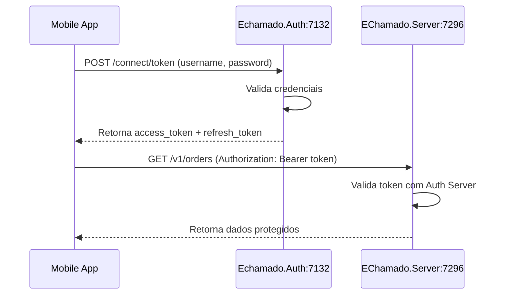
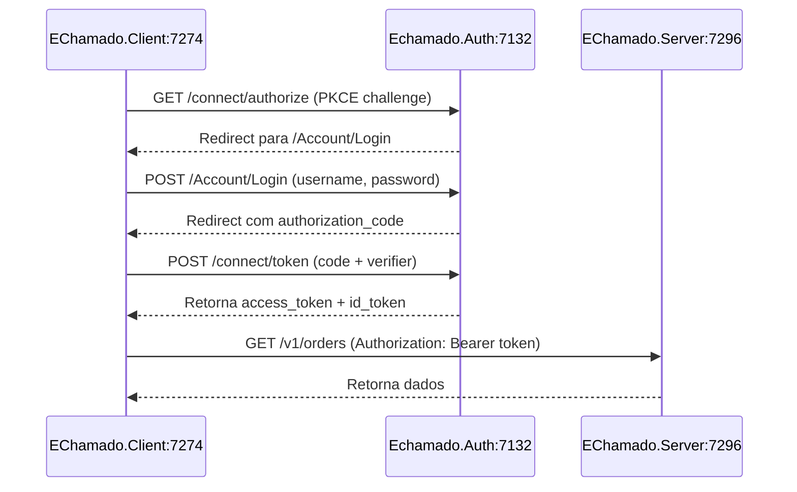

# Arquitetura de Autenticação - EChamado

## Visão Geral

O EChamado utiliza **OpenIddict** com uma arquitetura de dois servidores separados:

### 1. Echamado.Auth (porta 7132) - Authorization Server
**Responsabilidade:** Emitir e validar tokens de autenticação

- **Configuração:** `.AddServer()` + `.AddValidation()`
- **Endpoints disponíveis:**
  - `POST /connect/token` - Emite access tokens e refresh tokens
  - `GET/POST /connect/authorize` - Fluxo Authorization Code
  - `POST /connect/introspect` - Valida tokens
- **Grant Types suportados:**
  - Authorization Code + PKCE (Blazor WASM)
  - Password Grant (mobile, desktop, scripts)
  - Client Credentials (M2M)
  - Refresh Token

### 2. EChamado.Server (porta 7296) - Resource Server
**Responsabilidade:** Servir a API protegida e validar tokens

- **Configuração:** Apenas `.AddValidation()` (sem `.AddServer()`)
- **NÃO possui endpoints de autenticação**
- **Valida tokens** emitidos pelo Echamado.Auth
- **Endpoints disponíveis:**
  - `/v1/categories`, `/v1/orders`, etc. (API protegida)
  - `/health` (health checks)

## ⚠️ IMPORTANTE: URLs Corretas

### ❌ ERRADO - Requisição para o servidor de API
```bash
# ISSO VAI FALHAR!
curl -X POST https://localhost:7296/connect/token \
  -H "Content-Type: application/x-www-form-urlencoded" \
  -d "grant_type=password" \
  -d "username=admin@admin.com" \
  -d "password=Admin@123" \
  -d "client_id=mobile-client" \
  -d "scope=openid profile email roles api"
```

**Erro:** `System.InvalidOperationException: The OpenID Connect request cannot be retrieved.`

### ✅ CORRETO - Requisição para o servidor de autenticação
```bash
# Use a porta 7132 (Echamado.Auth)
curl -X POST https://localhost:7132/connect/token \
  -H "Content-Type: application/x-www-form-urlencoded" \
  -d "grant_type=password" \
  -d "username=admin@admin.com" \
  -d "password=Admin@123" \
  -d "client_id=mobile-client" \
  -d "scope=openid profile email roles api"
```

**Resposta esperada:**
```json
{
  "access_token": "eyJhbGciOiJSUzI1...",
  "token_type": "Bearer",
  "expires_in": 3600,
  "refresh_token": "CfDJ8...",
  "id_token": "eyJhbGciOiJSUzI1..."
}
```

## Fluxo de Autenticação

### 1. Password Grant (Mobile/Desktop/Scripts)



**Exemplo de uso:**
```bash
# 1. Obter token
TOKEN_RESPONSE=$(curl -X POST https://localhost:7132/connect/token \
  -H "Content-Type: application/x-www-form-urlencoded" \
  -d "grant_type=password" \
  -d "username=admin@admin.com" \
  -d "password=Admin@123" \
  -d "client_id=mobile-client" \
  -d "scope=openid profile email roles api chamados")

ACCESS_TOKEN=$(echo $TOKEN_RESPONSE | jq -r '.access_token')

# 2. Usar token para acessar API
curl -X GET https://localhost:7296/v1/categories \
  -H "Authorization: Bearer $ACCESS_TOKEN"
```

### 2. Authorization Code + PKCE (Blazor WASM)



### 3. Refresh Token

```bash
curl -X POST https://localhost:7132/connect/token \
  -H "Content-Type: application/x-www-form-urlencoded" \
  -d "grant_type=refresh_token" \
  -d "refresh_token=CfDJ8..." \
  -d "client_id=mobile-client"
```

## Configuração OpenIddict

### Echamado.Auth - Authorization Server
`src/EChamado/Echamado.Auth/Program.cs`

```csharp
builder.Services.AddOpenIddict()
    .AddCore(options => {
        options.UseEntityFrameworkCore()
               .UseDbContext<ApplicationDbContext>();
    })
    .AddServer(options => {
        // ✅ Configura endpoints de autenticação
        options.SetAuthorizationEndpointUris("/connect/authorize")
               .SetTokenEndpointUris("/connect/token")
               .SetIntrospectionEndpointUris("/connect/introspect");

        // ✅ Permite grant types
        options.AllowAuthorizationCodeFlow()
               .AllowRefreshTokenFlow()
               .AllowClientCredentialsFlow()
               .AllowPasswordFlow();

        // ✅ Exige PKCE
        options.RequireProofKeyForCodeExchange();

        // ✅ Habilita endpoints
        options.UseAspNetCore()
               .EnableAuthorizationEndpointPassthrough()
               .EnableTokenEndpointPassthrough();
    })
    .AddValidation(options => {
        options.UseLocalServer();
        options.UseAspNetCore();
    });
```

### EChamado.Server - Resource Server
`src/EChamado/Server/EChamado.Server.Infrastructure/Configuration/IdentityConfig.cs`

```csharp
builder.Services.AddOpenIddict()
    .AddCore(options => {
        options.UseEntityFrameworkCore()
               .UseDbContext<ApplicationDbContext>();
    })
    .AddValidation(options => {
        // ✅ Apenas VALIDAÇÃO de tokens
        // ❌ NÃO tem .AddServer() - não emite tokens
        options.SetIssuer(new Uri("https://localhost:7132"));
        options.UseSystemNetHttp();
        options.UseAspNetCore();
    });
```

## Scopes Disponíveis

Os scopes são registrados automaticamente pelo `OpenIddictWorker` na inicialização:

### Scopes Padrão (OpenID Connect)
- `openid` - Identificador único do usuário (obrigatório para OIDC)
- `profile` - Nome, username do usuário
- `email` - Email do usuário
- `roles` - Roles/permissões do usuário
- `address` - Endereço do usuário
- `phone` - Telefone do usuário

### Scopes Personalizados (EChamado)
- `api` - Acesso geral à API do EChamado
- `chamados` - Acesso completo aos chamados/tickets

**Importante:** Os scopes personalizados são registrados em dois lugares:
1. `Program.cs` - `options.RegisterScopes("openid", "profile", "email", "roles", "api", "chamados")`
2. `OpenIddictWorker.cs` - `RegisterCustomScopesAsync()` cria os descritores completos

## Clientes Configurados

### 1. bwa-client (Blazor WebAssembly)
- **Grant Type:** Authorization Code + PKCE
- **Redirect URI:** `https://localhost:7274/authentication/login-callback`
- **Post Logout Redirect:** `https://localhost:7274/authentication/logout-callback`
- **Scopes permitidos:** `openid`, `profile`, `email`, `roles`, `address`, `phone`, `api`, `chamados`
- **Configuração:** Criado/atualizado automaticamente pelo `OpenIddictWorker` no startup

### 2. mobile-client (Mobile/Desktop/Scripts)
- **Grant Type:** Password Grant, Refresh Token
- **Scopes permitidos:** `openid`, `profile`, `email`, `roles`, `address`, `phone`, `api`, `chamados`
- **Uso:** Apps móveis, desktop, scripts de teste
- **Configuração:** Criado/atualizado automaticamente pelo `OpenIddictWorker` no startup

## Usuários Padrão

Usuários criados automaticamente pelo seed:

```csharp
// Admin
Email: admin@admin.com
Password: Admin@123
Roles: Admin

// Usuário comum
Email: user@echamado.com
Password: User@123
Roles: User
```

## Troubleshooting

### Erro: "The OpenID Connect request cannot be retrieved"
**Causa:** Requisição enviada para o servidor errado (7296 ao invés de 7132)
**Solução:** Use `https://localhost:7132/connect/token`

### Erro: "invalid_scope"
**Causa:** Um ou mais scopes solicitados não estão registrados no servidor
**Exemplos:**
- Scope "chamados" não estava registrado em `Program.cs`
- Scope personalizado não foi criado no `OpenIddictWorker`
- Cliente não tem permissão para o scope solicitado

**Solução:**
1. Verifique se o scope está registrado em `Echamado.Auth/Program.cs`:
   ```csharp
   options.RegisterScopes("openid", "profile", "email", "roles", "api", "chamados");
   ```
2. Verifique se o `OpenIddictWorker` cria o scope personalizado:
   ```csharp
   await scopeManager.CreateAsync(new OpenIddictScopeDescriptor {
       Name = "chamados",
       DisplayName = "Chamados Access",
       Resources = { "echamado_api" }
   });
   ```
3. Verifique se o cliente tem permissão para o scope:
   ```csharp
   Permissions.Prefixes.Scope + "chamados"
   ```
4. **Reinicie o servidor** `Echamado.Auth` para aplicar as mudanças

### Erro: "invalid_client"
**Causa:** Client ID incorreto ou não configurado
**Solução:**
- Verifique que o client está registrado no `OpenIddictWorker.cs`
- Clientes são criados automaticamente no startup
- Verifique os logs de inicialização para confirmar criação

### Erro: "invalid_grant"
**Causa:** Credenciais inválidas ou usuário não existe
**Solução:**
- Verifique usuário/senha
- Execute o seed novamente (usuários padrão: admin@admin.com, user@echamado.com)
- Verifique se o banco de dados está acessível

### Erro: "unauthorized_client"
**Causa:** Grant type não permitido para o cliente
**Solução:**
- Verifique que o cliente permite o grant type solicitado
- mobile-client: Password Grant, Refresh Token
- bwa-client: Authorization Code, Refresh Token

## Validação de Token

O EChamado.Server valida tokens automaticamente usando o middleware OpenIddict:

```csharp
// Em IdentityConfig.cs
services.AddAuthentication(options => {
    options.DefaultAuthenticateScheme = OpenIddictValidationAspNetCoreDefaults.AuthenticationScheme;
})
```

**Como funciona:**
1. Request chega com header `Authorization: Bearer {token}`
2. OpenIddict Validation extrai o token
3. Valida assinatura, expiração, issuer
4. Opcionalmente chama `/connect/introspect` no Auth Server
5. Popula `HttpContext.User` com claims do token

## Referências

- [OpenIddict Documentation](https://documentation.openiddict.com/)
- [OAuth 2.0 RFC 6749](https://datatracker.ietf.org/doc/html/rfc6749)
- [PKCE RFC 7636](https://datatracker.ietf.org/doc/html/rfc7636)
- [OpenID Connect Core 1.0](https://openid.net/specs/openid-connect-core-1_0.html)

## Scripts de Teste

### Bash/Linux/WSL
```bash
./test-openiddict-login.sh
```

### PowerShell/Windows
```powershell
.\test-openiddict-login.ps1
```

### Python
```bash
python test-openiddict-login.py
```

Todos os scripts estão na raiz do projeto e testam o fluxo completo de autenticação.
