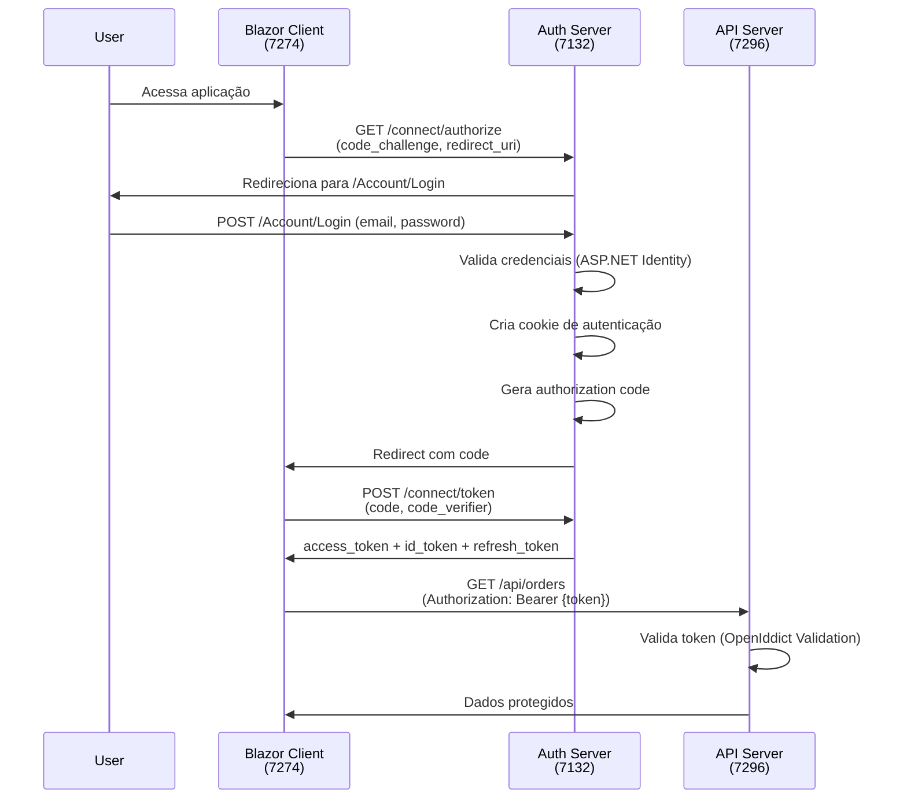

# Correções do Sistema de Login - EChamado

## 📋 Resumo Executivo

O sistema de autenticação foi **completamente reestruturado** para seguir as melhores práticas do OpenIddict e separação correta de responsabilidades entre Authorization Server e Resource Server.

## 🔴 Problemas Identificados

### 1. Arquitetura Confusa - Dupla Responsabilidade
- **Problema**: `EChamado.Server` (porta 7296) estava configurado como Authorization Server E Resource Server simultaneamente
- **Sintoma**: `Echamado.Auth` (porta 7132) apenas fazia login via cookie, mas não emitia tokens OpenIddict
- **Impacto**: Cliente Blazor apontava para porta 7296 como Authority, mas era redirecionado para 7132 via cookie "External", criando loop de redirecionamento incompatível com Authorization Code Flow + PKCE

### 2. Fluxo de Autenticação Quebrado
- **Problema**: Mistura de autenticação via Cookie e OIDC sem separação clara
- **Sintoma**: Cookie "External" sendo usado inadequadamente para comunicação entre apps
- **Impacto**: Authorization Code Flow + PKCE não funcionava corretamente

### 3. Configuração OpenIddict Incorreta
- **Problema**: EChamado.Server tinha endpoints `/connect/authorize` e `/connect/token` que não deveriam existir em um Resource Server
- **Sintoma**: Echamado.Auth não tinha configuração OpenIddict Server
- **Impacto**: Tokens não eram emitidos corretamente

## ✅ Soluções Implementadas

### Arquitetura Corrigida

```
┌─────────────────────────┐
│  Blazor WASM Client     │  (porta 7274)
│  - Public Client        │
│  - OIDC Client          │
└────────────┬────────────┘
             │
             │ Authorization Code + PKCE
             ▼
┌─────────────────────────┐
│  Echamado.Auth          │  (porta 7132)
│  - Authorization Server │  ✅ OpenIddict Server
│  - Login UI             │  ✅ ASP.NET Core Identity
│  - Token Issuer         │  ✅ Blazor Server UI
└────────────┬────────────┘
             │
             │ JWT Access Token
             ▼
┌─────────────────────────┐
│  EChamado.Server        │  (porta 7296)
│  - Resource Server      │  ✅ OpenIddict Validation
│  - API Endpoints        │  ✅ Minimal API
│  - Token Validation     │  ✅ Protected Resources
└─────────────────────────┘
```

### Alterações Realizadas

#### 1. **Echamado.Auth** - Agora é o Authorization Server

**Arquivos Modificados:**
- ✅ `src/EChamado/Echamado.Auth/Program.cs`
  - Adicionado OpenIddict Server configuration
  - Configurados endpoints: `/connect/authorize`, `/connect/token`, `/connect/userinfo`, `/connect/logout`
  - Issuer configurado: `https://localhost:7132`
  - Habilitado Authorization Code Flow + PKCE
  - Adicionado suporte a Controllers

**Arquivos Criados:**
- ✅ `src/EChamado/Echamado.Auth/Controllers/AuthorizationController.cs`
  - Endpoint `/connect/authorize` - Autentica usuário e emite authorization code
  - Endpoint `/connect/token` - Troca authorization code por access token
  - Endpoint `/connect/userinfo` - Retorna informações do usuário
  - Endpoint `/connect/logout` - Faz logout do usuário

- ✅ `src/EChamado/Echamado.Auth/Workers/OpenIddictClientWorker.cs`
  - Registra automaticamente o cliente `bwa-client` no banco de dados
  - Configura PKCE obrigatório
  - Define RedirectUris e PostLogoutRedirectUris

- ✅ `src/EChamado/Echamado.Auth/appsettings.json`
  - Adicionada seção `AppSettings` com configuração de chave secreta

**Configurações:**
```json
{
  "AppSettings": {
    "Secret": "MXFhejJ3c3gzZWRjZHdkd3dxZnFlZ3JoanlrdWlsbw==",
    "Issuer": "Echamado",
    "ValidOn": "https://localhost:7132"
  }
}
```

#### 2. **EChamado.Server** - Agora é apenas Resource Server

**Arquivos Modificados:**
- ✅ `src/EChamado/Server/EChamado.Server.Infrastructure/Configuration/IdentityConfig.cs`
  - **REMOVIDO**: OpenIddict Server configuration
  - **REMOVIDO**: Cookie "External" configuration
  - **ADICIONADO**: OpenIddict Validation configuration
  - Configurado para validar tokens emitidos por `https://localhost:7132`
  - DefaultAuthenticateScheme: `OpenIddictValidationAspNetCoreDefaults.AuthenticationScheme`

**Arquivos Desabilitados:**
- ✅ `src/EChamado/Server/EChamado.Server/Controllers/AuthorizationController.cs` → `.cs.old`
  - Controller de autorização removido (não é mais necessário)

#### 3. **EChamado.Client** - Cliente Blazor WASM

**Arquivos Modificados:**
- ✅ `src/EChamado/Client/EChamado.Client/wwwroot/appsettings.json`
  - **ALTERADO**: `Authority` de `https://localhost:7296` para `https://localhost:7132`
  - **ADICIONADO**: Escopo `roles` aos `DefaultScopes`

**Configuração Corrigida:**
```json
{
  "oidc": {
    "Authority": "https://localhost:7132",  // ✅ Agora aponta para Echamado.Auth
    "ClientId": "bwa-client",
    "DefaultScopes": ["openid", "profile", "email", "roles", "api", "chamados"],
    "ResponseType": "code",
    "PostLogoutRedirectUri": "https://localhost:7274/authentication/logout-callback",
    "RedirectUri": "https://localhost:7274/authentication/login-callback"
  },
  "BackendUrl": "https://localhost:7296"  // API permanece na porta 7296
}
```

## 🔄 Fluxo de Autenticação Corrigido

### 1. **Login do Usuário (Authorization Code Flow + PKCE)**



### 2. **Validação de Token no Resource Server**

```csharp
// EChamado.Server valida tokens automaticamente
services.AddOpenIddict()
    .AddValidation(options =>
    {
        options.SetIssuer("https://localhost:7132");  // Authority correto
        options.AddSigningKey(new SymmetricSecurityKey(key));
        options.UseAspNetCore();
        options.UseSystemNetHttp();
    });
```

## 🚀 Como Testar

### Pré-requisitos

1. Banco de dados PostgreSQL rodando (porta 5432)
2. Certificados SSL configurados para HTTPS

### Passo a Passo

**1. Limpar Banco de Dados (Opcional)**

```bash
# Se quiser começar do zero
cd src/EChamado/Server/EChamado.Server
dotnet ef database drop --force
dotnet ef database update
```

**2. Iniciar os Três Servidores (em terminais separados)**

```bash
# Terminal 1 - Authorization Server (DEVE SER O PRIMEIRO)
cd src/EChamado/Echamado.Auth
dotnet run
# Aguarde: "Now listening on: https://localhost:7132"

# Terminal 2 - API Server
cd src/EChamado/Server/EChamado.Server
dotnet run
# Aguarde: "Now listening on: https://localhost:7296"

# Terminal 3 - Blazor Client
cd src/EChamado/Client/EChamado.Client
dotnet run
# Aguarde: "Now listening on: https://localhost:7274"
```

**3. Testar o Fluxo de Login**

1. Abra o navegador em `https://localhost:7274`
2. Clique em "Log in"
3. Será redirecionado para `https://localhost:7132/Account/Login`
4. Faça login com:
   - **Email**: `admin@echamado.com`
   - **Password**: `Admin@123`
5. Será redirecionado de volta para `https://localhost:7274/authentication/login-callback`
6. Cliente processará o token e você estará autenticado
7. Acesse páginas protegidas (ex: `/orders`)

**4. Verificar Tokens**

Use o navegador Developer Tools (F12) para ver:

- **Network Tab**:
  - Request para `/connect/authorize` (7132)
  - Request para `/connect/token` (7132)
  - Request para `/api/*` com header `Authorization: Bearer ...` (7296)

- **Application Tab → Local Storage**:
  - Tokens armazenados pelo cliente OIDC

- **Console**:
  - Logs de autenticação do OpenIddict

## 🔍 Validações Importantes

### 1. Verificar Cliente Registrado

```sql
SELECT * FROM "OpenIddictApplications" WHERE "ClientId" = 'bwa-client';
```

Deve retornar 1 registro com:
- `Type`: `public`
- `RequirePkce`: `true` (ou equivalente)
- `RedirectUris`: contendo `https://localhost:7274/authentication/login-callback`

### 2. Verificar Logs do Authorization Server

No terminal do `Echamado.Auth`, você deve ver:

```
info: OpenIddict.Server.OpenIddictServerDispatcher[0]
      The authorization request was successfully extracted: ...

info: OpenIddict.Server.OpenIddictServerDispatcher[0]
      The token request was successfully extracted: ...
```

### 3. Verificar Logs do Resource Server

No terminal do `EChamado.Server`, você deve ver:

```
info: OpenIddict.Validation.OpenIddictValidationDispatcher[0]
      The access token was successfully validated
```

## 🐛 Troubleshooting

### Problema: "The authority must use HTTPS unless disabled for development"

**Solução**: Certifique-se de que todas as URLs usam HTTPS (não HTTP)

### Problema: "Invalid redirect_uri"

**Solução**:
1. Verifique que o cliente está registrado corretamente no banco
2. Confirme que a RedirectUri no banco corresponde à configuração do cliente
3. Execute o Worker novamente reiniciando o `Echamado.Auth`

### Problema: "CORS policy blocked"

**Solução**: Verifique que o CORS está configurado no `EChamado.Server` para aceitar requisições de `https://localhost:7274` e `https://localhost:7132`

### Problema: "The authorization code is no longer valid"

**Solução**:
1. Limpe os cookies do navegador
2. Limpe o Local Storage do navegador
3. Reinicie o fluxo de login

### Problema: "Invalid issuer"

**Solução**: Verifique que:
1. `Echamado.Auth` está configurado com issuer `https://localhost:7132`
2. `EChamado.Server` está configurado para validar tokens deste issuer
3. Cliente Blazor aponta para `Authority: https://localhost:7132`

## 📝 Notas Técnicas

### Chave Simétrica Compartilhada

Ambos `Echamado.Auth` e `EChamado.Server` usam a **mesma chave secreta** (`AppSettings:Secret`):
- **Authorization Server**: Usa para **assinar** tokens
- **Resource Server**: Usa para **validar** tokens

**Importante**: Em produção, considere usar certificados X.509 ao invés de chaves simétricas.

### PKCE (Proof Key for Code Exchange)

O cliente `bwa-client` está configurado com `RequireProofKeyForCodeExchange`:
- Gera `code_challenge` automaticamente
- Envia `code_verifier` ao trocar o code por token
- Aumenta a segurança contra ataques de interceptação

### Scopes Customizados

Scopes registrados:
- `openid` - Obrigatório para OIDC
- `profile` - Nome de usuário, username
- `email` - Email do usuário
- `roles` - Roles/permissões do usuário
- `api` - Acesso geral à API
- `chamados` - Acesso específico ao módulo de chamados

## 🎯 Próximos Passos

1. ✅ **Testar fluxo completo de autenticação**
2. ⬜ Implementar logout completo
3. ⬜ Adicionar testes automatizados para o fluxo OIDC
4. ⬜ Configurar refresh token rotation
5. ⬜ Implementar rate limiting nos endpoints de autenticação
6. ⬜ Adicionar auditoria de logins
7. ⬜ Configurar certificados X.509 para produção

## 📚 Referências

- [OpenIddict Documentation](https://documentation.openiddict.com/)
- [Authorization Code Flow + PKCE](https://oauth.net/2/pkce/)
- [ASP.NET Core Identity](https://learn.microsoft.com/en-us/aspnet/core/security/authentication/identity)
- [OpenID Connect Specification](https://openid.net/specs/openid-connect-core-1_0.html)

---

**Data das Correções**: 2025-11-12
**Versão**: 1.0
**Status**: ✅ Pronto para Teste
