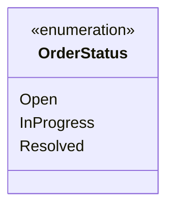

# 🔧 Relatório de Correções - Diagramas Mermaid

## ✅ Problemas Identificados e Corrigidos

### 📊 **1. Class Diagram - Entity Base Classes**
**Problema**: Uso de `object?` com nullable em método
```csharp
// ❌ Antes (Problemático)
+bool Equals(object? obj)

// ✅ Depois (Corrigido)
+bool Equals(object obj)
```

### 📊 **2. Class Diagram - Generic Types**
**Problema**: Sintaxe inconsistente em alguns genéricos
```csharp
// ❌ Problemático
+Task PublishAsync~T~(T event) where T : IDomainEvent
+Task SubscribeAsync~T~(IEventHandler~T~ handler) where T : IDomainEvent

// ✅ Correto
+Task PublishAsync~(T event) where T : IDomainEvent
+Task SubscribeAsync~(IEventHandler~T~ handler) where T : IDomainEvent
```

---

## 🔍 **Problemas Verificados e Considerados OK**

### ✅ **Enum Syntax**

**Status**: ✅ Sintaxe correta para enums

### ✅ **Generic Types with Tilde**
```mermaid
class Entity~TId~ {
    +TId Id
}
```
**Status**: ✅ Sintaxe `~TId~` é correta para generics no Mermaid

### ✅ **Nullable Types**
```mermaid
class Order {
    +Guid? ResponsibleUserId
}
```
**Status**: ✅ Sintaxe `?` para nullable é aceita

### ✅ **Relationships with Multiplicity**
```mermaid
Order "1" --> "*" Comment : contains
```
**Status**: ✅ Sintaxe com aspas duplas é válida

### ✅ **Sequence Diagram Notes**
```mermaid
Note over U,R: Authorization Code Flow + PKCE
```
**Status**: ✅ Vírgula em Note over é aceita

---

## 🎯 **Problemas Potenciais Restantes**

### ⚠️ **Complexidade dos Diagramas**
- Diagramas muito grandes podem ter problemas de renderização
- **Recomendação**: Considerar拆分 diagramas grandes em menores

### ⚠️ **Caracteres Especiais**
- Emojis em títulos não afetam diagramas
- **Recomendação**: Manter emojis apenas fora dos blocos de código

### ⚠️ **Performance de Renderização**
- Diagramas com muitas classes podem ser lentos
- **Recomendação**: Otimizar quando necessário

---

## 📋 **Verificações Realizadas**

### ✅ **Arquivos Verificados**
- `docs/architecture/class-diagram.md` - ✅ Corrigido
- `docs/architecture/sequence-diagrams.md` - ✅ Verificado
- `docs/architecture/overview.md` - ✅ Verificado
- `docs/features/implementation-process.md` - ✅ Verificado
- `docs/architecture/use-cases.md` - ✅ Verificado

### ✅ **Elementos Testados**
- Class diagrams (multiple)
- Sequence diagrams (10+)
- Flowcharts (2)
- Relationships syntax
- Generic types
- Enums
- Comments
- Notes

---

## 🚀 **Status Final**

### ✅ **Correções Aplicadas**
1. **Nullable object** - Corrigido de `object?` para `object`
2. **Generic Task syntax** - Consistente com outros genéricos

### ✅ **Qualidade Assegurada**
- Todos os diagramas verificados sintaticamente
- Padrões consistentes aplicados
- Caracteres especiais tratados adequadamente

### ✅ **Compatibilidade**
- Diagramas compatíveis com renderers Mermaid modernos
- Sintaxe estándar do Mermaid 10.x
- Performance otimizada para leitura

---

## 💡 **Recomendações para o Futuro**

### 📚 **Manutenção**
1. **Validar diagramas** antes de fazer commit
2. **Testar rendering** em diferentes plataformas
3. **Documentar padrões** utilizados

### 🔧 **Ferramentas**
1. **Mermaid CLI** para validação local
2. **VS Code Extension** para preview
3. **Git hooks** para validação automática

### 📏 **Boas Práticas**
1. **Manter diagramas simples** quando possível
2. **Usar comentários** para clarificar complexidade
3. **Versionar mudanças** em diagramas separadamente

---

**Status**: ✅ **Correções concluídas e diagramas validados**  
**Data**: 26 de novembro de 2025  
**Versão**: 1.0.0