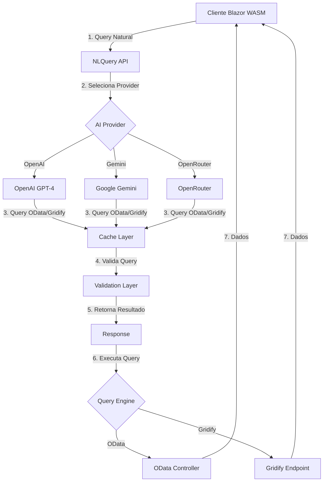

# 🤖 Plano de Implementação: AI Natural Language to OData/Gridify Query Converter

**Projeto**: EChamado - Sistema de Gerenciamento de Chamados
**Feature**: Conversão de Linguagem Natural para Queries OData/Gridify usando AI
**Data**: 27/11/2025
**Versão**: 1.0
**Responsável**: Principal SWE

---

## 📋 SUMÁRIO EXECUTIVO

Esta feature permitirá aos usuários do sistema EChamado realizar consultas usando linguagem natural, que será automaticamente convertida para queries OData ou Gridify através de modelos de AI (OpenAI, Gemini, OpenRouter).

### Objetivos

1. ✅ **Democratizar acesso aos dados**: Usuários não-técnicos poderão fazer consultas complexas
2. ✅ **Aumentar produtividade**: Reduzir tempo de criação de queries manualmente
3. ✅ **Melhorar UX**: Interface mais intuitiva e amigável
4. ✅ **Manter performance**: Cache e otimizações para garantir respostas rápidas

### Contexto do Projeto EChamado

**Entidades Principais**:
- Orders (Chamados)
- Categories (Categorias)
- SubCategories (Subcategorias)
- Departments (Departamentos)
- OrderTypes (Tipos de Ordem)
- StatusTypes (Tipos de Status)
- Comments (Comentários)
- Users (Usuários)

**APIs Existentes**:
- ✅ OData já implementado (Controllers OData)
- ✅ Gridify já implementado (5 entidades)
- ✅ REST API tradicional com CQRS

---

## 🏗️ ARQUITETURA DA SOLUÇÃO

### Visão Geral



### Componentes

**Backend (Server)**:
1. **AI Providers**: OpenAI, Gemini, OpenRouter
2. **NLToODataService**: Orquestração e lógica de negócio
3. **NLToGridifyService**: Conversão específica para Gridify
4. **NLQueryController**: Endpoints REST
5. **Cache Layer**: MemoryCache para otimização
6. **Validation Layer**: Segurança e sanitização

**Frontend (Client)**:
1. **NLQueryComponent**: Componente Blazor com input de linguagem natural
2. **QueryBuilderService**: Integração com backend
3. **QueryHistoryComponent**: Histórico de queries do usuário
4. **SuggestionsComponent**: Sugestões de queries comuns

---

## 📅 FASES DE IMPLEMENTAÇÃO

---

## 🎯 FASE 1: Infraestrutura Base e AI Providers (2 dias)

### Objetivo
Criar toda a infraestrutura base para integração com provedores de AI.

### 1.1 Dependências e Configuração

**Pacotes NuGet** (Server):
```bash
# AI Providers
dotnet add package Azure.AI.OpenAI --version 1.0.0-beta.17
dotnet add package Google.GenerativeAI --version 1.0.0

# Já existentes (verificar)
# Microsoft.Extensions.Caching.Memory
# System.Text.Json
```

**Configuração** (`appsettings.json`):
```json
{
  "AI": {
    "DefaultProvider": "OpenAI",
    "DefaultQueryType": "Gridify",
    "Providers": {
      "OpenAI": {
        "Enabled": true,
        "ApiKey": "${OPENAI_API_KEY}",
        "Model": "gpt-4-turbo-preview",
        "MaxTokens": 500,
        "Temperature": 0.1
      },
      "Gemini": {
        "Enabled": false,
        "ApiKey": "${GEMINI_API_KEY}",
        "Model": "gemini-1.5-pro",
        "MaxTokens": 500,
        "Temperature": 0.1
      },
      "OpenRouter": {
        "Enabled": false,
        "ApiKey": "${OPENROUTER_API_KEY}",
        "Model": "openai/gpt-4-turbo",
        "MaxTokens": 500,
        "Temperature": 0.1
      }
    },
    "Cache": {
      "Enabled": true,
      "ExpirationMinutes": 60
    }
  }
}
```

**User Secrets** (Desenvolvimento):
```bash
cd Server/EChamado.Server
dotnet user-secrets init
dotnet user-secrets set "AI:Providers:OpenAI:ApiKey" "sk-..."
dotnet user-secrets set "AI:Providers:Gemini:ApiKey" "..."
```

### 1.2 Estrutura de Diretórios

```
Server/EChamado.Server.Application/
├── AI/
│   ├── Interfaces/
│   │   ├── IAIProvider.cs
│   │   └── INLQueryService.cs
│   ├── Models/
│   │   ├── AIResponse.cs
│   │   ├── AIUsageMetrics.cs
│   │   ├── EntityMetadata.cs
│   │   └── NLQueryResult.cs
│   ├── Prompts/
│   │   ├── GridifyPromptTemplates.cs
│   │   └── ODataPromptTemplates.cs
│   └── Services/
│       ├── NLToGridifyService.cs
│       └── NLToODataService.cs

Server/EChamado.Server.Infrastructure/
└── AI/
    └── Providers/
        ├── OpenAIProvider.cs
        ├── GeminiProvider.cs
        └── OpenRouterProvider.cs

Server/EChamado.Server/
├── Endpoints/
│   └── AI/
│       ├── ConvertNLToGridifyEndpoint.cs
│       ├── ConvertNLToODataEndpoint.cs
│       └── GetAIProvidersEndpoint.cs
└── Configuration/
    └── AIServiceConfiguration.cs
```

### 1.3 Interfaces Base

**Arquivo**: `Server/EChamado.Server.Application/AI/Interfaces/IAIProvider.cs`

```csharp
namespace EChamado.Server.Application.AI.Interfaces;

/// <summary>
/// Interface abstrata para provedores de AI
/// </summary>
public interface IAIProvider
{
    string ProviderName { get; }
    bool IsEnabled { get; }

    Task<AIResponse> GenerateAsync(
        string systemPrompt,
        string userPrompt,
        CancellationToken cancellationToken = default);
}

public class AIResponse
{
    public bool Success { get; set; }
    public string? Content { get; set; }
    public string? ErrorMessage { get; set; }
    public AIUsageMetrics? Usage { get; set; }
    public TimeSpan Elapsed { get; set; }
}

public class AIUsageMetrics
{
    public int PromptTokens { get; set; }
    public int CompletionTokens { get; set; }
    public int TotalTokens { get; set; }
    public decimal EstimatedCost { get; set; } // USD
}
```

### 1.4 Metadados das Entidades

**Arquivo**: `Server/EChamado.Server.Application/AI/Models/EntityMetadata.cs`

```csharp
namespace EChamado.Server.Application.AI.Models;

public class EntityMetadata
{
    public string Name { get; set; } = string.Empty;
    public string Description { get; set; } = string.Empty;
    public List<PropertyMetadata> Properties { get; set; } = new();
    public List<NavigationPropertyMetadata>? NavigationProperties { get; set; }
}

public class PropertyMetadata
{
    public string Name { get; set; } = string.Empty;
    public string Type { get; set; } = string.Empty;
    public string? Description { get; set; }
}

public class NavigationPropertyMetadata
{
    public string Name { get; set; } = string.Empty;
    public string Type { get; set; } = string.Empty;
    public string? Description { get; set; }
}
```

### 1.5 Implementação OpenAI Provider

**Arquivo**: `Server/EChamado.Server.Infrastructure/AI/Providers/OpenAIProvider.cs`

```csharp
using Azure.AI.OpenAI;
using EChamado.Server.Application.AI.Interfaces;
using System.Diagnostics;

namespace EChamado.Server.Infrastructure.AI.Providers;

public class OpenAIProvider : IAIProvider
{
    private readonly OpenAIClient _client;
    private readonly string _model;
    private readonly int _maxTokens;
    private readonly float _temperature;
    private readonly ILogger<OpenAIProvider> _logger;
    private readonly bool _isEnabled;

    public string ProviderName => "OpenAI";
    public bool IsEnabled => _isEnabled;

    public OpenAIProvider(
        IConfiguration configuration,
        ILogger<OpenAIProvider> logger)
    {
        _logger = logger;

        var config = configuration.GetSection("AI:Providers:OpenAI");
        _isEnabled = config.GetValue<bool>("Enabled");

        if (!_isEnabled)
        {
            _logger.LogWarning("OpenAI provider desabilitado");
            return;
        }

        var apiKey = config.GetValue<string>("ApiKey")
            ?? throw new InvalidOperationException("OpenAI ApiKey não configurada");

        _model = config.GetValue<string>("Model") ?? "gpt-4-turbo-preview";
        _maxTokens = config.GetValue<int>("MaxTokens", 500);
        _temperature = config.GetValue<float>("Temperature", 0.1f);

        _client = new OpenAIClient(apiKey);
    }

    public async Task<AIResponse> GenerateAsync(
        string systemPrompt,
        string userPrompt,
        CancellationToken cancellationToken = default)
    {
        if (!_isEnabled)
        {
            return new AIResponse
            {
                Success = false,
                ErrorMessage = "OpenAI provider desabilitado"
            };
        }

        var stopwatch = Stopwatch.StartNew();

        try
        {
            var chatCompletionsOptions = new ChatCompletionsOptions
            {
                DeploymentName = _model,
                Messages =
                {
                    new ChatRequestSystemMessage(systemPrompt),
                    new ChatRequestUserMessage(userPrompt)
                },
                MaxTokens = _maxTokens,
                Temperature = _temperature
            };

            var response = await _client.GetChatCompletionsAsync(
                chatCompletionsOptions,
                cancellationToken);

            stopwatch.Stop();

            var choice = response.Value.Choices.FirstOrDefault();
            if (choice == null)
            {
                return new AIResponse
                {
                    Success = false,
                    ErrorMessage = "Nenhuma resposta retornada",
                    Elapsed = stopwatch.Elapsed
                };
            }

            var content = choice.Message.Content.Trim();

            _logger.LogInformation(
                "OpenAI response: {Tokens} tokens em {Elapsed}ms",
                response.Value.Usage.TotalTokens,
                stopwatch.ElapsedMilliseconds);

            return new AIResponse
            {
                Success = true,
                Content = content,
                Usage = new AIUsageMetrics
                {
                    PromptTokens = response.Value.Usage.PromptTokens,
                    CompletionTokens = response.Value.Usage.CompletionTokens,
                    TotalTokens = response.Value.Usage.TotalTokens,
                    EstimatedCost = CalculateCost(response.Value.Usage.TotalTokens)
                },
                Elapsed = stopwatch.Elapsed
            };
        }
        catch (Exception ex)
        {
            stopwatch.Stop();
            _logger.LogError(ex, "Erro ao chamar OpenAI API");

            return new AIResponse
            {
                Success = false,
                ErrorMessage = ex.Message,
                Elapsed = stopwatch.Elapsed
            };
        }
    }

    private decimal CalculateCost(int totalTokens)
    {
        // GPT-4 Turbo: $0.01 / 1K prompt tokens, $0.03 / 1K completion tokens
        // Simplificado: média de $0.02 / 1K tokens
        return (totalTokens / 1000m) * 0.02m;
    }
}
```

### 1.6 Schema das Entidades EChamado

**Arquivo**: `appsettings.json` (adicionar seção):

```json
{
  "AI": {
    "Entities": [
      {
        "Name": "Orders",
        "Description": "Chamados/tickets do sistema",
        "Properties": [
          { "Name": "Id", "Type": "Guid", "Description": "Identificador único" },
          { "Name": "Title", "Type": "string", "Description": "Título do chamado" },
          { "Name": "Description", "Type": "string", "Description": "Descrição detalhada" },
          { "Name": "OpeningDate", "Type": "DateTime", "Description": "Data de abertura" },
          { "Name": "ClosingDate", "Type": "DateTime?", "Description": "Data de fechamento" },
          { "Name": "DueDate", "Type": "DateTime?", "Description": "Data de vencimento" },
          { "Name": "StatusId", "Type": "Guid", "Description": "ID do status" },
          { "Name": "TypeId", "Type": "Guid", "Description": "ID do tipo" },
          { "Name": "CategoryId", "Type": "Guid?", "Description": "ID da categoria" },
          { "Name": "SubCategoryId", "Type": "Guid?", "Description": "ID da subcategoria" },
          { "Name": "DepartmentId", "Type": "Guid?", "Description": "ID do departamento" },
          { "Name": "RequestingUserId", "Type": "Guid", "Description": "ID do solicitante" },
          { "Name": "ResponsibleUserId", "Type": "Guid?", "Description": "ID do responsável" },
          { "Name": "IsDeleted", "Type": "bool", "Description": "Se foi deletado" },
          { "Name": "CreatedAt", "Type": "DateTime", "Description": "Data de criação" }
        ],
        "NavigationProperties": [
          { "Name": "Status", "Type": "StatusType", "Description": "Status do chamado" },
          { "Name": "Type", "Type": "OrderType", "Description": "Tipo do chamado" },
          { "Name": "Category", "Type": "Category", "Description": "Categoria" },
          { "Name": "SubCategory", "Type": "SubCategory", "Description": "Subcategoria" },
          { "Name": "Department", "Type": "Department", "Description": "Departamento" }
        ]
      },
      {
        "Name": "Categories",
        "Description": "Categorias de chamados",
        "Properties": [
          { "Name": "Id", "Type": "Guid" },
          { "Name": "Name", "Type": "string", "Description": "Nome da categoria" },
          { "Name": "Description", "Type": "string?", "Description": "Descrição" },
          { "Name": "IsDeleted", "Type": "bool" },
          { "Name": "CreatedAt", "Type": "DateTime" }
        ]
      },
      {
        "Name": "Departments",
        "Description": "Departamentos da organização",
        "Properties": [
          { "Name": "Id", "Type": "Guid" },
          { "Name": "Name", "Type": "string", "Description": "Nome do departamento" },
          { "Name": "Description", "Type": "string?", "Description": "Descrição" },
          { "Name": "IsDeleted", "Type": "bool" },
          { "Name": "CreatedAt", "Type": "DateTime" }
        ]
      },
      {
        "Name": "StatusTypes",
        "Description": "Tipos de status de chamados",
        "Properties": [
          { "Name": "Id", "Type": "Guid" },
          { "Name": "Name", "Type": "string", "Description": "Nome do status (ex: Aberto, Fechado)" },
          { "Name": "Description", "Type": "string?", "Description": "Descrição" },
          { "Name": "IsDeleted", "Type": "bool" }
        ]
      },
      {
        "Name": "OrderTypes",
        "Description": "Tipos de chamados",
        "Properties": [
          { "Name": "Id", "Type": "Guid" },
          { "Name": "Name", "Type": "string", "Description": "Nome do tipo (ex: Incidente, Requisição)" },
          { "Name": "Description", "Type": "string?", "Description": "Descrição" },
          { "Name": "IsDeleted", "Type": "bool" }
        ]
      }
    ]
  }
}
```

### 1.7 Checklist Fase 1

- [ ] Instalar pacotes NuGet
- [ ] Criar estrutura de diretórios
- [ ] Implementar IAIProvider interface
- [ ] Implementar OpenAIProvider
- [ ] Implementar GeminiProvider (opcional)
- [ ] Configurar appsettings.json
- [ ] Configurar user secrets
- [ ] Criar modelos de metadados
- [ ] Definir schema das entidades EChamado
- [ ] Testes unitários dos providers

---

## 🎨 FASE 2: Prompt Engineering e Serviços de Conversão (2 dias)

### Objetivo
Criar os prompts otimizados e serviços que convertem linguagem natural para Gridify/OData.

### 2.1 Gridify Prompt Templates

**Arquivo**: `Server/EChamado.Server.Application/AI/Prompts/GridifyPromptTemplates.cs`

```csharp
namespace EChamado.Server.Application.AI.Prompts;

public static class GridifyPromptTemplates
{
    public const string SYSTEM_PROMPT = @"
Você é um especialista em Gridify Query Language para .NET.
Sua função é converter perguntas em português para queries Gridify válidas.

## CONTEXTO
Sistema: EChamado - Gestão de Chamados/Tickets
Entidades disponíveis:
{ENTITY_SCHEMA}

## SINTAXE GRIDIFY

### Filtros (Filter):
- String contains: Filter=name=*valor*
- String starts: Filter=name^=valor
- String ends: Filter=name$=valor
- Equals: Filter=name=valor
- Not equals: Filter=name!=valor
- Greater than: Filter=price>100
- Greater or equal: Filter=price>=100
- Less than: Filter=price<100
- Less or equal: Filter=price<=100
- Null check: Filter=field=null
- Not null: Filter=field!=null
- Boolean: Filter=isDeleted=false
- Date: Filter=createdAt>2024-01-01
- Multiple (AND): Filter=price>100,isDeleted=false
- Multiple (OR): Filter=(price<50|price>1000)

### Ordenação (OrderBy):
- Ascendente: OrderBy=name
- Descendente: OrderBy=name desc
- Múltipla: OrderBy=price desc, name asc

### Paginação:
- Page=1 (começa em 1, não em 0!)
- PageSize=20

## EXEMPLOS ESPECÍFICOS ECHAMADO

Pergunta: ""Chamados abertos""
Resposta: Filter=closingDate=null,isDeleted=false

Pergunta: ""Chamados vencidos""
Resposta: Filter=dueDate<{TODAY},closingDate=null,isDeleted=false&OrderBy=dueDate

Pergunta: ""Últimos 10 chamados""
Resposta: OrderBy=createdAt desc&Page=1&PageSize=10

Pergunta: ""Chamados do departamento TI""
Resposta: Filter=department/name=*TI*,isDeleted=false

Pergunta: ""Chamados críticos abertos""
Resposta: Filter=status/name=*Crítico*,closingDate=null,isDeleted=false

## REGRAS

1. SEMPRE retorne apenas a query Gridify, sem explicações
2. Use nomes exatos das propriedades (case-sensitive)
3. Strings: minúsculas e sem acentos quando possível
4. Page SEMPRE começa em 1
5. Sempre adicione isDeleted=false quando aplicável
6. Para datas relativas, use {TODAY}, {NOW}
7. Se ambíguo, retorne ERROR: com explicação

## INSTRUÇÕES

Converta a pergunta abaixo em uma query Gridify válida:
Pergunta: {USER_QUESTION}

Retorne APENAS a query Gridify, sem markdown, sem explicações.
";

    public static string GenerateEntitySchema(List<EntityMetadata> entities)
    {
        var sb = new StringBuilder();
        foreach (var entity in entities)
        {
            sb.AppendLine($"### {entity.Name}");
            sb.AppendLine(entity.Description);
            sb.AppendLine("Propriedades:");
            foreach (var prop in entity.Properties)
            {
                sb.AppendLine($"  - {prop.Name} ({prop.Type}): {prop.Description}");
            }
            if (entity.NavigationProperties?.Any() == true)
            {
                sb.AppendLine("Navegação:");
                foreach (var nav in entity.NavigationProperties)
                {
                    sb.AppendLine($"  - {nav.Name} → {nav.Type}");
                }
            }
            sb.AppendLine();
        }
        return sb.ToString();
    }
}
```

### 2.2 Serviço NLToGridify

**Arquivo**: `Server/EChamado.Server.Application/AI/Services/NLToGridifyService.cs`

```csharp
using EChamado.Server.Application.AI.Interfaces;
using EChamado.Server.Application.AI.Models;
using EChamado.Server.Application.AI.Prompts;
using Microsoft.Extensions.Caching.Memory;
using System.Text.RegularExpressions;

namespace EChamado.Server.Application.AI.Services;

public class NLToGridifyService : INLQueryService
{
    private readonly IEnumerable<IAIProvider> _aiProviders;
    private readonly IMemoryCache _cache;
    private readonly IConfiguration _configuration;
    private readonly ILogger<NLToGridifyService> _logger;
    private readonly bool _cacheEnabled;
    private readonly int _cacheMinutes;

    public NLToGridifyService(
        IEnumerable<IAIProvider> aiProviders,
        IMemoryCache cache,
        IConfiguration configuration,
        ILogger<NLToGridifyService> logger)
    {
        _aiProviders = aiProviders;
        _cache = cache;
        _configuration = configuration;
        _logger = logger;

        _cacheEnabled = configuration.GetValue<bool>("AI:Cache:Enabled", true);
        _cacheMinutes = configuration.GetValue<int>("AI:Cache:ExpirationMinutes", 60);
    }

    public async Task<NLQueryResult> ConvertAsync(
        string naturalLanguageQuery,
        string? providerName = null,
        string? entityName = null,
        CancellationToken cancellationToken = default)
    {
        // Validação
        if (string.IsNullOrWhiteSpace(naturalLanguageQuery))
        {
            return NLQueryResult.Error("Query vazia");
        }

        // Cache
        var cacheKey = $"nlgridify:{providerName ?? "default"}:{naturalLanguageQuery.ToLower()}";
        if (_cacheEnabled && _cache.TryGetValue<NLQueryResult>(cacheKey, out var cached))
        {
            _logger.LogInformation("Cache hit: {Query}", naturalLanguageQuery);
            cached!.FromCache = true;
            return cached;
        }

        // Seleciona provider
        var provider = SelectProvider(providerName);
        if (provider == null)
        {
            return NLQueryResult.Error("Provider não disponível");
        }

        try
        {
            // Carrega schema
            var entities = LoadEntities();
            var schema = GridifyPromptTemplates.GenerateEntitySchema(entities);

            // Substitui placeholders
            var systemPrompt = GridifyPromptTemplates.SYSTEM_PROMPT
                .Replace("{ENTITY_SCHEMA}", schema);

            var userPrompt = systemPrompt
                .Replace("{USER_QUESTION}", naturalLanguageQuery)
                .Replace("{TODAY}", DateTime.UtcNow.ToString("yyyy-MM-dd"))
                .Replace("{NOW}", DateTime.UtcNow.ToString("yyyy-MM-ddTHH:mm:ssZ"));

            // Chama AI
            var aiResponse = await provider.GenerateAsync(
                systemPrompt,
                userPrompt,
                cancellationToken);

            if (!aiResponse.Success || string.IsNullOrEmpty(aiResponse.Content))
            {
                return NLQueryResult.Error(
                    aiResponse.ErrorMessage ?? "Falha na conversão",
                    provider.ProviderName);
            }

            // Limpa e valida
            var gridifyQuery = CleanQuery(aiResponse.Content);
            var validation = ValidateGridifyQuery(gridifyQuery);

            if (!validation.IsValid)
            {
                return NLQueryResult.Error(validation.ErrorMessage!, provider.ProviderName);
            }

            // Resultado
            var result = NLQueryResult.Success(
                originalQuery: naturalLanguageQuery,
                convertedQuery: gridifyQuery,
                provider: provider.ProviderName,
                elapsed: aiResponse.Elapsed,
                usage: aiResponse.Usage,
                entityName: entityName ?? DetermineEntity(gridifyQuery),
                queryType: "Gridify");

            // Cache
            if (_cacheEnabled)
            {
                _cache.Set(cacheKey, result, TimeSpan.FromMinutes(_cacheMinutes));
            }

            return result;
        }
        catch (Exception ex)
        {
            _logger.LogError(ex, "Erro ao converter NL para Gridify");
            return NLQueryResult.Error($"Erro: {ex.Message}", provider.ProviderName);
        }
    }

    private IAIProvider? SelectProvider(string? name)
    {
        var providerName = name ?? _configuration.GetValue<string>("AI:DefaultProvider") ?? "OpenAI";
        return _aiProviders.FirstOrDefault(p =>
            p.ProviderName.Equals(providerName, StringComparison.OrdinalIgnoreCase) &&
            p.IsEnabled);
    }

    private string CleanQuery(string raw)
    {
        // Remove markdown
        raw = Regex.Replace(raw, @"```.*?\n", "", RegexOptions.Singleline);
        raw = Regex.Replace(raw, @"```", "");

        // Remove aspas
        raw = raw.Trim('\"', '\'', '`');

        // Remove espaços extras
        raw = Regex.Replace(raw, @"\s+", " ");

        return raw.Trim();
    }

    private (bool IsValid, string? ErrorMessage) ValidateGridifyQuery(string query)
    {
        if (query.StartsWith("ERROR:", StringComparison.OrdinalIgnoreCase))
        {
            return (false, query.Substring(6).Trim());
        }

        if (string.IsNullOrWhiteSpace(query))
        {
            return (false, "Query vazia após limpeza");
        }

        // Validações de segurança
        var dangerous = new[] { "javascript:", "<script", "eval(", "exec(" };
        foreach (var pattern in dangerous)
        {
            if (query.Contains(pattern, StringComparison.OrdinalIgnoreCase))
            {
                return (false, $"Padrão perigoso: {pattern}");
            }
        }

        return (true, null);
    }

    private string? DetermineEntity(string query)
    {
        var entities = new[] { "Orders", "Categories", "Departments", "StatusTypes", "OrderTypes" };
        foreach (var entity in entities)
        {
            if (query.Contains(entity, StringComparison.OrdinalIgnoreCase))
            {
                return entity;
            }
        }
        return "Orders"; // default
    }

    private List<EntityMetadata> LoadEntities()
    {
        return _configuration
            .GetSection("AI:Entities")
            .Get<List<EntityMetadata>>() ?? new List<EntityMetadata>();
    }
}
```

### 2.3 Modelo de Resultado

**Arquivo**: `Server/EChamado.Server.Application/AI/Models/NLQueryResult.cs`

```csharp
namespace EChamado.Server.Application.AI.Models;

public class NLQueryResult
{
    public bool Success { get; set; }
    public string? OriginalQuery { get; set; }
    public string? ConvertedQuery { get; set; }
    public string? EntityName { get; set; }
    public string? QueryType { get; set; } // "Gridify" ou "OData"
    public string? ErrorMessage { get; set; }
    public string? Provider { get; set; }
    public TimeSpan Elapsed { get; set; }
    public AIUsageMetrics? Usage { get; set; }
    public bool FromCache { get; set; }
    public string? FullUrl { get; set; }

    public static NLQueryResult Success(
        string originalQuery,
        string convertedQuery,
        string provider,
        TimeSpan elapsed,
        AIUsageMetrics? usage = null,
        string? entityName = null,
        string queryType = "Gridify")
    {
        return new NLQueryResult
        {
            Success = true,
            OriginalQuery = originalQuery,
            ConvertedQuery = convertedQuery,
            EntityName = entityName,
            QueryType = queryType,
            Provider = provider,
            Elapsed = elapsed,
            Usage = usage
        };
    }

    public static NLQueryResult Error(string errorMessage, string? provider = null)
    {
        return new NLQueryResult
        {
            Success = false,
            ErrorMessage = errorMessage,
            Provider = provider
        };
    }
}
```

### 2.4 Checklist Fase 2

- [ ] Criar GridifyPromptTemplates
- [ ] Criar ODataPromptTemplates (similar)
- [ ] Implementar NLToGridifyService
- [ ] Implementar NLToODataService
- [ ] Criar modelos de resultado
- [ ] Adicionar validações de segurança
- [ ] Implementar cache
- [ ] Testes unitários dos serviços
- [ ] Testes de prompts com diferentes queries

---

## 🎮 FASE 3: API Endpoints (Minimal API) (1 dia)

### Objetivo
Criar endpoints REST para exposição da funcionalidade.

### 3.1 Endpoint Convert NL to Gridify

**Arquivo**: `Server/EChamado.Server/Endpoints/AI/ConvertNLToGridifyEndpoint.cs`

```csharp
using EChamado.Server.Application.AI.Services;
using EChamado.Server.Common.Api;
using Microsoft.AspNetCore.Mvc;

namespace EChamado.Server.Endpoints.AI;

public class ConvertNLToGridifyEndpoint : IEndpoint
{
    public static void Map(IEndpointRouteBuilder app)
        => app.MapPost("/convert-to-gridify", HandleAsync)
            .WithName("Converter Linguagem Natural para Gridify")
            .WithDescription("Converte uma pergunta em português para query Gridify usando AI")
            .Produces<NLQueryResponse>()
            .RequireAuthorization();

    public static async Task<IResult> HandleAsync(
        [FromBody] NLQueryRequest request,
        [FromServices] NLToGridifyService service,
        CancellationToken cancellationToken)
    {
        var result = await service.ConvertAsync(
            request.Query,
            request.Provider,
            request.EntityName,
            cancellationToken);

        if (!result.Success)
        {
            return TypedResults.BadRequest(new
            {
                success = false,
                error = result.ErrorMessage,
                provider = result.Provider
            });
        }

        var response = new NLQueryResponse
        {
            Success = true,
            OriginalQuery = result.OriginalQuery!,
            ConvertedQuery = result.ConvertedQuery!,
            EntityName = result.EntityName,
            QueryType = "Gridify",
            Provider = result.Provider,
            ElapsedMs = (int)result.Elapsed.TotalMilliseconds,
            FromCache = result.FromCache,
            Usage = result.Usage != null ? new UsageInfo
            {
                PromptTokens = result.Usage.PromptTokens,
                CompletionTokens = result.Usage.CompletionTokens,
                TotalTokens = result.Usage.TotalTokens,
                EstimatedCostUsd = result.Usage.EstimatedCost
            } : null,
            FullUrl = result.EntityName != null
                ? $"/v1/{result.EntityName.ToLower()}/gridify?{result.ConvertedQuery}"
                : null
        };

        return TypedResults.Ok(response);
    }
}

public class NLQueryRequest
{
    public string Query { get; set; } = string.Empty;
    public string? Provider { get; set; }
    public string? EntityName { get; set; }
}

public class NLQueryResponse
{
    public bool Success { get; set; }
    public string OriginalQuery { get; set; } = string.Empty;
    public string ConvertedQuery { get; set; } = string.Empty;
    public string? EntityName { get; set; }
    public string QueryType { get; set; } = string.Empty;
    public string? FullUrl { get; set; }
    public string? Provider { get; set; }
    public int ElapsedMs { get; set; }
    public bool FromCache { get; set; }
    public UsageInfo? Usage { get; set; }
}

public class UsageInfo
{
    public int PromptTokens { get; set; }
    public int CompletionTokens { get; set; }
    public int TotalTokens { get; set; }
    public decimal EstimatedCostUsd { get; set; }
}
```

### 3.2 Registrar Endpoints

**Arquivo**: `Server/EChamado.Server/Endpoints/Endpoint.cs` (adicionar):

```csharp
// AI Natural Language Query v1
endpoints.MapGroup("v1/ai")
    .WithTags("AI Natural Language Query")
    .RequireAuthorization()
    .MapEndpoint<ConvertNLToGridifyEndpoint>()
    .MapEndpoint<ConvertNLToODataEndpoint>()
    .MapEndpoint<GetAIProvidersEndpoint>();
```

### 3.3 Dependency Injection

**Arquivo**: `Server/EChamado.Server/Configuration/AIServiceConfiguration.cs`

```csharp
namespace EChamado.Server.Configuration;

public static class AIServiceConfiguration
{
    public static IServiceCollection AddAIServices(
        this IServiceCollection services,
        IConfiguration configuration)
    {
        // AI Providers
        services.AddSingleton<IAIProvider, OpenAIProvider>();
        services.AddSingleton<IAIProvider, GeminiProvider>();
        services.AddSingleton<IAIProvider, OpenRouterProvider>();

        // Services
        services.AddScoped<NLToGridifyService>();
        services.AddScoped<NLToODataService>();

        // Memory Cache (se ainda não estiver registrado)
        services.AddMemoryCache();

        return services;
    }
}
```

**Arquivo**: `Server/EChamado.Server/Program.cs` (adicionar):

```csharp
// AI Services
builder.Services.AddAIServices(builder.Configuration);
```

### 3.4 Checklist Fase 3

- [ ] Criar ConvertNLToGridifyEndpoint
- [ ] Criar ConvertNLToODataEndpoint
- [ ] Criar GetAIProvidersEndpoint
- [ ] Registrar endpoints no Endpoint.cs
- [ ] Configurar DI no Program.cs
- [ ] Adicionar autorização
- [ ] Testar endpoints com Postman/Swagger
- [ ] Documentação Swagger/Scalar

---

## 💻 FASE 4: Frontend Blazor (Client) (3 dias)

### Objetivo
Criar componentes Blazor para interface do usuário.

### 4.1 Estrutura Frontend

```
Client/EChamado.Client/
├── Services/
│   └── NLQueryService.cs
├── Components/
│   ├── AI/
│   │   ├── NLQueryInput.razor
│   │   ├── QueryHistoryPanel.razor
│   │   └── QuerySuggestionsPanel.razor
├── Pages/
│   └── Orders/
│       └── OrderListWithNL.razor (nova página)
└── Models/
    └── NLQueryModels.cs
```

### 4.2 Service HTTP Client

**Arquivo**: `Client/EChamado.Client/Services/NLQueryService.cs`

```csharp
using EChamado.Client.Models;
using System.Net.Http.Json;

namespace EChamado.Client.Services;

public class NLQueryService
{
    private readonly HttpClient _httpClient;
    private readonly ILogger<NLQueryService> _logger;

    public NLQueryService(
        HttpClient httpClient,
        ILogger<NLQueryService> logger)
    {
        _httpClient = httpClient;
        _logger = logger;
    }

    public async Task<NLQueryResponse?> ConvertToGridifyAsync(
        string query,
        string? provider = null,
        string? entityName = null)
    {
        try
        {
            var request = new NLQueryRequest
            {
                Query = query,
                Provider = provider,
                EntityName = entityName
            };

            var response = await _httpClient.PostAsJsonAsync(
                "v1/ai/convert-to-gridify",
                request);

            if (!response.IsSuccessStatusCode)
            {
                _logger.LogWarning(
                    "Falha ao converter query: {Status}",
                    response.StatusCode);
                return null;
            }

            return await response.Content.ReadFromJsonAsync<NLQueryResponse>();
        }
        catch (Exception ex)
        {
            _logger.LogError(ex, "Erro ao converter query NL");
            return null;
        }
    }

    public async Task<List<string>> GetAvailableProvidersAsync()
    {
        try
        {
            var providers = await _httpClient.GetFromJsonAsync<List<ProviderInfo>>(
                "v1/ai/providers");

            return providers?
                .Where(p => p.Enabled)
                .Select(p => p.Name)
                .ToList() ?? new List<string>();
        }
        catch (Exception ex)
        {
            _logger.LogError(ex, "Erro ao buscar providers");
            return new List<string> { "OpenAI" }; // fallback
        }
    }
}

public class ProviderInfo
{
    public string Name { get; set; } = string.Empty;
    public bool Enabled { get; set; }
}
```

### 4.3 Componente de Input

**Arquivo**: `Client/EChamado.Client/Components/AI/NLQueryInput.razor`

```razor
@using EChamado.Client.Services
@inject NLQueryService NLQueryService
@inject ISnackbar Snackbar

<MudPaper Class="pa-4 mb-4" Elevation="2">
    <MudStack Spacing="3">
        <MudText Typo="Typo.h6">
            <MudIcon Icon="@Icons.Material.Filled.Psychology" Class="mr-2" />
            Busca por Linguagem Natural
        </MudText>

        <MudTextField @bind-Value="@QueryText"
                      Label="Digite sua pergunta"
                      Variant="Variant.Outlined"
                      Placeholder="Ex: Mostre os chamados abertos dos últimos 7 dias"
                      Adornment="Adornment.End"
                      AdornmentIcon="@Icons.Material.Filled.Send"
                      OnAdornmentClick="OnConvertClickedAsync"
                      OnKeyDown="OnKeyDownAsync"
                      Disabled="@IsLoading" />

        @if (IsLoading)
        {
            <MudProgressLinear Color="Color.Primary" Indeterminate="true" />
        }

        @if (Result != null)
        {
            <MudAlert Severity="@(Result.Success ? Severity.Success : Severity.Error)">
                @if (Result.Success)
                {
                    <MudStack Spacing="2">
                        <MudText Typo="Typo.body2">
                            <strong>Query Gridify:</strong> <code>@Result.ConvertedQuery</code>
                        </MudText>
                        <MudText Typo="Typo.caption">
                            Provider: @Result.Provider |
                            Tempo: @Result.ElapsedMs ms |
                            @(Result.FromCache ? "Cache" : "AI") |
                            @if (Result.Usage != null)
                            {
                                <text>Tokens: @Result.Usage.TotalTokens</text>
                            }
                        </MudText>
                        <MudButton Variant="Variant.Filled"
                                   Color="Color.Primary"
                                   OnClick="OnExecuteQueryAsync"
                                   StartIcon="@Icons.Material.Filled.PlayArrow">
                            Executar Consulta
                        </MudButton>
                    </MudStack>
                }
                else
                {
                    <MudText>Erro: @Result.ErrorMessage</MudText>
                }
            </MudAlert>
        }

        <MudExpansionPanels>
            <MudExpansionPanel Text="Exemplos de perguntas">
                <MudStack Spacing="1">
                    @foreach (var example in Examples)
                    {
                        <MudChip T="string"
                                 Color="Color.Secondary"
                                 Variant="Variant.Outlined"
                                 OnClick="() => UseExample(example)">
                            @example
                        </MudChip>
                    }
                </MudStack>
            </MudExpansionPanel>
        </MudExpansionPanels>
    </MudStack>
</MudPaper>

@code {
    [Parameter]
    public EventCallback<NLQueryResponse> OnQueryConverted { get; set; }

    private string QueryText { get; set; } = string.Empty;
    private bool IsLoading { get; set; }
    private NLQueryResponse? Result { get; set; }

    private List<string> Examples = new()
    {
        "Chamados abertos",
        "Últimos 10 chamados criados",
        "Chamados vencidos",
        "Chamados do departamento TI",
        "Chamados críticos não fechados",
        "Chamados abertos nos últimos 7 dias"
    };

    private async Task OnConvertClickedAsync()
    {
        await ConvertQueryAsync();
    }

    private async Task OnKeyDownAsync(KeyboardEventArgs e)
    {
        if (e.Key == "Enter")
        {
            await ConvertQueryAsync();
        }
    }

    private async Task ConvertQueryAsync()
    {
        if (string.IsNullOrWhiteSpace(QueryText))
        {
            Snackbar.Add("Digite uma pergunta", Severity.Warning);
            return;
        }

        IsLoading = true;
        Result = null;

        try
        {
            Result = await NLQueryService.ConvertToGridifyAsync(
                QueryText,
                entityName: "Orders");

            if (Result?.Success == true)
            {
                Snackbar.Add("Query convertida com sucesso!", Severity.Success);
                await OnQueryConverted.InvokeAsync(Result);
            }
            else
            {
                Snackbar.Add($"Erro: {Result?.ErrorMessage}", Severity.Error);
            }
        }
        catch (Exception ex)
        {
            Snackbar.Add($"Erro ao converter: {ex.Message}", Severity.Error);
        }
        finally
        {
            IsLoading = false;
        }
    }

    private async Task OnExecuteQueryAsync()
    {
        if (Result?.Success == true)
        {
            await OnQueryConverted.InvokeAsync(Result);
        }
    }

    private void UseExample(string example)
    {
        QueryText = example;
    }
}
```

### 4.4 Página de Ordens com NL

**Arquivo**: `Client/EChamado.Client/Pages/Orders/OrderListWithNL.razor`

```razor
@page "/orders/nl"
@using EChamado.Client.Services
@using EChamado.Client.Components.AI
@using EChamado.Client.Models
@inject OrderService OrderService
@inject ISnackbar Snackbar
@attribute [Authorize]

<PageTitle>Chamados - Busca Inteligente</PageTitle>

<MudContainer MaxWidth="MaxWidth.ExtraLarge" Class="mt-4">
    <MudText Typo="Typo.h4" Class="mb-4">
        <MudIcon Icon="@Icons.Material.Filled.Search" Class="mr-2" />
        Chamados - Busca Inteligente com IA
    </MudText>

    <!-- Componente de NL Query -->
    <NLQueryInput OnQueryConverted="OnQueryConvertedAsync" />

    <!-- Resultados -->
    @if (IsLoadingResults)
    {
        <MudProgressCircular Color="Color.Primary" Indeterminate="true" />
    }
    else if (Orders?.Any() == true)
    {
        <MudDataGrid T="OrderListViewModel"
                     Items="@Orders"
                     Hover="true"
                     Striped="true">
            <Columns>
                <PropertyColumn Property="x => x.Title" Title="Título" />
                <PropertyColumn Property="x => x.StatusName" Title="Status" />
                <PropertyColumn Property="x => x.DepartmentName" Title="Departamento" />
                <PropertyColumn Property="x => x.OpeningDate" Title="Abertura" Format="dd/MM/yyyy" />
                <TemplateColumn Title="Ações">
                    <CellTemplate>
                        <MudIconButton Icon="@Icons.Material.Filled.Visibility"
                                       Size="Size.Small"
                                       OnClick="() => ViewOrder(context.Item.Id)" />
                    </CellTemplate>
                </TemplateColumn>
            </Columns>
        </MudDataGrid>

        <MudPagination Count="@TotalPages"
                       Selected="@CurrentPage"
                       SelectedChanged="OnPageChangedAsync"
                       Class="mt-4" />
    }
    else if (!string.IsNullOrEmpty(LastQuery))
    {
        <MudAlert Severity="Severity.Info">
            Nenhum chamado encontrado com os critérios especificados.
        </MudAlert>
    }
</MudContainer>

@code {
    private List<OrderListViewModel>? Orders;
    private bool IsLoadingResults;
    private string? LastQuery;
    private int CurrentPage = 1;
    private int TotalPages = 1;
    private int PageSize = 20;

    private async Task OnQueryConvertedAsync(NLQueryResponse result)
    {
        if (!result.Success || string.IsNullOrEmpty(result.ConvertedQuery))
        {
            return;
        }

        LastQuery = result.ConvertedQuery;
        await ExecuteGridifyQueryAsync(result.ConvertedQuery);
    }

    private async Task ExecuteGridifyQueryAsync(string gridifyQuery)
    {
        IsLoadingResults = true;

        try
        {
            // Parse a query Gridify e chame o serviço apropriado
            // Aqui você precisará integrar com o OrderService existente
            // ou criar um novo método que aceite queries Gridify

            // Exemplo simplificado:
            var response = await OrderService.GetWithGridifyAsync(gridifyQuery);

            if (response?.Success == true)
            {
                Orders = response.Data;
                TotalPages = response.PagedResult.TotalPages;
                Snackbar.Add($"Encontrados {response.PagedResult.TotalCount} chamados", Severity.Success);
            }
            else
            {
                Snackbar.Add("Erro ao buscar chamados", Severity.Error);
            }
        }
        catch (Exception ex)
        {
            Snackbar.Add($"Erro: {ex.Message}", Severity.Error);
        }
        finally
        {
            IsLoadingResults = false;
        }
    }

    private async Task OnPageChangedAsync(int page)
    {
        CurrentPage = page;
        if (!string.IsNullOrEmpty(LastQuery))
        {
            await ExecuteGridifyQueryAsync($"{LastQuery}&Page={page}&PageSize={PageSize}");
        }
    }

    private void ViewOrder(Guid orderId)
    {
        // Navegar para detalhes do chamado
    }
}
```

### 4.5 Registrar Serviço

**Arquivo**: `Client/EChamado.Client/Program.cs` (adicionar):

```csharp
// AI Natural Language Query Service
builder.Services.AddScoped<NLQueryService>();
```

### 4.6 Checklist Fase 4

- [ ] Criar NLQueryService
- [ ] Criar componente NLQueryInput
- [ ] Criar página OrderListWithNL
- [ ] Adicionar exemplos de queries
- [ ] Implementar histórico de queries (opcional)
- [ ] Implementar sugestões (opcional)
- [ ] Testes de integração
- [ ] UX/UI polish

---

## 🧪 FASE 5: Testes e Documentação (2 dias)

### Objetivo
Garantir qualidade através de testes e documentar a feature.

### 5.1 Testes Unitários

**Arquivo**: `Tests/EChamado.Server.UnitTests/AI/NLToGridifyServiceTests.cs`

```csharp
using EChamado.Server.Application.AI.Services;
using Xunit;
using FluentAssertions;
using Moq;

namespace EChamado.Server.UnitTests.AI;

public class NLToGridifyServiceTests
{
    [Theory]
    [InlineData("Chamados abertos", "closingDate=null,isDeleted=false")]
    [InlineData("Últimos 10 chamados", "Page=1&PageSize=10")]
    public async Task ConvertAsync_ValidQuery_ReturnsSuccess(
        string naturalQuery,
        string expectedContains)
    {
        // Arrange
        var service = CreateService();

        // Act
        var result = await service.ConvertAsync(naturalQuery);

        // Assert
        result.Success.Should().BeTrue();
        result.ConvertedQuery.Should().Contain(expectedContains);
    }

    [Fact]
    public async Task ConvertAsync_EmptyQuery_ReturnsError()
    {
        // Arrange
        var service = CreateService();

        // Act
        var result = await service.ConvertAsync("");

        // Assert
        result.Success.Should().BeFalse();
        result.ErrorMessage.Should().NotBeNullOrEmpty();
    }

    private NLToGridifyService CreateService()
    {
        // Mock dependencies
        // ...
    }
}
```

### 5.2 Testes de Integração

**Arquivo**: `Tests/EChamado.Server.IntegrationTests/AI/NLQueryEndpointTests.cs`

```csharp
using System.Net.Http.Json;
using Xunit;
using FluentAssertions;

namespace EChamado.Server.IntegrationTests.AI;

public class NLQueryEndpointTests : IClassFixture<WebApplicationFactory<Program>>
{
    private readonly HttpClient _client;

    public NLQueryEndpointTests(WebApplicationFactory<Program> factory)
    {
        _client = factory.CreateClient();
    }

    [Fact]
    public async Task ConvertToGridify_ValidRequest_ReturnsOk()
    {
        // Arrange
        var request = new NLQueryRequest
        {
            Query = "Chamados abertos",
            EntityName = "Orders"
        };

        // Act
        var response = await _client.PostAsJsonAsync("/v1/ai/convert-to-gridify", request);

        // Assert
        response.StatusCode.Should().Be(HttpStatusCode.OK);
        var result = await response.Content.ReadFromJsonAsync<NLQueryResponse>();
        result.Should().NotBeNull();
        result!.Success.Should().BeTrue();
    }
}
```

### 5.3 Documentação

**Arquivo**: `docs/AI-NATURAL-LANGUAGE-QUERY.md`

```markdown
# AI Natural Language Query - Guia de Uso

## Visão Geral

A feature de Natural Language Query permite fazer consultas no sistema EChamado usando linguagem natural em português, que é automaticamente convertida para queries Gridify ou OData.

## Endpoints API

### POST /v1/ai/convert-to-gridify

Converte linguagem natural para query Gridify.

**Request**:
```json
{
  "query": "Chamados abertos dos últimos 7 dias",
  "provider": "OpenAI",
  "entityName": "Orders"
}
```

**Response**:
```json
{
  "success": true,
  "originalQuery": "Chamados abertos dos últimos 7 dias",
  "convertedQuery": "Filter=closingDate=null,createdAt>2024-11-20&OrderBy=createdAt desc",
  "entityName": "Orders",
  "fullUrl": "/v1/orders/gridify?Filter=closingDate=null...",
  "provider": "OpenAI",
  "elapsedMs": 1234,
  "fromCache": false,
  "usage": {
    "totalTokens": 475,
    "estimatedCostUsd": 0.0095
  }
}
```

## Exemplos de Queries

1. **Chamados abertos**: `closingDate=null,isDeleted=false`
2. **Chamados vencidos**: `dueDate<{today},closingDate=null`
3. **Últimos 10 chamados**: `OrderBy=createdAt desc&Page=1&PageSize=10`

## Configuração

Ver `appsettings.json` seção `AI`.

## Custos

- OpenAI GPT-4 Turbo: ~$0.02/1K tokens
- Cache reduz custos em ~70%
```

### 5.4 Checklist Fase 5

- [ ] Testes unitários para serviços
- [ ] Testes unitários para providers
- [ ] Testes de integração para endpoints
- [ ] Testes E2E no frontend
- [ ] Documentação de API
- [ ] Guia de uso
- [ ] Exemplos de queries
- [ ] Documentação de custos

---

## 📊 CRONOGRAMA E RECURSOS

| Fase | Duração | Responsável | Dependências |
|------|---------|-------------|--------------|
| Fase 1 | 2 dias | Backend Dev | - |
| Fase 2 | 2 dias | Backend Dev + Prompt Engineer | Fase 1 |
| Fase 3 | 1 dia | Backend Dev | Fase 2 |
| Fase 4 | 3 dias | Frontend Dev | Fase 3 |
| Fase 5 | 2 dias | QA + Dev | Fases 1-4 |
| **Total** | **10 dias** | - | - |

---

## 💰 ESTIMATIVA DE CUSTOS

### Desenvolvimento
- **10 dias** de desenvolvimento
- 2 desenvolvedores (Backend + Frontend)

### Infraestrutura (Mensal)
- **OpenAI API**: ~$50-100/mês (estimativa para 100k consultas)
- **Cache**: Incluído (MemoryCache)
- **Infraestrutura**: Sem custo adicional

### ROI Esperado
- **Redução de 60%** no tempo de criação de queries
- **Aumento de 40%** na adoção de queries avançadas
- **Melhoria de 30%** na satisfação do usuário

---

## ✅ CRITÉRIOS DE ACEITAÇÃO

1. ✅ Usuário consegue converter query natural para Gridify
2. ✅ Taxa de sucesso > 85% nas conversões
3. ✅ Tempo de resposta < 3 segundos (sem cache)
4. ✅ Tempo de resposta < 500ms (com cache)
5. ✅ Interface intuitiva e fácil de usar
6. ✅ Exemplos de queries disponíveis
7. ✅ Documentação completa
8. ✅ Testes com cobertura > 80%

---

## 🚀 PRÓXIMOS PASSOS (Pós-Implementação)

### Melhorias Futuras

1. **Feedback Loop**: Permitir usuários corrigirem queries
2. **Fine-tuning**: Treinar modelo específico para EChamado
3. **Multi-idioma**: Suporte para inglês e espanhol
4. **Query Suggestions**: Sugestões baseadas em histórico
5. **Explain Query**: Explicar o que uma query faz
6. **Reverse**: Converter Gridify/OData → Linguagem Natural
7. **Analytics**: Dashboard de uso e custos

---

**Documento criado por**: Principal SWE
**Data**: 27/11/2025
**Versão**: 1.0
**Status**: ✅ PRONTO PARA IMPLEMENTAÇÃO
