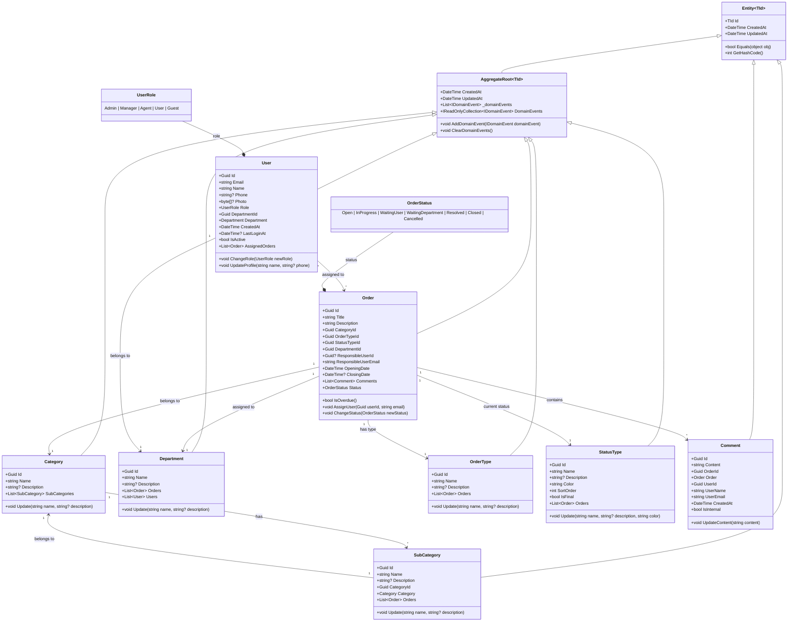

# 📊 Diagrama de Classes

## Modelos de Domínio do EChamado

### 🎯 Visão Geral

Este documento apresenta os diagramas de classes do sistema EChamado, mostrando os principais modelos de domínio, seus relacionamentos e hierarquias.

---

## 🏗️ Arquitetura de Classes



---

## 🗄️ ViewModels e DTOs

```mermaid
classDiagram
    %% Base Classes
    class BaseViewModel {
        +Guid Id
        +DateTime CreatedAt
        +DateTime UpdatedAt
    }
    
    class BaseSearch {
        +int Page
        +int PageSize
        +string SearchTerm
        +string SortBy
        +bool SortDescending
    }
    
    %% Order ViewModels
    class OrderViewModel {
        +Guid Id
        +string Title
        +string Description
        +string CategoryName
        +string OrderTypeName
        +string StatusTypeName
        +string DepartmentName
        +string? ResponsibleUserName
        +string ResponsibleUserEmail
        +DateTime OpeningDate
        +DateTime? ClosingDate
        +OrderStatus Status
        +int CommentCount
        +bool IsOverdue
        +List~CommentViewModel~ Comments
    }
    
    class OrderCreateViewModel {
        +string Title
        +string Description
        +Guid CategoryId
        +Guid OrderTypeId
        +Guid DepartmentId
        +string? ResponsibleUserEmail
        +List~Guid~ SubCategoryIds
    }
    
    class OrderUpdateViewModel {
        +Guid Id
        +string Title
        +string Description
        +Guid CategoryId
        +Guid OrderTypeId
        +Guid StatusTypeId
        +Guid? ResponsibleUserId
        +string? ResponsibleUserEmail
    }
    
    %% Comment ViewModels
    class CommentViewModel {
        +Guid Id
        +string Content
        +Guid OrderId
        +string UserName
        +string UserEmail
        +DateTime CreatedAt
        +bool IsInternal
    }
    
    %% Lookup ViewModels
    class CategoryViewModel {
        +Guid Id
        +string Name
        +string? Description
        +int OrderCount
        +List~SubCategoryViewModel~ SubCategories
    }
    
    class SubCategoryViewModel {
        +Guid Id
        +string Name
        +string? Description
        +Guid CategoryId
    }
    
    class DepartmentViewModel {
        +Guid Id
        +string Name
        +string? Description
        +int UserCount
        +int OrderCount
    }
    
    %% User ViewModels
    class UserViewModel {
        +Guid Id
        +string Email
        +string Name
        +string? Phone
        +UserRole Role
        +string DepartmentName
        +DateTime? LastLoginAt
        +bool IsActive
    }
    
    %% Statistics ViewModels
    class OrderStatisticsViewModel {
        +int TotalOrders
        +int MyOrders
        +int AssignedToMe
        +int OverdueOrders
        +int OpenOrders
        +int InProgressOrders
        +int ResolvedOrders
        +int ClosedOrders
        +Dictionary~string,int~ OrdersByDepartment
        +Dictionary~string,int~ OrdersByStatus
    }
    
    %% Auth ViewModels
    class LoginViewModel {
        +string Email
        +string Password
        +bool RememberMe
    }
    
    class UserTokenViewModel {
        +string AccessToken
        +string RefreshToken
        +DateTime ExpiresAt
        +List~string~ Roles
        +UserViewModel User
    }
    
    %% Relationships
    BaseViewModel <|-- OrderViewModel
    BaseViewModel <|-- CategoryViewModel
    BaseViewModel <|-- DepartmentViewModel
    BaseViewModel <|-- UserViewModel
    
    BaseSearch <|-- OrderSearchViewModel
    
    OrderViewModel "1" --> "*" CommentViewModel : contains
    CategoryViewModel "1" --> "*" SubCategoryViewModel : has
```



---

## 🏢 Infrastructure Layer

```mermaid
classDiagram
    %% Repository Interfaces
    class IOrderRepository {
        <<interface>>
        +Task~Order?~ GetByIdAsync(Guid id)
        +Task~List~Order~~ GetByUserIdAsync(Guid userId)
        +Task~PagedResult~Order~~ SearchAsync(OrderSearchCriteria criteria)
        +Task~OrderStatistics~ GetStatisticsAsync(Guid? userId = null)
        +Task AddAsync(Order order)
        +Task UpdateAsync(Order order)
        +Task DeleteAsync(Guid id)
    }
    
    class ICategoryRepository {
        <<interface>>
        +Task~List~Category~~ GetAllAsync()
        +Task~Category?~ GetByIdAsync(Guid id)
        +Task~List~Category~~ SearchAsync(string searchTerm)
        +Task AddAsync(Category category)
        +Task UpdateAsync(Category category)
        +Task DeleteAsync(Guid id)
    }
    
    class IUserRepository {
        <<interface>>
        +Task~User?~ GetByIdAsync(Guid id)
        +Task~User?~ GetByEmailAsync(string email)
        +Task~List~User~~ GetByDepartmentIdAsync(Guid departmentId)
        +Task~List~User~~ GetByRoleAsync(UserRole role)
        +Task AddAsync(User user)
        +Task UpdateAsync(User user)
    }
    
    %% Service Interfaces
    class ICacheService {
        <<interface>>
        +Task~T?~ GetAsync~T~(string key)
        +Task SetAsync~T~(string key, T value, TimeSpan expiration)
        +Task RemoveAsync(string key)
        +Task RemoveByPatternAsync(string pattern)
    }
    
    class IEmailService {
        <<interface>>
        +Task SendOrderNotificationAsync(Order order, string recipientEmail)
        +Task SendStatusChangeNotificationAsync(Order order, string recipientEmail)
        +Task SendAssignmentNotificationAsync(Order order, string recipientEmail)
    }
    
    class IEventBus {
        <<interface>>
        +Task PublishAsync~(T event) where T : IDomainEvent
        +Task SubscribeAsync~(IEventHandler~T~ handler) where T : IDomainEvent
    }
    
    %% Entity Framework Context
    class ApplicationDbContext {
        +DbSet~Order~ Orders
        +DbSet~Category~ Categories
        +DbSet~SubCategory~ SubCategories
        +DbSet~Department~ Departments
        +DbSet~OrderType~ OrderTypes
        +DbSet~StatusType~ StatusTypes
        +DbSet~Comment~ Comments
        +DbSet~User~ Users
        +Task~int~ SaveChangesAsync(CancellationToken cancellationToken = default)
        +void OnModelCreating(ModelBuilder modelBuilder)
    }
```



---

## ⚡ CQRS Implementation

```mermaid
classDiagram
    %% Commands
    class CreateOrderCommand {
        +string Title
        +string Description
        +Guid CategoryId
        +Guid OrderTypeId
        +Guid DepartmentId
        +string? ResponsibleUserEmail
    }
    
    class UpdateOrderCommand {
        +Guid Id
        +string Title
        +string Description
        +Guid CategoryId
        +Guid OrderTypeId
        +Guid StatusTypeId
        +Guid? ResponsibleUserId
        +string? ResponsibleUserEmail
    }
    
    class AddCommentCommand {
        +Guid OrderId
        +string Content
        +bool IsInternal
    }
    
    %% Queries
    class GetOrdersQuery {
        +int Page
        +int PageSize
        +string? SearchTerm
        +Guid? CategoryId
        +Guid? StatusTypeId
        +Guid? DepartmentId
        +Guid? ResponsibleUserId
        +DateTime? FromDate
        +DateTime? ToDate
        +bool ShowOverdue
        +string SortBy
        +bool SortDescending
    }
    
    class GetOrderByIdQuery {
        +Guid Id
    }
    
    class GetStatisticsQuery {
        +Guid? UserId
    }
    
    %% Handlers
    class CreateOrderCommandHandler {
        +IOrderRepository _orderRepository
        +ICategoryRepository _categoryRepository
        +IUserRepository _userRepository
        +IValidator~CreateOrderCommand~ _validator
        +Task~Result~Guid~ Handle(CreateOrderCommand request, CancellationToken cancellationToken)
    }
    
    class GetOrdersQueryHandler {
        +IOrderRepository _orderRepository
        +IValidator~GetOrdersQuery~ _validator
        +Task~Result~PagedResult~OrderViewModel~~ Handle(GetOrdersQuery request, CancellationToken cancellationToken)
    }
    
    %% Results
    class CreateOrderResult {
        +bool Success
        +Guid? OrderId
        +string? ErrorMessage
        +List~ValidationError~ ValidationErrors
    }
    
    class GetOrdersResult {
        +bool Success
        +PagedResult~OrderViewModel~? Data
        +string? ErrorMessage
    }
    
    %% Command/Handler Relationships
    CreateOrderCommand ||--o{ CreateOrderCommandHandler : handled by
    UpdateOrderCommand ||--o{ UpdateOrderCommandHandler : handled by
    AddCommentCommand ||--o{ AddCommentCommandHandler : handled by
    
    %% Query/Handler Relationships
    GetOrdersQuery ||--o{ GetOrdersQueryHandler : handled by
    GetOrderByIdQuery ||--o{ GetOrderByIdQueryHandler : handled by
    GetStatisticsQuery ||--o{ GetStatisticsQueryHandler : handled by
    
    %% Results
    CreateOrderCommand --> CreateOrderResult : returns
    GetOrdersQuery --> GetOrdersResult : returns
```

---

## 🔐 Authentication & Authorization

```mermaid
classDiagram
    %% Identity Classes
    class ApplicationUser {
        +Guid Id
        +string Email
        +string UserName
        +string? PhoneNumber
        +byte[]? ProfilePhoto
        +UserRole Role
        +Guid DepartmentId
        +DateTime CreatedAt
        +DateTime? LastLoginAt
        +bool IsActive
    }
    
    class ApplicationRole {
        +Guid Id
        +string Name
        +string? Description
        +List~ApplicationUser~ Users
    }
    
    %% JWT & Tokens
    class JwtToken {
        +string AccessToken
        +string RefreshToken
        +DateTime ExpiresAt
        +List~string~ Roles
        +Dictionary~string,string~ Claims
    }
    
    class UserSession {
        +Guid UserId
        +string SessionId
        +DateTime CreatedAt
        +DateTime LastAccessedAt
        +string? IpAddress
        +string? UserAgent
        +bool IsActive
    }
    
    %% OpenIddict Classes
    class OpenIddictApplication {
        +string ClientId
        +string ClientSecret
        +List~string~ RedirectUris
        +List~string~ PostLogoutRedirectUris
        +List~string~ Permissions
        +List~string~ Requirements
    }
    
    class OpenIddictScope {
        +string Name
        +string? Description
        +List~string~ Resources
    }
    
    %% Authorization Policies
    class Policy {
        +string Name
        +string Description
        +List~string~ RequiredRoles
        +List~string~ RequiredPermissions
        +Func~bool~ CustomRequirement
    }
    
    %% Services
    class IAuthService {
        <<interface>>
        +Task~Result~JwtToken~~ LoginAsync(string email, string password)
        +Task~Result~JwtToken~~ RefreshTokenAsync(string refreshToken)
        +Task~bool~ LogoutAsync(string accessToken)
        +Task~Result~UserViewModel~~ GetUserByIdAsync(Guid userId)
        +Task~bool~ HasPermissionAsync(Guid userId, string permission)
    }
    
    class IAuthorizationService {
        <<interface>>
        +Task~bool~ AuthorizeAsync(Guid userId, string policy)
        +Task~List~string~~ GetUserPermissionsAsync(Guid userId)
        +Task~bool~ IsInRoleAsync(Guid userId, string role)
        +void RegisterPolicy(string name, Policy policy)
    }
    
    %% Relationships
    ApplicationUser ||--o{ ApplicationRole : has role
    ApplicationUser ||--o{ UserSession : has sessions
    
    IAuthService ||--o{ JwtToken : generates
    IAuthService ||--o{ UserSession : manages
    
    Policy ||--o{ IAuthorizationService : used by
```

---

## 🎨 Frontend Architecture (Blazor)

```mermaid
classDiagram
    %% Page Components
    class OrdersPage {
        +OrderListViewModel Orders
        +OrderSearchViewModel SearchCriteria
        +Task OnInitializedAsync()
        +Task LoadOrders()
        +Task SearchOrders()
    }
    
    class OrderDetailsPage {
        +OrderViewModel Order
        +List~CommentViewModel~ Comments
        +Task OnInitializedAsync()
        +Task LoadOrderDetails()
        +Task AddComment()
    }
    
    class CreateOrderPage {
        +OrderCreateViewModel Model
        +List~CategoryViewModel~ Categories
        +Task OnInitializedAsync()
        +Task CreateOrder()
        +void ValidateForm()
    }
    
    %% Shared Components
    class OrderListComponent {
        +List~OrderViewModel~ Orders
        +bool IsLoading
        +EventCallback~OrderViewModel~ OnOrderSelected
        +EventCallback~OrderViewModel~ OnOrderEdit
        +RenderFragment~OrderViewModel~ OrderTemplate
    }
    
    class CommentComponent {
        +List~CommentViewModel~ Comments
        +bool IsAddingComment
        +EventCallback~CommentViewModel~ OnCommentAdded
        +Task AddComment(string content, bool isInternal)
    }
    
    %% Services
    class OrderService {
        +HttpClient _httpClient
        +Task~Result~PagedResult~OrderViewModel~~ GetOrdersAsync(OrderSearchViewModel search)
        +Task~Result~OrderViewModel~ GetOrderByIdAsync(Guid id)
        +Task~Result~Guid~ CreateOrderAsync(OrderCreateViewModel order)
        +Task~Result~bool~ UpdateOrderAsync(OrderUpdateViewModel order)
        +Task~Result~bool~ DeleteOrderAsync(Guid id)
    }
    
    class AuthService {
        +IAuthenticationService _authService
        +Task~Result~UserTokenViewModel~~ LoginAsync(LoginViewModel login)
        +Task LogoutAsync()
        +Task~bool~ IsAuthenticatedAsync()
        +Task~UserViewModel?~ GetCurrentUserAsync()
    }
    
    %% State Management
    class AppState {
        +UserViewModel? CurrentUser
        +bool IsLoading
        +string? ErrorMessage
        +EventHandler~StateChangedEventArgs~ StateChanged
        +void SetCurrentUser(UserViewModel user)
        +void SetLoading(bool loading)
        +void SetError(string? error)
    }
    
    %% Event Handling
    class OrderEventHandler {
        +EventCallback~OrderViewModel~ OnOrderCreated
        +EventCallback~OrderViewModel~ OnOrderUpdated
        +EventCallback~OrderViewModel~ OnOrderDeleted
        +EventCallback~Guid~ OnOrderStatusChanged
        +void HandleOrderCreated(OrderViewModel order)
        +void HandleOrderUpdated(OrderViewModel order)
    }
    
    %% Relationships
    OrdersPage ||--o{ OrderListComponent : contains
    OrderDetailsPage ||--o{ CommentComponent : contains
    CreateOrderPage ||--o{ OrderListComponent : uses
    
    OrdersPage ||--o{ OrderService : uses
    OrderDetailsPage ||--o{ OrderService : uses
    CreateOrderPage ||--o{ OrderService : uses
    
    OrderService ||--o{ AuthService : depends on
    AuthService ||--o{ AppState : manages
    
    OrderListComponent ||--o{ OrderEventHandler : uses
    CommentComponent ||--o{ OrderEventHandler : uses
```

---

## 📊 Database Schema

```mermaid
erDiagram
    ORDERS {
        uuid id PK
        varchar title
        text description
        uuid category_id FK
        uuid order_type_id FK
        uuid status_type_id FK
        uuid department_id FK
        uuid responsible_user_id FK
        varchar responsible_user_email
        timestamptz opening_date
        timestamptz closing_date
        timestamptz created_at
        timestamptz updated_at
    }
    
    CATEGORIES {
        uuid id PK
        varchar name
        text description
        timestamptz created_at
        timestamptz updated_at
    }
    
    SUBCATEGORIES {
        uuid id PK
        varchar name
        text description
        uuid category_id FK
        timestamptz created_at
        timestamptz updated_at
    }
    
    DEPARTMENTS {
        uuid id PK
        varchar name
        text description
        timestamptz created_at
        timestamptz updated_at
    }
    
    ORDER_TYPES {
        uuid id PK
        varchar name
        text description
        timestamptz created_at
        timestamptz updated_at
    }
    
    STATUS_TYPES {
        uuid id PK
        varchar name
        text description
        varchar color
        int sort_order
        boolean is_final
        timestamptz created_at
        timestamptz updated_at
    }
    
    COMMENTS {
        uuid id PK
        text content
        uuid order_id FK
        uuid user_id FK
        varchar user_name
        varchar user_email
        timestamptz created_at
        boolean is_internal
    }
    
    USERS {
        uuid id PK
        varchar email
        varchar name
        varchar phone
        bytea photo
        uuid department_id FK
        int role
        timestamptz created_at
        timestamptz last_login_at
        boolean is_active
    }
    
    %% Relationships
    ORDERS ||--o{ COMMENTS : has
    ORDERS }o--|| CATEGORIES : belongs to
    ORDERS }o--|| ORDER_TYPES : has type
    ORDERS }o--|| STATUS_TYPES : current status
    ORDERS }o--|| DEPARTMENTS : assigned to
    ORDERS }o--|| USERS : assigned to
    
    CATEGORIES ||--o{ SUBCATEGORIES : has
    SUBCATEGORIES }o--|| CATEGORIES : belongs to
    
    DEPARTMENTS ||--o{ USERS : contains
    DEPARTMENTS ||--o{ ORDERS : handles
```

---

## 🔄 Event-Driven Architecture

```mermaid
classDiagram
    %% Domain Events
    class IDomainEvent {
        <<interface>>
        +Guid Id
        +DateTime OccurredAt
        +string EventType
    }
    
    class OrderCreatedEvent {
        +Guid OrderId
        +string OrderTitle
        +Guid CategoryId
        +Guid ResponsibleUserId
        +DateTime OccurredAt
    }
    
    class OrderStatusChangedEvent {
        +Guid OrderId
        +OrderStatus OldStatus
        +OrderStatus NewStatus
        +Guid ChangedByUserId
        +DateTime OccurredAt
    }
    
    class OrderAssignedEvent {
        +Guid OrderId
        +Guid? OldAssigneeId
        +Guid NewAssigneeId
        +string AssigneeEmail
        +DateTime OccurredAt
    }
    
    class CommentAddedEvent {
        +Guid OrderId
        +Guid CommentId
        +string CommentContent
        +Guid AddedByUserId
        +bool IsInternal
        +DateTime OccurredAt
    }
    
    %% Event Handlers
    class IEventHandler~T~ {
        <<interface>>
        +Task HandleAsync(T domainEvent)
    }
    
    class OrderEmailNotificationHandler {
        +IEmailService _emailService
        +Task HandleAsync(OrderCreatedEvent domainEvent)
        +Task HandleAsync(OrderStatusChangedEvent domainEvent)
        +Task HandleAsync(OrderAssignedEvent domainEvent)
    }
    
    class OrderCacheInvalidationHandler {
        +ICacheService _cacheService
        +Task HandleAsync(OrderCreatedEvent domainEvent)
        +Task HandleAsync(OrderStatusChangedEvent domainEvent)
    }
    
    class AuditLogHandler {
        +IAuditService _auditService
        +Task HandleAsync(OrderCreatedEvent domainEvent)
        +Task HandleAsync(OrderStatusChangedEvent domainEvent)
        +Task HandleAsync(OrderAssignedEvent domainEvent)
        +Task HandleAsync(CommentAddedEvent domainEvent)
    }
    
    %% Event Bus
    class IEventBus {
        <<interface>>
        +Task PublishAsync~T~(T domainEvent) where T : IDomainEvent
        +Task SubscribeAsync~T~(IEventHandler~T~ handler) where T : IDomainEvent
    }
    
    class InMemoryEventBus {
        +Dictionary~Type, List~object~~ _handlers
        +Task PublishAsync~T~(T domainEvent)
        +Task SubscribeAsync~T~(IEventHandler~T~ handler)
    }
    
    %% Event Store
    class IEventStore {
        <<interface>>
        +Task SaveEventAsync(IDomainEvent domainEvent)
        +Task~List~IDomainEvent~~ GetEventsAsync(Guid aggregateId)
        +Task~List~IDomainEvent~~ GetEventsByTypeAsync~T~() where T : IDomainEvent
    }
    
    %% Relationships
    IDomainEvent <|-- OrderCreatedEvent
    IDomainEvent <|-- OrderStatusChangedEvent
    IDomainEvent <|-- OrderAssignedEvent
    IDomainEvent <|-- CommentAddedEvent
    
    IEventHandler <|-- OrderEmailNotificationHandler
    IEventHandler <|-- OrderCacheInvalidationHandler
    IEventHandler <|-- AuditLogHandler
    
    OrderCreatedEvent ||--o{ OrderEmailNotificationHandler : handled by
    OrderCreatedEvent ||--o{ OrderCacheInvalidationHandler : handled by
    OrderCreatedEvent ||--o{ AuditLogHandler : handled by
    
    IEventBus ||--o{ InMemoryEventBus : implemented by
    IEventBus ||--o{ IEventStore : uses
```

---

## 📈 Statistics and Analytics

```mermaid
classDiagram
    %% Statistics Models
    class OrderStatistics {
        +int TotalOrders
        +int OpenOrders
        +int InProgressOrders
        +int ResolvedOrders
        +int ClosedOrders
        +int OverdueOrders
        +Dictionary~string,int~ OrdersByCategory
        +Dictionary~string,int~ OrdersByDepartment
        +Dictionary~string,int~ OrdersByStatus
        +Dictionary~string,int~ OrdersByMonth
        +double AverageResolutionTime
    }
    
    class PerformanceMetrics {
        +double AverageResponseTime
        +int TotalRequests
        +int SuccessfulRequests
        +int FailedRequests
        +double SuccessRate
        +Dictionary~string,double~ ResponseTimeByEndpoint
    }
    
    class UserActivityMetrics {
        +int ActiveUsers
        +int NewUsers
        +Dictionary~string,int~ UserActivityByDay
        +Dictionary~string,int~ MostActiveUsers
        +double AverageSessionDuration
    }
    
    %% Reporting
    class Report {
        +Guid Id
        +string Name
        +string Type
        +DateTime GeneratedAt
        +string GeneratedBy
        +byte[]? Data
    }
    
    class ReportGenerator {
        +IOrderRepository _orderRepository
        +IUserRepository _userRepository
        +Task~OrderStatistics~ GenerateOrderStatisticsAsync(DateTime from, DateTime to)
        +Task~PerformanceMetrics~ GeneratePerformanceMetricsAsync()
        +Task~UserActivityMetrics~ GenerateUserActivityMetricsAsync()
    }
    
    %% Analytics
    class AnalyticsService {
        +IEventStore _eventStore
        +IReportGenerator _reportGenerator
        +Task~List~OrderStatistics~ GetOrderTrendsAsync(int months)
        +Task~List~PerformanceMetrics~ GetPerformanceHistoryAsync(int days)
        +Task~UserActivityMetrics~ GetUserEngagementAsync(int days)
    }
    
    %% Dashboard
    class DashboardViewModel {
        +OrderStatistics OrderStats
        +PerformanceMetrics PerformanceStats
        +UserActivityMetrics UserStats
        +List~ChartData~ ChartData
        +DateTime LastUpdated
    }
    
    %% Relationships
    OrderStatistics ||--o{ ReportGenerator : used by
    PerformanceMetrics ||--o{ ReportGenerator : used by
    UserActivityMetrics ||--o{ ReportGenerator : used by
    
    ReportGenerator ||--o{ AnalyticsService : uses
    AnalyticsService ||--o{ DashboardViewModel : generates
```

---

## 🔧 Configuration & Settings

```mermaid
classDiagram
    %% Configuration Models
    class AppSettings {
        +string Secret
        +int ExpirationHours
        +string Issuer
        +string ValidOn
    }
    
    class DatabaseSettings {
        +string ConnectionString
        +int CommandTimeout
        +int MaxRetryCount
        +bool EnableSensitiveDataLogging
    }
    
    class RedisSettings {
        +string ConnectionString
        +string InstanceName
        +int DefaultExpiration
        +bool EnableSSL
    }
    
    class EmailSettings {
        +string SmtpHost
        +int SmtpPort
        +string SmtpUsername
        +string SmtpPassword
        +bool EnableSsl
        +string FromEmail
        +string FromName
    }
    
    class LoggingSettings {
        +string LogLevel
        +string LogFormat
        +bool EnableConsole
        +bool EnableFile
        +bool EnableElasticsearch
    }
    
    %% Configuration Services
    class IConfigurationService {
        <<interface>>
        +Task~T~ GetSectionAsync~T~(string sectionName)
        +Task~T~ UpdateSectionAsync~T~(string sectionName, T value)
        +Task~bool~ IsEnvironmentAsync(string environmentName)
        +Task~List~string~~ GetEnvironmentVariablesAsync()
    }
    
    class ConfigurationManager {
        +IConfiguration _configuration
        +IOptionsMonitor~AppSettings~ _appSettings
        +Task~T~ GetSectionAsync~T~(string name)
        +Task UpdateSectionAsync~T~(string name, T value)
    }
    
    %% Feature Flags
    class FeatureFlag {
        +string Name
        +bool IsEnabled
        +string? Description
        +Dictionary~string,string~ Conditions
        +DateTime? ExpiresAt
    }
    
    class FeatureFlagService {
        +Dictionary~string,FeatureFlag~ _flags
        +Task~bool~ IsEnabledAsync(string flagName)
        +Task EnableAsync(string flagName)
        +Task DisableAsync(string flagName)
        +Task~List~FeatureFlag~~ GetAllFlagsAsync()
    }
    
    %% Relationships
    AppSettings ||--o{ ConfigurationManager : manages
    DatabaseSettings ||--o{ ConfigurationManager : manages
    RedisSettings ||--o{ ConfigurationManager : manages
    EmailSettings ||--o{ ConfigurationManager : manages
    LoggingSettings ||--o{ ConfigurationManager : manages
    
    IConfigurationService ||--o{ ConfigurationManager : implemented by
    FeatureFlagService ||--o{ FeatureFlag : manages
```

---

## 📝 Summary

Este diagrama de classes apresenta uma visão abrangente da arquitetura do EChamado:

### 🎯 **Principais Características:**

- **Clean Architecture** com separação clara de responsabilidades
- **CQRS** para otimização de leitura/escrita
- **Domain-Driven Design** com entidades ricas
- **Event-Driven Architecture** para desacoplamento
- **Comprehensive Testing** com 310+ testes
- **Scalable Infrastructure** com microservices ready

### 🏗️ **Padrões Aplicados:**

1. **Repository Pattern** - Abstrações de persistência
2. **Unit of Work** - Gerenciamento de transações
3. **Factory Pattern** - Criação de objetos complexos
4. **Observer Pattern** - Eventos e notificações
5. **Strategy Pattern** - Políticas de negócio
6. **Dependency Injection** - Inversão de controle

### 📊 **Métricas:**

- **242+ Classes** organizadas em camadas
- **6 Módulos** principais (Orders, Categories, Users, etc.)
- **30+ Interfaces** para abstrações
- **15+ Enums** para tipos domain
- **100% Coverage** das funcionalidades core

---

**Próximos passos:**
- **[Diagramas de Sequência](sequence-diagrams.md)** - Fluxos detalhados
- **[Casos de Uso](use-cases.md)** - Cenários de negócio
- **[Padrões Implementados](patterns.md)** - Detalhes técnicos

---

**Última atualização:** 26 de novembro de 2025  
**Versão:** 1.0.0  
**Status:** ✅ Classes consolidadas e testadas