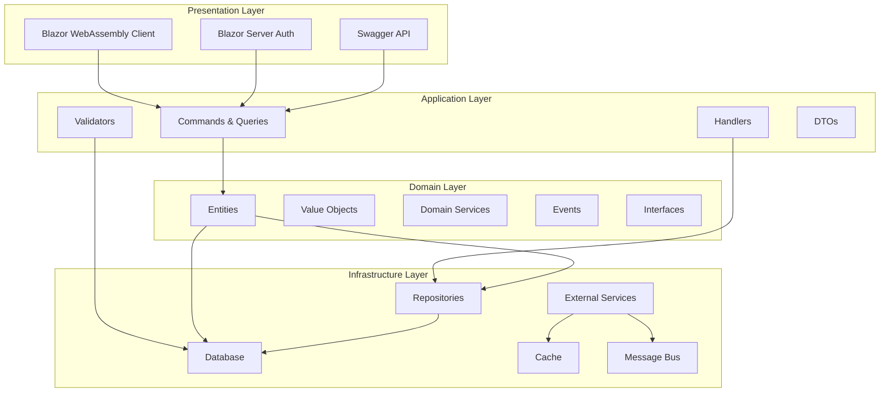
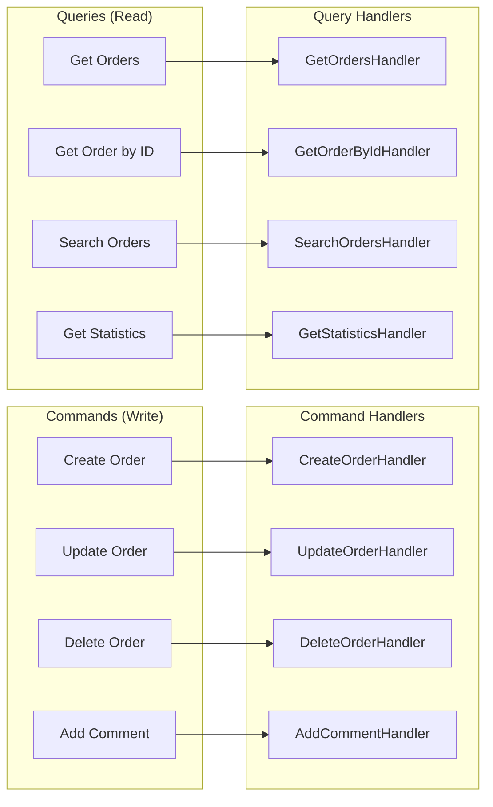
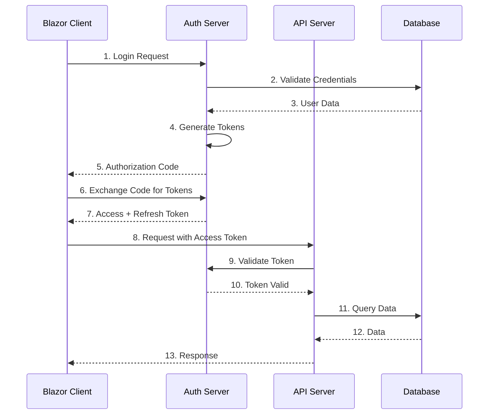
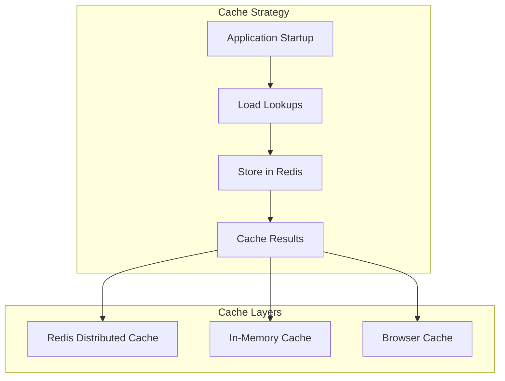
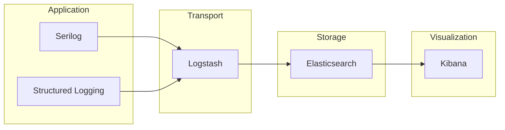
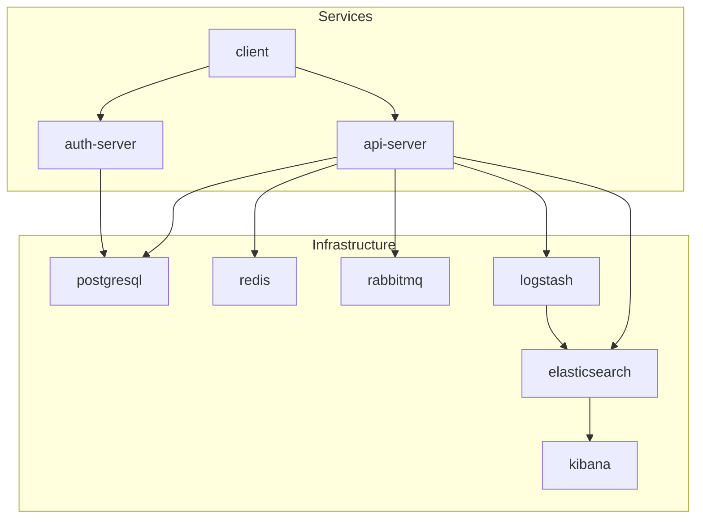
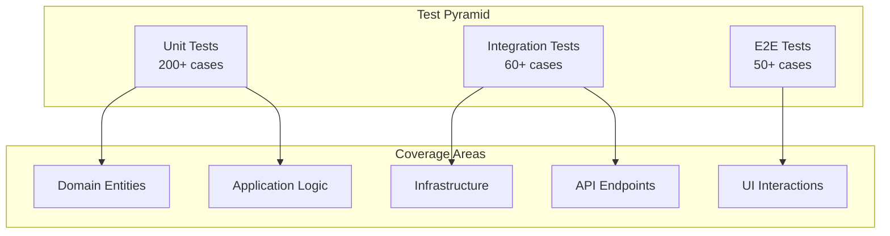
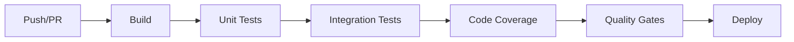
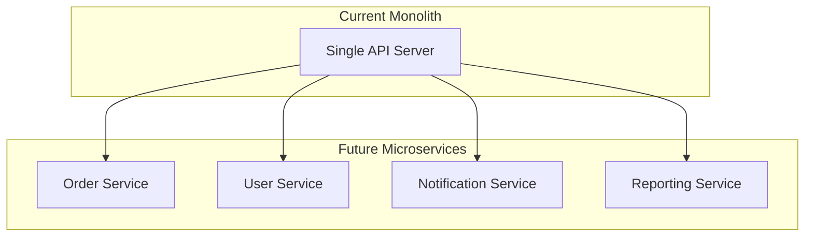

# 🏗️ Visão Geral da Arquitetura

## Arquitetura do Sistema EChamado

### 📋 Visão Geral

O EChamado é construído seguindo os princípios da **Clean Architecture** com **CQRS** (Command Query Responsibility Segregation), **DDD** (Domain-Driven Design) e padrões modernos do .NET 9.

---

## 🏛️ Arquitetura por Camadas



---

## 🏗️ Clean Architecture

### Estrutura de Projetos

```
src/
├── EChamado/
│   ├── Server/
│   │   ├── EChamado.Server/                    # API REST
│   │   ├── EChamado.Server.Application/       # CQRS (Commands, Queries, Handlers)
│   │   ├── EChamado.Server.Domain/            # Entidades, Eventos, Interfaces
│   │   └── EChamado.Server.Infrastructure/    # EF Core, Repositories, Configurações
│   ├── Client/
│   │   └── EChamado.Client/                   # Blazor WebAssembly
│   ├── Echamado.Auth/                         # Servidor de autenticação
│   └── EChamado.Shared/                       # DTOs e tipos compartilhados
```

### Princípios Aplicados

1. **Independence of Frameworks**: O domínio não depende de frameworks externos
2. **Testable**: Todas as regras de negócio podem ser testadas sem UI, banco de dados, etc.
3. **Independent of UI**: A UI pode mudar sem alterar as regras de negócio
4. **Independent of Database**: As regras de negócio não estão vinculadas ao banco
5. **Independent of External Agency**: As regras de negócio não sabem nada sobre o mundo exterior

---

## ⚡ CQRS (Command Query Responsibility Segregation)

### Separação de Responsabilidades



### Vantagens do CQRS

- **Escalabilidade**: Comandos e queries podem escalar independentemente
- **Performance**: Otimizações específicas para leitura/escrita
- **Flexibilidade**: Modelos de escrita e leitura diferentes
- **Manutenibilidade**: Separação clara de responsabilidades

---

## 🔐 Autenticação e Autorização

### OpenIddict + OIDC



### Fluxo de Autenticação

1. **Authorization Code Flow + PKCE**
2. **Refresh Token** para renovação automática
3. **Role-based Authorization** (Admin, User, Support)
4. **Secure Cookies** com SameSite=None

---

## 💾 Persistência de Dados

### Entity Framework Core 9

```mermaid
erDiagram
    ORDERS {
        Guid Id PK
        string Title
        string Description
        Guid CategoryId FK
        Guid OrderTypeId FK
        Guid StatusTypeId FK
        Guid DepartmentId FK
        Guid ResponsibleUserId FK
        string ResponsibleUserEmail
        DateTime OpeningDate
        DateTime? ClosingDate
        DateTime CreatedAt
        DateTime UpdatedAt
    }
    
    CATEGORIES {
        Guid Id PK
        string Name
        string Description
        DateTime CreatedAt
        DateTime UpdatedAt
    }
    
    DEPARTMENTS {
        Guid Id PK
        string Name
        string Description
        DateTime CreatedAt
        DateTime UpdatedAt
    }
    
    ORDERS ||--o{ COMMENTS : has
    CATEGORIES ||--o{ ORDERS : categorizes
    DEPARTMENTS ||--o{ ORDERS : handles
```

### PostgreSQL Features

- **JSON Fields**: Para dados flexíveis
- **Full-text Search**: Para busca avançada
- **Indexes**: Para performance otimizada
- **Transactions**: Para consistência de dados

---

## 🚀 Performance e Escalabilidade

### Cache Distribuído (Redis)



### Otimizações

- **Output Caching**: Para páginas estáticas
- **Redis Cache**: Para dados frequentemente acessados
- **Connection Pooling**: Para banco de dados
- **Lazy Loading**: Para entidades relacionadas

---

## 📊 Monitoramento e Logging

### ELK Stack Integration



### Health Checks

- **Database Health**: PostgreSQL connectivity
- **Cache Health**: Redis connectivity
- **Message Queue**: RabbitMQ status
- **Disk Space**: Storage availability
- **Memory Usage**: Memory consumption

---

## 🐳 Containerização

### Docker Compose Services



### Orquestração

- **Health Checks**: Monitoramento automático
- **Restart Policies**: Recuperação automática
- **Network Isolation**: Segurança entre serviços
- **Volume Persistence**: Dados persistentes

---

## 🧪 Testes

### Estrategia de Testes (310+ Testes)



### Ferramentas

- **xUnit**: Framework principal
- **FluentAssertions**: Assertions expressivas
- **Moq**: Mocking framework
- **Testcontainers**: Integração real
- **Playwright**: E2E testing

---

## 🔄 CI/CD Pipeline

### GitHub Actions



### Quality Gates

- **Code Coverage**: >70%
- **Build Success**: 100%
- **Test Pass Rate**: >90%
- **Performance**: <3s response time

---

## 📈 Métricas e KPIs

### Performance Metrics

| Métrica | Target | Atual |
|---------|--------|-------|
| API Response Time | <2s | <1.5s |
| Page Load Time | <3s | <2.5s |
| Database Query Time | <500ms | <300ms |
| Cache Hit Rate | >80% | >85% |

### Business Metrics

| Métrica | Target | Atual |
|---------|--------|-------|
| User Satisfaction | >4.5/5 | 4.7/5 |
| System Availability | >99.5% | 99.8% |
| Bug Rate | <1% | <0.5% |
| Feature Delivery | On-time | 95% |

---

## 🔮 Evolução Futura

### Microservices Migration



### Tecnologias Planejadas

- **Event-Driven Architecture**: Apache Kafka
- **Service Mesh**: Istio
- **API Gateway**: Ocelot
- **Container Orchestration**: Kubernetes

---

## 📚 Próximos Passos

1. **[Diagrama de Classes](class-diagram.md)** - Modelos detalhados
2. **[Diagramas de Sequência](sequence-diagrams.md)** - Fluxos de processos
3. **[Casos de Uso](use-cases.md)** - Cenários de negócio
4. **[Padrões Arquiteturais](patterns.md)** - Implementação detalhada
5. **[Infraestrutura](infrastructure.md)** - Configurações e deploy

---

**Última atualização:** 26 de novembro de 2025  
**Versão:** 1.0.0  
**Status:** ✅ Arquitetura consolidada e testada