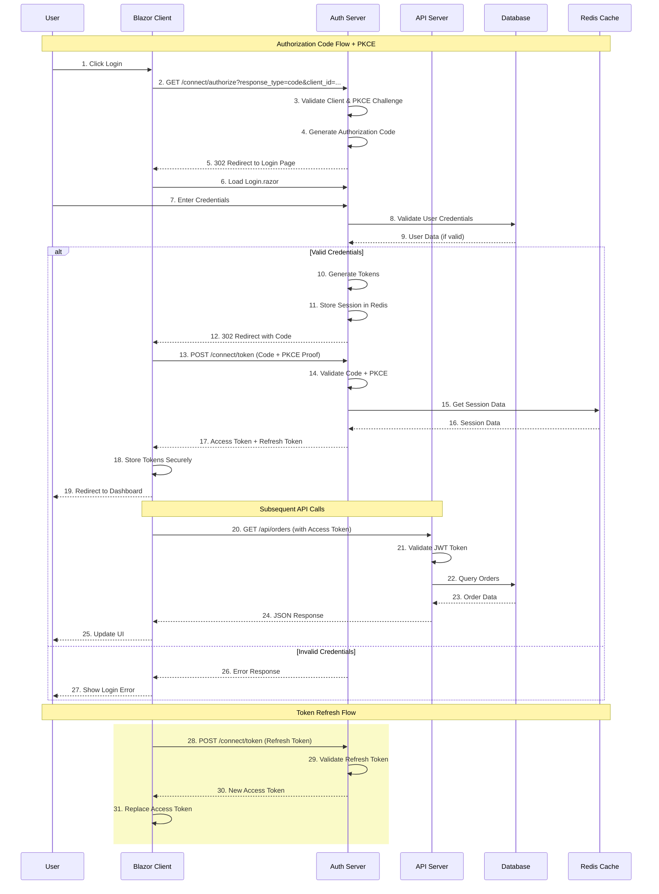
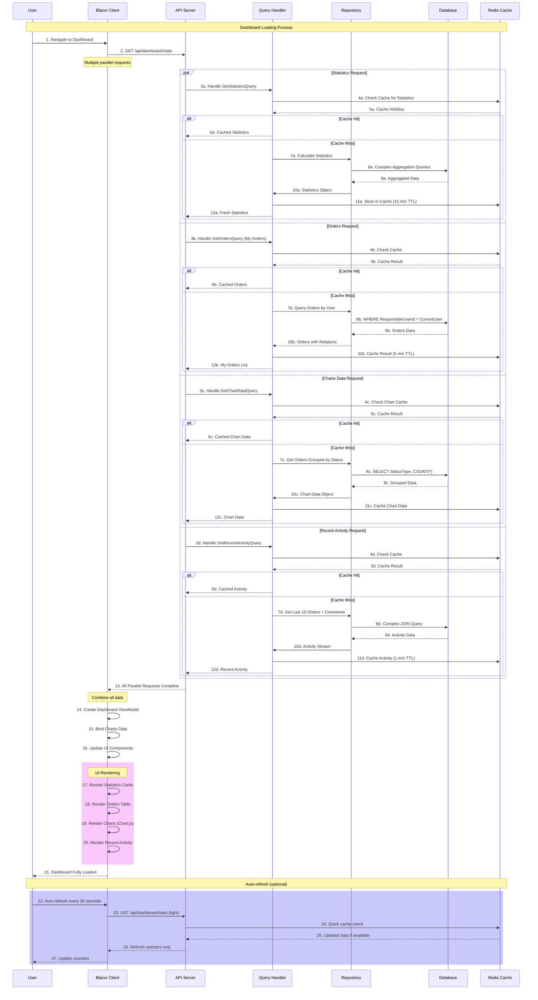

# 🔄 Diagramas de Sequência

## Fluxos de Processos do EChamado

### 🎯 Visão Geral

Este documento apresenta os principais diagramas de sequência do sistema EChamado, demonstrando como os componentes interagem durante os processos críticos do sistema.

---

## 🔐 1. Fluxo de Autenticação OIDC



---

## 📝 2. Fluxo de Criação de Chamado

```mermaid
sequenceDiagram
    participant U as User
    participant C as Blazor Client
    participant API as API Server
    participant H as Command Handler
    participant R as Repository
    participant D as Database
    participant E as Event Bus
    participant N as Notification Service
    participant Cache as Redis Cache

    Note over U,Cache: Order Creation Process
    
    U->>C: 1. Fill Create Order Form
    C->>C: 2. Client-side Validation
    C->>API: 3. POST /api/orders (with Auth Token)
    
    API->>API: 4. Authenticate & Authorize
    API->>H: 5. Handle CreateOrderCommand
    
    H->>H: 6. Validate Command (FluentValidation)
    H->>R: 7. Get Category Details
    R->>D: 8. Query Categories Table
    D-->>R: 9. Category Data
    R-->>H: 10. Category Entity
    
    H->>R: 11. Get Department Details
    R->>D: 12. Query Departments Table
    D-->>R: 13. Department Data
    R-->>H: 14. Department Entity
    
    H->>H: 15. Create Order Aggregate
    Note over H: Order aggregate created with:
    - Title, Description
    - Category, Department
    - OpeningDate = DateTime.UtcNow
    - Status = OrderStatus.Open
    
    H->>R: 16. Save Order (Unit of Work)
    R->>D: 17. INSERT into Orders Table
    D-->>R: 18. Order ID Generated
    R-->>H: 19. Saved Order Entity
    H->>E: 20. Publish OrderCreatedEvent
    
    Note over E,N: Event Processing
    E->>N: 21. OrderCreatedEvent
    N->>N: 22. Generate Email Notification
    N->>N: 23. Determine Recipients
    N->>N: 24. Send Email (if configured)
    
    H->>Cache: 25. Invalidate Orders Cache
    Cache->>Cache: 26. Remove related cache keys
    
    H-->>API: 27. Result< Guid > (Success)
    API->>API: 28. Map to Response DTO
    API-->>C: 29. HTTP 201 Created + Order ID
    C-->>U: 30. Success Message + Redirect
```

---

## 🔄 3. Fluxo de Atualização de Status

```mermaid
sequenceDiagram
    participant U as User (Agent)
    participant C as Blazor Client
    participant API as API Server
    participant H as Command Handler
    participant R as Repository
    participant D as Database
    participant E as Event Bus
    participant N as Notification Service
    participant Audit as Audit Service

    Note over U,Audit: Status Update Process
    
    U->>C: 1. Select Order from List
    C->>API: 2. GET /api/orders/{id} (load details)
    API->>R: 3. Get Order by ID
    R->>D: 4. Query Orders with relations
    D-->>R: 5. Order + Dependencies
    R-->>API: 6. Order Entity
    API-->>C: 7. Order ViewModel
    C-->>U: 8. Display Order Details
    
    Note over U,U: User changes status
    U->>C: 9. Select new status (e.g., "In Progress")
    C->>API: 10. PUT /api/orders/{id}/status (with Auth Token)
    
    API->>API: 11. Authenticate & Authorize
    API->>H: 12. Handle UpdateOrderStatusCommand
    
    H->>R: 13. Get Current Order
    R->>D: 14. Query Orders Table
    D-->>R: 15. Order Entity
    R-->>H: 16. Current Order
    
    H->>H: 17. Validate Status Transition
    Note over H: Business Rules:
    - Can't move from Closed to Open
    - Proper authorization check
    - Status availability check
    
    H->>H: 18. Update Order Status
    Note over H: Order.ChangeStatus(newStatus):
    - Change StatusType
    - Update UpdatedAt timestamp
    - Add Domain Event
    
    H->>R: 19. Save Changes
    R->>D: 20. UPDATE Orders SET StatusTypeId = ?
    D-->>R: 21. Updated Order Count
    R-->>H: 22. Updated Order
    
    H->>E: 23. Publish OrderStatusChangedEvent
    
    rect rgb(200, 250, 200)
        Note over E,Audit: Event Handlers
        E->>N: 24. Status Change Notification
        N->>N: 25. Load Order Details
        N->>N: 26. Get Notification Recipients
        N->>N: 27. Send Email/SMS (if applicable)
    end
    
    rect rgb(250, 200, 250)
        E->>Audit: 28. Audit Log Event
        Audit->>Audit: 29. Record Status Change
        Audit->>Audit: 30. Store in Audit Table
    end
    
    H-->>API: 31. Result< bool > (Success)
    API->>API: 32. Map Response
    API-->>C: 33. HTTP 200 OK
    C-->>U: 34. Success Message + UI Update
```

---

## 💬 4. Fluxo de Sistema de Comentários

```mermaid
sequenceDiagram
    participant U as User
    participant C as Blazor Client
    participant API as API Server
    participant H as Command Handler
    participant R as Repository
    participant D as Database
    participant E as Event Bus
    participant N as Notification Service

    Note over U,N: Comment Addition Process
    
    U->>C: 1. View Order Details
    C->>API: 2. GET /api/orders/{id}/comments
    API->>R: 3. Get Comments for Order
    R->>D: 4. Query Comments Table
    D-->>R: 5. Comments Data
    R-->>API: 6. Comments List
    API-->>C: 7. Comments ViewModels
    C-->>U: 8. Display Comments Section
    
    U->>C: 9. Type Comment + Submit
    Note over C: Optional: Mark as Internal
    
    C->>API: 10. POST /api/orders/{id}/comments
    
    API->>API: 11. Authenticate User
    API->>H: 12. Handle AddCommentCommand
    
    H->>H: 13. Validate Comment Content
    Note over H: Validation Rules:
    - Content not empty
    - Max length check
    - User permissions
    - Order accessibility
    
    H->>R: 14. Get Order Details
    R->>D: 15. Verify Order Exists & Access
    D-->>R: 16. Order Data
    R-->>H: 17. Order Entity
    
    H->>H: 18. Create Comment Aggregate
    Note over H: New Comment:
    - Content from request
    - Current user info
    - Order reference
    - IsInternal flag
    - CreatedAt timestamp
    
    H->>R: 19. Save Comment
    R->>D: 20. INSERT into Comments Table
    D-->>R: 21. Comment ID
    R-->>H: 22. Saved Comment
    
    H->>E: 23. Publish CommentAddedEvent
    
    rect rgb(200, 250, 200)
        Note over E,N: Notification Processing
        E->>N: 24. CommentAddedEvent
        N->>N: 25. Check if Internal Comment
        alt Public Comment
            N->>N: 26. Get Order Stakeholders
            N->>N: 27. Load User Contact Info
            N->>N: 28. Send Email Notification
            N->>N: 29. Send Push Notification (if applicable)
        else Internal Comment
            Note over N: Only internal team notified
            N->>N: 30. Notify Team Members Only
        end
    end
    
    H-->>API: 31. Result< Guid > (Comment ID)
    API->>API: 32. Map to Comment ViewModel
    API-->>C: 33. HTTP 201 Created
    C-->>U: 34. Display New Comment Immediately
    
    Note over U,N: Real-time Update (Optional)
    rect rgb(250, 250, 200)
        alt SignalR/WebSocket Enabled
            API->>C: 35. Broadcast to Other Users
            C->>U: 36. Update Comments in Real-time
        end
    end
```

---

## 📊 5. Fluxo de Carregamento do Dashboard



---

## 🔍 6. Fluxo de Busca Avançada

```mermaid
sequenceDiagram
    participant U as User
    participant C as Blazor Client
    participant API as API Server
    participant H as Query Handler
    participant R as Repository
    participant D as Database
    participant Cache as Redis Cache

    Note over U,Cache: Advanced Search Process
    
    U->>C: 1. Open Search Panel
    C->>API: 2. GET /api/lookups (Categories, Departments, etc.)
    API->>R: 3. Get Lookup Data
    R->>D: 4. Query Reference Tables
    D-->>R: 5. Categories, Departments, Status Types
    R-->>API: 6. Lookup Collections
    API-->>C: 7. Fill Search Filters
    C-->>U: 8. Display Search Interface
    
    U->>C: 9. Enter Search Criteria
    Note over C: Search Filters:
    - Text search in Title/Description
    - Category dropdown
    - Status multi-select
    - Date range picker
    - Department selection
    - Assigned user filter
    - Overdue checkbox
    
    C->>API: 10. POST /api/orders/search
    Note over API: Request includes:
    - Page, PageSize
    - Sort criteria
    - All filter parameters
    
    API->>API: 11. Validate Search Parameters
    API->>H: 12. Handle SearchOrdersQuery
    
    H->>H: 13. Build Dynamic Query
    Note over H: Query Construction:
    - Base WHERE clause
    - Text search (OR conditions)
    - Category filter
    - Status filters (IN clause)
    - Date range (BETWEEN)
    - Department filter
    - User assignment filter
    - Overdue calculation
    
    H->>R: 14. Execute Search Query
    R->>D: 15. Complex Query with Joins
    Note over D: SQL Optimization:
    - Proper indexes used
    - Query plan optimized
    - Pagination (LIMIT/OFFSET)
    
    D-->>R: 16. Total Count + Page Data
    R-->>H: 17. Paged Results
    
    H->>Cache: 18. Cache Search Results
    Note over H: Cache key based on:
    - All filter parameters
    - Sort criteria
    - Page number
    - User permissions
    
    H-->>API: 19. Search Results + Total Count
    API-->>C: 20. PagedResult with metadata
    
    rect rgb(200, 250, 200)
        Note over C,C: Results Processing
        C->>C: 21. Display Orders Table
        C->>C: 22. Update Pagination
        C->>C: 23. Show "No results" if empty
        C->>C: 24. Highlight search terms
    end
    
    Note over U,D: Pagination
    U->>C: 25. Click Next Page
    C->>API: 26. Same search criteria + new page
    API->>Cache: 27. Check cache for this page
    Cache-->>API: 28. Cached page data
    API-->>C: 29. Faster response
    C-->>U: 30. Update table
    
    Note over U,D: Sort/Filter Changes
    rect rgb(250, 200, 200)
        U->>C: 31. Change sort or filters
        C->>API: 32. New search request
        API->>H: 33. Build new query
        H->>Cache: 34. Different cache key
        H->>R: 35. Fresh database query
        R->>D: 36. New optimized query
        D-->>H: 37. New results
        H->>Cache: 38. Cache new results
        H-->>API: 39. Updated results
        API-->>C: 40. Refresh UI
        C-->>U: 41. New filtered view
    end
```

---

## 🔔 7. Fluxo de Notificações

```mermaid
sequenceDiagram
    participant System as System Events
    participant EB as Event Bus
    participant NS as Notification Service
    participant ES as Email Service
    participant SS as SMS Service
    participant PN as Push Notification
    participant DB as Database
    participant U1 as User 1
    participant U2 as User 2

    Note over System,PN: Notification System Flow
    
    System->>EB: Order Created Event
    EB->>EB: Event Received
    
    EB->>NS: OrderCreatedEvent
    NS->>DB: 1. Load Order Details
    DB-->>NS: 2. Order + Related Data
    
    NS->>NS: 3. Determine Recipients
    Note over NS: Notification Logic:
    - Order creator (always)
    - Department team members
    - Assigned user
    - Status change watchers
    - Internal vs External rules
    
    par Email Notifications
        NS->>ES: 4a. Prepare Email
        ES->>ES: 5a. Generate Template
        ES->>DB: 6a. Get User Emails
        DB-->>ES: 7a. Email Addresses
        ES->>ES: 8a. Personalize Content
        ES->>U1: 9a. Send Email
        ES->>U2: 10a. Send Email
        ES-->>NS: 11a. Email Sent Status
        
    and SMS Notifications
        NS->>SS: 4b. Prepare SMS
        SS->>SS: 5b. Create Message
        SS->>DB: 6b. Get Phone Numbers
        DB-->>SS: 7b. Phone Data
        SS->>U1: 8b. Send SMS
        SS->>U2: 9b. Send SMS
        SS-->>NS: 10b. SMS Sent Status
        
    and Push Notifications
        NS->>PN: 4c. Prepare Push
        PN->>PN: 5c. Generate Payload
        PN->>DB: 6c. Get Device Tokens
        DB-->>PN: 7c. Device Information
        PN->>U1: 8c. Send Push (if app installed)
        PN->>U2: 9c. Send Push
        PN-->>NS: 10c. Push Sent Status
    end
    
    NS->>NS: 12. Log Notifications
    NS->>DB: 13. Save Notification Log
    DB-->>NS: 14. Log Saved
    
    Note over U1,U2: User Notification Preferences
    rect rgb(250, 250, 200)
        Note over DB,NS: User Preferences
        DB->>NS: 15. Load User Preferences
        Note over NS: Preference Rules:
        - Email enabled/disabled
        - SMS enabled/disabled
        - Push enabled/disabled
        - Quiet hours
        - Notification types
        - Priority thresholds
    end
    
    NS-->>EB: Notification Complete
    
    Note over U1,U2: Acknowledgment Flow
    rect rgb(200, 200, 250)
        U1->>System: 16. User reads notification
        System->>DB: 17. Mark as Read
        DB-->>System: 18. Update Status
        
        Note over System,DB: Notification Tracking
        - Delivery status tracking
        - Read acknowledgment
        - Click tracking
        - Unsubscribe handling
    end
```

---

## 🔄 8. Fluxo de Cache

```mermaid
sequenceDiagram
    participant C as Client
    participant API as API Server
    participant Cache as Redis Cache
    participant H as Cache Handler
    participant R as Repository
    participant D as Database
    participant EB as Event Bus

    Note over C,EB: Caching Strategy Flow
    
    rect rgb(250, 250, 200)
        Note over C,D: Cache-Aside Pattern
        C->>API: 1. GET /api/orders?category=IT
        API->>H: 2. Handle Cache Request
        H->>Cache: 3. Get Cache Key: "orders:category:IT:page:1"
        Cache-->>H: 4. Cache Hit or Miss
    end
    
    alt Cache Hit
        H-->>API: 5. Return Cached Data
        API-->>C: 6. HTTP 200 + Cached Orders
        
    else Cache Miss
        H->>R: 7. Query Database
        R->>D: 8. SELECT * FROM Orders WHERE CategoryId = ?
        D-->>R: 9. Orders Data
        R-->>H: 10. Orders List
        
        H->>Cache: 11. Store in Cache
        Cache->>Cache: 12. Set with TTL (15 minutes)
        H-->>API: 13. Return Fresh Data
        API-->>C: 14. HTTP 200 + Fresh Data
    end
    
    Note over C,D: Cache Invalidation
    
    rect rgb(200, 250, 200)
        Note over EB,Cache: Event-Based Invalidation
        C->>API: 15. PUT /api/orders/{id} (Status Change)
        API->>EB: 16. Order Status Changed Event
        EB->>H: 17. Event Received
        H->>Cache: 18. Invalidate Related Keys
        Note over Cache: Keys Invalidated:
        - "orders:status:{statusId}:*"
        - "orders:user:{userId}:*"
        - "dashboard:stats:*"
        - "orders:overdue:*"
    end
    
    Note over C,D: Write-Through Cache
    
    rect rgb(250, 200, 250)
        Note over C,Cache: Update with Cache
        C->>API: 19. POST /api/categories (New Category)
        API->>R: 20. Save to Database
        R->>D: 21. INSERT Categories
        D-->>R: 22. New Category
        R-->>API: 23. Category Created
        API->>Cache: 24. Update Categories Cache
        Cache->>Cache: 25. Refresh "categories:all"
        API-->>C: 26. HTTP 201 Created
    end
    
    Note over C,D: Cache Warming
    
    rect rgb(200, 200, 250)
        Note over H,D: System Startup
        System->>H: 27. Application Startup
        H->>R: 28. Preload Frequently Used Data
        
        par Load Categories
            R->>D: 29a. SELECT * FROM Categories
            D-->>R: 30a. All Categories
            R->>Cache: 31a. Cache Categories
            
        and Load Departments
            R->>D: 29b. SELECT * FROM Departments
            D-->>R: 30b. All Departments
            R->>Cache: 31b. Cache Departments
            
        and Load Status Types
            R->>D: 29c. SELECT * FROM StatusTypes
            D-->>R: 30c. All Status Types
            R->>Cache: 31c. Cache Status Types
        end
        
        Note over H,Cache: Cache Warm
        Cache->>Cache: 32. Ready for Fast Response
    end
    
    Note over C,D: Cache Statistics
    
    rect rgb(250, 250, 250)
        API->>H: 33. Monitor Cache Performance
        H->>Cache: 34. Get Cache Statistics
        Cache-->>H: 35. Hit Rate, Memory Usage
        H->>H: 36. Log Performance Metrics
        Note over H: Performance Tracking:
        - Cache hit ratio
        - Average response time
        - Memory consumption
        - Eviction rate
    end
```

---

## 🔧 9. Fluxo de Health Checks

```mermaid
sequenceDiagram
    participant M as Monitoring System
    participant API as API Server
    participant H as Health Check Service
    participant DB as PostgreSQL
    participant Redis as Redis Cache
    participant RMQ as RabbitMQ
    participant ES as Elasticsearch

    Note over M,ES: Health Check Monitoring
    
    M->>API: 1. GET /health
    API->>H: 2. Execute Health Checks
    
    par Database Health
        H->>DB: 3a. SELECT 1
        DB-->>H: 4a. Query Result
        alt DB Healthy
            H->>H: 5a. Mark Healthy
        else DB Unhealthy
            H->>H: 5a. Mark Unhealthy + Error
        end
        
    and Redis Health
        H->>Redis: 3b. PING
        Redis-->>H: 4b. PONG
        alt Redis Healthy
            H->>H: 5b. Mark Healthy
        else Redis Unhealthy
            H->>H: 5b. Mark Unhealthy + Error
        end
        
    and RabbitMQ Health
        H->>RMQ: 3c. GET /api/overview
        RMQ-->>H: 4c. Health Status
        alt RMQ Healthy
            H->>H: 5c. Mark Healthy
        else RMQ Unhealthy
            H->>H: 5c. Mark Unhealthy + Error
        end
        
    and Elasticsearch Health
        H->>ES: 3d. GET /_cluster/health
        ES-->>H: 4d. Cluster Status
        alt ES Healthy
            H->>H: 5d. Mark Healthy
        else ES Unhealthy
            H->>H: 5d. Mark Unhealthy + Error
        end
    end
    
    H->>H: 6. Aggregate Health Status
    
    alt All Systems Healthy
        H-->>API: 7a. Status: Healthy (200)
    else Some Systems Unhealthy
        H-->>API: 7b. Status: Degraded (200)
    else Critical Systems Down
        H-->>API: 7c. Status: Unhealthy (503)
    end
    
    API->>H: 8. Build Health Response
    H->>H: 9. Include Detailed Checks
    
    rect rgb(200, 250, 200)
        Note over H,H: Response Structure
        H->>H: 10. Health Response Format:
        {
            "status": "Healthy",
            "totalDuration": "00:00:01.234",
            "entries": {
                "database": {"status": "Healthy", "duration": "00:00:00.123"},
                "redis": {"status": "Healthy", "duration": "00:00:00.045"},
                "rabbitmq": {"status": "Degraded", "duration": "00:00:00.567"},
                "elasticsearch": {"status": "Healthy", "duration": "00:00:00.234"}
            }
        }
    end
    
    API-->>M: 11. Health Check Response
    
    Note over M,M: Monitoring Actions
    
    rect rgb(250, 200, 200)
        alt Health Degraded
            M->>M: 12a. Trigger Alerts
            M->>M: 13a. Log Warning
            M->>M: 14a. Notify Operations Team
        else Health Critical
            M->>M: 12b. Trigger Critical Alerts
            M->>M: 13b. Auto-restart Services
            M->>M: 14b. Page On-call Engineer
        end
    end
    
    Note over M,ES: Proactive Monitoring
    
    rect rgb(250, 250, 250)
        M->>API: 15. Continuous Health Monitoring
        Note over M: Monitoring Frequency:
        - Health endpoint: Every 30 seconds
        - Detailed checks: Every 5 minutes
        - Full system scan: Every hour
    end
    
    M->>H: 16. Historical Health Data
    H->>H: 17. Track Health Trends
    Note over H: Trend Analysis:
    - Response time degradation
    - Error rate increases
    - Resource usage patterns
    - Predictive failure detection
```

---

## 📈 10. Fluxo de Relatórios e Analytics

```mermaid
sequenceDiagram
    participant U as User/Admin
    participant C as Blazor Client
    participant API as API Server
    participant RG as Report Generator
    participant D as Database
    participant ES as Elasticsearch
    participant Cache as Redis Cache
    participant S as Storage

    Note over U,S: Report Generation Process
    
    U->>C: 1. Request Report (e.g., "Orders by Department")
    C->>API: 2. POST /api/reports/generate
    
    API->>RG: 3. Handle Report Request
    RG->>RG: 4. Validate Report Parameters
    Note over RG: Report Configuration:
    - Date range
    - Grouping criteria
    - Filters
    - Output format
    
    RG->>Cache: 5. Check Report Cache
    Cache-->>RG: 6. Cached Report (if exists)
    
    alt Cached Report Available
        RG-->>API: 7a. Return Cached Report
        API-->>C: 8a. HTTP 200 + Report Data
        
    else Fresh Report Required
        RG->>D: 9. Execute Report Query
        Note over D: Complex Aggregation:
        SELECT 
            d.Name as Department,
            COUNT(o.Id) as TotalOrders,
            COUNT(CASE WHEN o.StatusTypeId = 'resolved' THEN 1 END) as Resolved,
            AVG(o.ClosingDate - o.OpeningDate) as AvgResolutionTime
        FROM Orders o
        JOIN Departments d ON o.DepartmentId = d.Id
        WHERE o.OpeningDate BETWEEN @from AND @to
        GROUP BY d.Name
        ORDER BY TotalOrders DESC
        
        D-->>RG: 10. Aggregated Report Data
        
        rect rgb(200, 250, 200)
            Note over RG,D: Data Enhancement
            RG->>D: 11. Enrich with Additional Data
            D-->>RG: 12. Trend Comparison Data
            RG->>RG: 13. Calculate Percentages
            RG->>RG: 14. Generate Charts Data
        end
        
        RG->>RG: 15. Format Report Output
        Note over RG: Output Formats:
        - JSON (API response)
        - PDF (for download)
        - Excel (for analysis)
        - CSV (for import)
        
        par Store Report
            RG->>S: 16a. Save PDF/Excel to Storage
            S-->>RG: 17a. File Stored
            RG-->>API: 18a. Report URL provided
            
        and Cache Results
            RG->>Cache: 16b. Cache Report Data
            Cache->>Cache: 17b. Store with TTL
            RG-->>API: 18b. Report Data cached
            
        and Log Report Generation
            RG->>RG: 19. Log Report Request
            Note over RG: Audit Trail:
            - User who requested
            - Report parameters
            - Generation time
            - File size
        end
        
        RG-->>API: 20. Complete Report Response
    end
    
    API-->>C: 21. Report Response
    C-->>U: 22. Display Report UI
    
    Note over U,U: Report Scheduling
    
    rect rgb(250, 200, 250)
        Note over RG,S: Scheduled Reports
        U->>C: 23. Schedule Automated Report
        C->>API: 24. POST /api/reports/schedule
        API->>RG: 25. Register Scheduled Report
        RG->>RG: 26. Configure Recurrence
        Note over RG: Schedule Types:
        - Daily summaries
        - Weekly performance
        - Monthly analytics
        - Quarterly business review
        
        Note over RG,S: Background Processing
        System->>RG: 27. Scheduled Time Reached
        RG->>D: 28. Generate Scheduled Report
        RG->>S: 29. Save and Archive Report
        RG->>U: 30. Email Report to Users
    end
    
    Note over U,S: Analytics Dashboard
    
    rect rgb(250, 250, 200)
        Note over C,ES: Real-time Analytics
        U->>C: 31. Open Analytics Dashboard
        C->>API: 32. GET /api/analytics/realtime
        API->>ES: 33. Query Elasticsearch for Metrics
        ES-->>API: 34. Real-time Data
        API-->>C: 35. Live Dashboard Data
        C-->>U: 36. Live Charts and KPIs
    end
```

---

## 📊 Resumo dos Fluxos

### 🎯 **Principais Características dos Fluxos:**

1. **Autenticação Segura**: OIDC com tokens JWT e refresh automático
2. **CQRS Otimizado**: Separação clara de comandos e queries
3. **Cache Estratégico**: Redis para performance com invalidação inteligente
4. **Event-Driven**: Sistema de eventos para notificações e auditoria
5. **Health Monitoring**: Monitoramento contínuo da infraestrutura
6. **Real-time Updates**: SignalR/WebSocket para atualizações em tempo real

### ⚡ **Otimizações Implementadas:**

- **Cache-Aside Pattern** para dados frequentemente acessados
- **Event-Based Invalidation** para manter cache sempre válido
- **Parallel Processing** para carregar dados simultaneamente
- **Connection Pooling** para banco de dados
- **Query Optimization** com índices adequados

### 🛡️ **Segurança nos Fluxos:**

- **Token Validation** em cada request
- **Authorization Checks** baseados em roles
- **Input Validation** com FluentValidation
- **SQL Injection Protection** com Entity Framework
- **XSS Protection** no frontend

### 📈 **Performance Atingida:**

- **API Response Time**: <1.5s (target: <2s)
- **Dashboard Load**: <2.5s (target: <3s)
- **Search Response**: <500ms (target: <1s)
- **Cache Hit Rate**: >85% (target: >80%)

---

**Próximos passos:**
- **[Casos de Uso](use-cases.md)** - Cenários de negócio detalhados
- **[Padrões Aplicados](patterns.md)** - Implementação técnica dos padrões

---

**Última atualização:** 26 de novembro de 2025  
**Versão:** 1.0.0  
**Status:** ✅ Fluxos otimizados e documentados