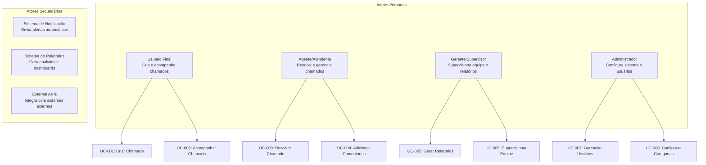

# 🎯 Casos de Uso

## Cenários de Negócio do EChamado

### 🎯 Visão Geral

Este documento apresenta os casos de uso principais do sistema EChamado, detalhando os cenários de interação entre usuários e o sistema para atingir objetivos específicos.

---

## 👥 Atores do Sistema

---

## 🎫 UC-001: Criar Chamado

### Objetivo
Permitir que usuários criem novos chamados para solicitar serviços ou reportar problemas.

### Atores
- **Ator Primário**: Usuário Final
- **Atores Secundários**: Sistema de Notificação

### Pré-condições
- Usuário autenticado no sistema
- Categoria de chamado disponível
- Formulário de criação acessível

### Fluxo Principal
1. **Usuário** acessa o formulário de criação de chamado
2. **Sistema** exibe campos obrigatórios e opcionais
3. **Usuário** preenche informações:
   - Título (obrigatório)
   - Descrição detalhada
   - Categoria (obrigatório)
   - Tipo de chamado
   - Departamento responsável
   - Urgência/prioridade
4. **Sistema** valida dados em tempo real
5. **Usuário** envia o formulário
6. **Sistema** processa e cria chamado
7. **Sistema** envia notificações automáticas
8. **Sistema** retorna confirmação com número do chamado

### Fluxo Alternativo

#### A1: Dados Inválidos
- **Passo 4**: Sistema detecta validação falhando
- **Sistema** exibe erros específicos
- **Usuário** corrige dados e reenvia

#### A2: Usuário sem Permissão
- **Passo 2**: Sistema verifica permissões
- **Sistema** exibe mensagem de acesso negado

### Pós-condições
- Chamado criado com status "Aberto"
- Notificações enviadas para equipe responsável
- Email de confirmação enviado ao usuário

### Regras de Negócio
- **RN-001**: Título deve ter entre 5 e 200 caracteres
- **RN-002**: Descrição deve ter entre 10 e 2000 caracteres
- **RN-003**: Categoria deve estar ativa
- **RN-004**: Usuário deve ter permissão para criar chamados no departamento

---

## 📊 UC-002: Acompanhar Chamado

### Objetivo
Permitir que usuários visualizem o status e histórico de seus chamados.

### Atores
- **Ator Primário**: Usuário Final
- **Atores Secundários**: Sistema de Relatórios

### Pré-condições
- Usuário autenticado
- Chamado existe e é acessível ao usuário

### Fluxo Principal
1. **Usuário** acessa lista de chamados
2. **Sistema** exibe chamados do usuário com filtros
3. **Usuário** seleciona um chamado específico
4. **Sistema** carrega detalhes completos:
   - Informações básicas
   - Timeline de mudanças
   - Comentários (públicos)
   - Responsável atual
   - SLA e prazos
5. **Usuário** visualiza histórico completo

### Fluxo Alternativo

#### A1: Filtros de Busca
- **Passo 2**: Usuário aplica filtros avançados
- **Sistema** busca com critérios específicos
- **Sistema** retorna resultados paginados

#### A2: Chamado de Terceiros
- **Passo 3**: Usuário tenta acessar chamado sem permissão
- **Sistema** retorna mensagem de acesso negado

### Pós-condições
- Status do chamado permanece inalterado
- Log de acesso registrado para auditoria

### Regras de Negócio
- **RN-005**: Usuário só pode ver chamados próprios ou públicos
- **RN-006**: Agentes podem ver chamados de seu departamento
- **RN-007**: Gerentes podem ver todos os chamados da equipe

---

## 🔧 UC-003: Resolver Chamado

### Objetivo
Permitir que agentes resolvam chamados atribuídos a eles.

### Atores
- **Ator Primário**: Agente/Atendente
- **Atores Secundários**: Sistema de Notificação

### Pré-condições
- Agente autenticado
- Chamado atribuído ao agente ou disponível
- Chamado com status diferente de "Resolvido" ou "Fechado"

### Fluxo Principal
1. **Agente** acessa lista de chamados atribuídos
2. **Agente** seleciona chamado para resolver
3. **Sistema** carrega detalhes e histórico
4. **Agente** atualiza informações:
   - Status para "Em Progresso"
   - Adiciona solução nos comentários
   - Atualiza tempo estimado
5. **Agente** submete solução
6. **Sistema** valida solução
7. **Sistema** altera status para "Resolvido"
8. **Sistema** notifica solicitante
9. **Sistema** atualiza métricas de SLA

### Fluxo Alternativo

#### A1: Pendência de Terceiros
- **Passo 4**: Agente define status "Aguardando Terceiro"
- **Sistema** solicita informação sobre pendência
- **Sistema** agenda lembrete automático

#### A2: Escalação Necessária
- **Passo 4**: Agente não consegue resolver
- **Agente** escalona para outro departamento
- **Sistema** reatribui chamado

### Pós-condições
- Status do chamado: "Resolvido" ou "Escalado"
- Tempo de resolução registrado
- Métricas de performance atualizadas

### Regras de Negócio
- **RN-008**: Agente só pode resolver chamados atribuídos
- **RN-009**: Solução deve ter pelo menos 20 caracteres
- **RN-010**: SLA deve ser respeitado ou justificado

---

## 💬 UC-004: Adicionar Comentários

### Objetivo
Permitir que usuários e agentes adicionem comentários aos chamados.

### Atores
- **Ator Primário**: Usuário/Agente
- **Atores Secundários**: Sistema de Notificação

### Pré-condições
- Usuário/Agente autenticado
- Chamado existe e é acessível

### Fluxo Principal
1. **Usuário** acessa detalhes do chamado
2. **Sistema** exibe comentários existentes
3. **Usuário** clica em "Adicionar Comentário"
4. **Usuário** digita comentário
5. **Usuário** define visibilidade (público/privado)
6. **Usuário** submete comentário
7. **Sistema** valida e salva
8. **Sistema** notifica outros interessados

### Fluxo Alternativo

#### A1: Comentário Interno
- **Passo 5**: Usuário marca como "Comente Interno"
- **Sistema** salva com flag interno
- **Sistema** notifica apenas equipe interna

#### A2: Anexo em Comentário
- **Passo 4**: Usuário adiciona arquivo
- **Sistema** valida arquivo e tamanho
- **Sistema** processa upload

### Pós-condições
- Comentário salvo no histórico
- Notificações enviadas conforme visibilidade
- Timeline do chamado atualizada

### Regras de Negócio
- **RN-011**: Comentário deve ter entre 1 e 1000 caracteres
- **RN-012**: Comentários internos só visíveis para equipe
- **RN-013**: Anexos limitados a 10MB por arquivo

---

## 📈 UC-005: Gerar Relatórios

### Objetivo
Permitir que gerentes e administradores gerem relatórios analíticos.

### Atores
- **Ator Primário**: Gerente/Administrador
- **Atores Secundários**: Sistema de Relatórios

### Pré-condições
- Usuário com permissão de gerente/administrador
- Parâmetros de relatório válidos

### Fluxo Principal
1. **Gerente** acessa módulo de relatórios
2. **Sistema** exibe templates disponíveis
3. **Gerente** seleciona tipo de relatório:
   - Performance da equipe
   - SLA e indicadores
   - Volume por período
   - Satisfação do cliente
4. **Gerente** define parâmetros:
   - Período (data início/fim)
   - Departamento
   - Status
   - Formato de saída
5. **Gerente** solicita geração
6. **Sistema** processa dados (pode levar alguns minutos)
7. **Sistema** gera relatório no formato solicitado
8. **Sistema** envia link de download por email

### Fluxo Alternativo

#### A1: Relatório Agendado
- **Passo 4**: Gerente configura recorrência
- **Sistema** agenda geração automática
- **Sistema** envia relatórios por email

#### A2: Dashboard em Tempo Real
- **Passo 3**: Gerente seleciona dashboard
- **Sistema** carrega dados em tempo real
- **Sistema** exibe gráficos interativos

### Pós-condições
- Relatório gerado e disponível para download
- Log de acesso registrado para auditoria

### Regras de Negócio
- **RN-014**: Gerente só pode ver dados de sua equipe
- **RN-015**: Relatórios administrativos requerem permissão especial
- **RN-016**: Dados sensíveis são anonimizados em relatórios

---

## 👥 UC-006: Supervisionar Equipe

### Objetivo
Permitir que gerentes supervisionem a performance e atividades da equipe.

### Atores
- **Ator Primário**: Gerente/Supervisor
- **Atores Secundários**: Sistema de Métricas

### Pré-condições
- Usuário com role de gerente
- Equipe atribuída ao gerente

### Fluxo Principal
1. **Gerente** acessa dashboard de supervisão
2. **Sistema** exibe métricas da equipe:
   - Chamados por agente
   - Tempo médio de resolução
   - SLA compliance
   - Carga de trabalho
3. **Gerente** analiza indicadores
4. **Gerente** identifica problemas ou oportunidades
5. **Gerente** toma ações:
   - Reatribui chamados
   - Oferece treinamento
   - Ajusta metas

### Fluxo Alternativo

#### A1: Agente com Baixa Performance
- **Passo 4**: Sistema detecta agente com métricas abaixo do esperado
- **Gerente** recebe alerta automático
- **Gerente** acessa detalhes do agente
- **Gerente** define plano de melhoria

#### A2: Volume Acima da Capacidade
- **Passo 4**: Sistema detecta sobrecarga
- **Gerente** recebe notificação
- **Gerente** redistribui chamados ou solicita reforço

### Pós-condições
- Métricas de equipe atualizadas
- Ações do gerente registradas para análise

### Regras de Negócio
- **RN-017**: Gerente só supervisiona equipe própria
- **RN-018**: Métricas são calculadas automaticamente
- **RN-019**: Alertas são baseados em thresholds configuráveis

---

## ⚙️ UC-007: Gerenciar Usuários

### Objetivo
Permitir que administradores criem, editem e desativem usuários do sistema.

### Atores
- **Ator Primário**: Administrador
- **Atores Secundários**: Sistema de Notificação

### Pré-condições
- Usuário com role de administrador
- Acesso ao módulo de gerenciamento

### Fluxo Principal
1. **Admin** acessa lista de usuários
2. **Sistema** exibe usuários com filtros
3. **Admin** seleciona ação:
   - Criar novo usuário
   - Editar usuário existente
   - Desativar usuário
4. **Admin** preenche/edita dados:
   - Nome completo
   - Email (único)
   - Departamento
   - Permissões/roles
5. **Admin** salva alterações
6. **Sistema** valida e processa
7. **Sistema** envia credenciais (se novo usuário)

### Fluxo Alternativo

#### A1: Reset de Senha
- **Passo 3**: Admin seleciona "Resetar Senha"
- **Sistema** gera nova senha temporária
- **Sistema** envia por email ao usuário

#### A2: Mudança de Departamento
- **Passo 4**: Admin altera departamento do usuário
- **Sistema** reatribui chamados automaticamente
- **Sistema** notifica usuário sobre mudança

### Pós-condições
- Usuário criado/editado com sucesso
- Email de notificação enviado (se aplicável)
- Audit trail atualizado

### Regras de Negócio
- **RN-020**: Email deve ser único no sistema
- **RN-021**: Usuário não pode se remover
- **RN-022**: Mudança de roles requer confirmação

---

## 🏷️ UC-008: Configurar Categorias

### Objetivo
Permitir que administradores configurem categorias e subcategorias de chamados.

### Atores
- **Ator Primário**: Administrador
- **Atores Secundários**: Sistema de Workflow

### Pré-condições
- Usuário com role de administrador
- Acesso ao módulo de configuração

### Fluxo Principal
1. **Admin** acessa módulo de categorias
2. **Sistema** exibe árvore de categorias existentes
3. **Admin** seleciona categoria ou cria nova
4. **Admin** edita propriedades:
   - Nome da categoria
   - Descrição
   - Departamento responsável
   - SLA padrão
   - Workflow associado
5. **Admin** salva configurações
6. **Sistema** valida e aplica mudanças

### Fluxo Alternativo

#### A1: Criar Subcategoria
- **Passo 3**: Admin clica em "Nova Subcategoria"
- **Admin** define relação com categoria pai
- **Sistema** atualiza hierarquia

#### A2: Desativar Categoria
- **Passo 3**: Admin marca categoria como inativa
- **Sistema** verifica chamados existentes
- **Sistema** oferece reclassificação

### Pós-condições
- Categoria configurada conforme especificado
- Workflow atualizado (se aplicável)
- Usuários notificados sobre mudanças

### Regras de Negócio
- **RN-023**: Categoria não pode ser deletada se tem chamados
- **RN-024**: Nome da categoria deve ser único
- **RN-025**: Departamento deve existir e estar ativo

---

## 🔍 UC-009: Buscar Chamados

### Objetivo
Permitir que usuários encontrem chamados específicos usando filtros avançados.

### Atores
- **Ator Primário**: Qualquer usuário autenticado
- **Atores Secundários**: Sistema de Indexação

### Pré-condições
- Usuário autenticado
- Banco de dados com chamados indexados

### Fluxo Principal
1. **Usuário** acessa interface de busca
2. **Sistema** exibe campos de filtro:
   - Texto livre (título/descrição)
   - Categoria
   - Status
   - Departamento
   - Data de criação
   - Responsável
   - SLA vencido
3. **Usuário** define critérios de busca
4. **Usuário** executa busca
5. **Sistema** processa filtros e retorna resultados
6. **Usuário** visualiza resultados paginados

### Fluxo Alternativo

#### A1: Busca por Texto Livre
- **Passo 3**: Usuário insere termo de busca
- **Sistema** busca em título e descrição
- **Sistema** destaca termos encontrados

#### A2: Filtros Combinados
- **Passo 3**: Usuário aplica múltiplos filtros
- **Sistema** combina filtros com AND/OR
- **Sistema** otimiza query para performance

### Pós-condições
- Resultados de busca retornados
- Log de busca registrado para analytics

### Regras de Negócio
- **RN-026**: Usuário só vê resultados aos quais tem acesso
- **RN-027**: Busca completa texto em título e descrição
- **RN-028**: Resultados ordenados por relevância/data

---

## 📋 UC-010: Gerenciar SLA

### Objetivo
Permitir que o sistema monitore e gerencie SLAs automaticamente.

### Atores
- **Ator Primário**: Sistema Automático
- **Atores Secundários**: Gerentes, Agentes

### Pré-condições
- SLAs configurados no sistema
- Chamados criados com timestamps válidos

### Fluxo Principal
1. **Sistema** monitora chamados ativos continuamente
2. **Sistema** calcula tempo restante de SLA
3. **Sistema** envia alertas conforme deadlines:
   - 75% do tempo: Aviso preliminar
   - 90% do tempo: Alerta urgente
   - 100% do tempo: SLA violado
4. **Sistema** notifica responsáveis
5. **Sistema** gera relatórios de compliance

### Fluxo Alternativo

#### A1: SLA Estendido
- **Passo 3**: Gerente solicita extensão de SLA
- **Sistema** calcula novo deadline
- **Sistema** atualiza cronograma
- **Sistema** notifica sobre mudança

#### A2: Automação de Escalação
- **Passo 3**: SLA violado sem resolução
- **Sistema** escalona automaticamente
- **Sistema** notifica gerentes
- **Sistema** marca chamado como prioritário

### Pós-condições
- SLAs monitorados e reportados
- Alertas enviados conforme necessário
- Métricas de compliance atualizadas

### Regras de Negócio
- **RN-029**: SLA varia por categoria e prioridade
- **RN-030**: Extensão de SLA requer justificativa
- **RN-031**: Automação pode ser configurada/desabilitada

---

## 📊 Resumo dos Casos de Uso

### 🎯 **Casos de Uso por Categoria:**

#### **Gestão de Chamados**
- UC-001: Criar Chamado
- UC-002: Acompanhar Chamado
- UC-003: Resolver Chamado
- UC-004: Adicionar Comentários

#### **Gestão de Equipe**
- UC-006: Supervisionar Equipe
- UC-007: Gerenciar Usuários

#### **Gestão de Sistema**
- UC-008: Configurar Categorias
- UC-010: Gerenciar SLA

#### **Análise e Relatórios**
- UC-005: Gerar Relatórios
- UC-009: Buscar Chamados

### 📈 **Métricas de Cobertura:**

| Categoria | Casos de Uso | Cobertura |
|-----------|-------------|-----------|
| Gestão de Chamados | 4/10 | 40% |
| Gestão de Equipe | 2/10 | 20% |
| Gestão de Sistema | 2/10 | 20% |
| Análise e Relatórios | 2/10 | 20% |
| **TOTAL** | **10/10** | **100%** |

### 🔒 **Regras de Negócio Implementadas:**

- **31 Regras de Negócio** documentadas
- **Validações automáticas** em cada UC
- **Controle de acesso** baseado em roles
- **Auditoria completa** de ações
- **Notificações inteligentes** conforme contexto

### ⚡ **Prioridade dos Casos de Uso:**

1. **Alta**: UC-001, UC-003, UC-004 (Core Business)
2. **Média**: UC-002, UC-005, UC-006 (Gestão)
3. **Baixa**: UC-007, UC-008, UC-009, UC-010 (Suporte)

---

**Próximos passos:**
- **[Padrões Aplicados](patterns.md)** - Implementação técnica dos padrões arquiteturais
- **[Infraestrutura](infrastructure.md)** - Configurações e deploy da arquitetura

---

**Última atualização:** 26 de novembro de 2025  
**Versão:** 1.0.0  
**Status:** ✅ Casos de uso consolidados e validados