# 🆕 Guia de Implementação de Novas Funcionalidades

## Processo e Padrões para Desenvolvimento

### 🎯 Visão Geral

Este guia estabelece o processo completo para implementação de novas funcionalidades no EChamado, garantindo consistência, qualidade e manutenibilidade do código.

---

## 📋 Processo de Implementação

### 🔄 1. Fluxo de Desenvolvimento

```mermaid
graph TD
    A[Requisito Identificado] --> B[Análise de Arquitetura]
    B --> C[Design da Solução]
    C --> D[Estimation & Planning]
    D --> E[Development]
    E --> F[Unit Testing]
    F --> G[Integration Testing]
    G --> H[Code Review]
    H --> I[QA Testing]
    I --> J[Documentation]
    J --> K[Deployment]
    K --> L[Post-Deployment Monitoring]
    
    H --> M[Changes Requested]
    M --> E
    
    I --> N[QA Issues Found]
    N --> E
    
    L --> O[Production Issues]
    O --> E
```



### 📊 2. Fases do Desenvolvimento

#### **Fase 1: Planejamento (1-2 dias)**
- Análise de requisitos
- Design da solução
- Estimativa de esforço
- Definição de testes

#### **Fase 2: Desenvolvimento (3-7 dias)**
- Implementação da solução
- Testes unitários
- Testes de integração
- Documentação

#### **Fase 3: Revisão (1-2 dias)**
- Code review
- QA testing
- Validação de performance
- Deploy em staging

---

## 🏗️ 3. Padrões de Implementação

### 3.1 Implementação de Nova Entidade

#### **Exemplo: Implementação de "Etiqueta" (Tag)**

**1. Domain Entity**
```csharp
// Server/EChamado.Server.Domain/Domains/Tags/Tag.cs
namespace EChamado.Server.Domain.Domains.Tags
{
    public class Tag : AggregateRoot<Guid>
    {
        public string Name { get; private set; }
        public string? Description { get; private set; }
        public string Color { get; private set; }
        public bool IsActive { get; private set; }
        
        // Constructor
        public Tag(string name, string? description, string color)
        {
            Id = Guid.NewGuid();
            Name = name ?? throw new ArgumentNullException(nameof(name));
            Description = description;
            Color = color ?? throw new ArgumentNullException(nameof(color));
            IsActive = true;
            CreatedAt = DateTime.UtcNow;
            UpdatedAt = DateTime.UtcNow;
        }
        
        // Methods
        public void Update(string name, string? description, string color)
        {
            Name = name ?? throw new ArgumentNullException(nameof(name));
            Description = description;
            Color = color ?? throw new ArgumentNullException(nameof(color));
            UpdatedAt = DateTime.UtcNow;
        }
        
        public void Deactivate()
        {
            IsActive = false;
            UpdatedAt = DateTime.UtcNow;
        }
    }
}
```

**2. Repository Interface**
```csharp
// Server/EChamado.Server.Domain/Repositories/ITagRepository.cs
namespace EChamado.Server.Domain.Repositories
{
    public interface ITagRepository
    {
        Task<Tag?> GetByIdAsync(Guid id);
        Task<IEnumerable<Tag>> GetAllAsync();
        Task<IEnumerable<Tag>> GetActiveTagsAsync();
        Task<Tag> AddAsync(Tag tag);
        Task<Tag> UpdateAsync(Tag tag);
        Task DeleteAsync(Guid id);
        Task<bool> ExistsAsync(Guid id);
        Task<bool> ExistsByNameAsync(string name, Guid? excludeId = null);
    }
}
```

**3. Repository Implementation**
```csharp
// Server/EChamado.Server.Infrastructure/Repositories/TagRepository.cs
namespace EChamado.Server.Infrastructure.Repositories
{
    public class TagRepository : ITagRepository
    {
        private readonly ApplicationDbContext _context;
        
        public TagRepository(ApplicationDbContext context)
        {
            _context = context ?? throw new ArgumentNullException(nameof(context));
        }
        
        public async Task<Tag?> GetByIdAsync(Guid id)
        {
            var entity = await _context.Tags.FindAsync(id);
            return entity?.ToDomain();
        }
        
        public async Task<IEnumerable<Tag>> GetAllAsync()
        {
            var entities = await _context.Tags
                .Where(t => t.IsActive)
                .OrderBy(t => t.Name)
                .ToListAsync();
                
            return entities.Select(e => e.ToDomain());
        }
        
        public async Task<Tag> AddAsync(Tag tag)
        {
            var entity = tag.ToEntity();
            _context.Tags.Add(entity);
            await _context.SaveChangesAsync();
            return entity.ToDomain();
        }
        
        // ... outros métodos implementados similarmente
    }
}
```

**4. CQRS Commands**
```csharp
// Server/EChamado.Server.Application/UseCases/Tags/Commands/CreateTagCommand.cs
namespace EChamado.Server.Application.UseCases.Tags.Commands
{
    public record CreateTagCommand(
        string Name,
        string? Description,
        string Color
    ) : IRequest<Result<Guid>>;
    
    public class CreateTagCommandHandler : IRequestHandler<CreateTagCommand, Result<Guid>>
    {
        private readonly ITagRepository _tagRepository;
        private readonly IValidator<CreateTagCommand> _validator;
        
        public CreateTagCommandHandler(
            ITagRepository tagRepository,
            IValidator<CreateTagCommand> validator)
        {
            _tagRepository = tagRepository;
            _validator = validator;
        }
        
        public async Task<Result<Guid>> Handle(CreateTagCommand request, CancellationToken cancellationToken)
        {
            // Validation
            var validationResult = await _validator.ValidateAsync(request);
            if (!validationResult.IsValid)
            {
                return Result<Guid>.Failure(validationResult.Errors.Select(e => e.ErrorMessage));
            }
            
            // Business logic
            if (await _tagRepository.ExistsByNameAsync(request.Name))
            {
                return Result<Guid>.Failure("Tag name already exists");
            }
            
            // Create entity
            var tag = new Tag(request.Name, request.Description, request.Color);
            var createdTag = await _tagRepository.AddAsync(tag);
            
            return Result<Guid>.Success(createdTag.Id);
        }
    }
}
```

**5. CQRS Queries**
```csharp
// Server/EChamado.Server.Application/UseCases/Tags/Queries/GetTagsQuery.cs
namespace EChamado.Server.Application.UseCases.Tags.Queries
{
    public record GetTagsQuery() : IRequest<Result<IEnumerable<TagDto>>>;
    
    public class GetTagsQueryHandler : IRequestHandler<GetTagsQuery, Result<IEnumerable<TagDto>>>
    {
        private readonly ITagRepository _tagRepository;
        private readonly IMapper _mapper;
        
        public GetTagsQueryHandler(ITagRepository tagRepository, IMapper mapper)
        {
            _tagRepository = tagRepository;
            _mapper = mapper;
        }
        
        public async Task<Result<IEnumerable<TagDto>>> Handle(GetTagsQuery request, CancellationToken cancellationToken)
        {
            var tags = await _tagRepository.GetAllAsync();
            var tagDtos = _mapper.Map<IEnumerable<TagDto>>(tags);
            
            return Result<IEnumerable<TagDto>>.Success(tagDtos);
        }
    }
}
```

**6. API Endpoints**
```csharp
// Server/EChamado.Server/Endpoints/Tags/TagsController.cs
namespace EChamado.Server.Endpoints.Tags
{
    [Route("api/[controller]")]
    [ApiController]
    [Authorize]
    public class TagsController : ControllerBase
    {
        private readonly IMediator _mediator;
        
        public TagsController(IMediator mediator)
        {
            _mediator = mediator;
        }
        
        [HttpGet]
        public async Task<ActionResult<IEnumerable<TagDto>>> GetTags()
        {
            var result = await _mediator.Send(new GetTagsQuery());
            
            if (result.IsSuccess)
                return Ok(result.Data);
                
            return BadRequest(result.Errors);
        }
        
        [HttpPost]
        public async Task<ActionResult<Guid>> CreateTag([FromBody] CreateTagCommand command)
        {
            var result = await _mediator.Send(command);
            
            if (result.IsSuccess)
                return CreatedAtAction(nameof(GetTag), new { id = result.Data }, result.Data);
                
            return BadRequest(result.Errors);
        }
        
        [HttpGet("{id}")]
        public async Task<ActionResult<TagDto>> GetTag(Guid id)
        {
            var result = await _mediator.Send(new GetTagByIdQuery(id));
            
            if (result.IsSuccess && result.Data != null)
                return Ok(result.Data);
                
            if (result.Data == null)
                return NotFound();
                
            return BadRequest(result.Errors);
        }
    }
}
```

### 3.2 Implementação no Frontend

**7. DTOs e ViewModels**
```csharp
// Shared/ViewModels/Tags/TagDto.cs
namespace EChamado.Shared.ViewModels.Tags
{
    public class TagDto : BaseViewModel
    {
        public string Name { get; set; } = string.Empty;
        public string? Description { get; set; }
        public string Color { get; set; } = string.Empty;
        public bool IsActive { get; set; }
    }
    
    public class CreateTagViewModel
    {
        public string Name { get; set; } = string.Empty;
        public string? Description { get; set; }
        public string Color { get; set; } = "#007bff";
    }
    
    public class UpdateTagViewModel
    {
        public Guid Id { get; set; }
        public string Name { get; set; } = string.Empty;
        public string? Description { get; set; }
        public string Color { get; set; } = string.Empty;
    }
}
```

**8. Frontend Service**
```csharp
// Client/EChamado.Client/Services/TagService.cs
namespace EChamado.Client.Services
{
    public interface ITagService
    {
        Task<Result<IEnumerable<TagDto>>> GetTagsAsync();
        Task<Result<Guid>> CreateTagAsync(CreateTagViewModel tag);
        Task<Result<bool>> UpdateTagAsync(UpdateTagViewModel tag);
        Task<Result<bool>> DeleteTagAsync(Guid id);
    }
    
    public class TagService : ITagService
    {
        private readonly HttpClient _httpClient;
        
        public TagService(HttpClient httpClient)
        {
            _httpClient = httpClient;
        }
        
        public async Task<Result<IEnumerable<TagDto>>> GetTagsAsync()
        {
            try
            {
                var response = await _httpClient.GetAsync("api/tags");
                
                if (response.IsSuccessStatusCode)
                {
                    var tags = await response.Content.ReadFromJsonAsync<IEnumerable<TagDto>>();
                    return Result<IEnumerable<TagDto>>.Success(tags ?? Enumerable.Empty<TagDto>());
                }
                
                return Result<IEnumerable<TagDto>>.Failure("Failed to fetch tags");
            }
            catch (Exception ex)
            {
                return Result<IEnumerable<TagDto>>.Failure($"Error: {ex.Message}");
            }
        }
        
        // ... outros métodos implementados similarmente
    }
}
```

**9. Blazor Components**
```csharp
// Client/EChamado.Client/Pages/Tags/TagsPage.razor
@page "/tags"
@using EChamado.Client.Services
@using EChamado.Shared.ViewModels.Tags
@inject ITagService TagService
@inject IJSRuntime JSRuntime

<PageTitle>Tags</PageTitle>

<div class="d-flex justify-content-between align-items-center mb-4">
    <h1>Gerenciar Tags</h1>
    <MudButton 
        Color="Color.Primary" 
        StartIcon="@Icons.Material.Filled.Add"
        OnClick="OpenCreateDialog">
        Nova Tag
    </MudButton>
</div>

@if (_isLoading)
{
    <MudProgressLinear Color="Color.Primary" Indeterminate="true" />
}
else if (_tags?.Any() == true)
{
    <MudDataGrid 
        T="TagDto" 
        Items="@_tags" 
        Sortable="true" 
        Filterable="true" 
        QuickFilter="@_quickFilter"
        Hover="true">
        <ToolBarContent>
            <MudText Typo="Typo.h6">Tags</MudText>
            <MudSpacer />
            <MudTextField @bind-Value="_searchString" Placeholder="Buscar" Adornment="Adornment.Start" AdornmentIcon="@Icons.Material.Filled.Search" IconSize="Size.Medium"></MudTextField>
        </ToolBarContent>
        <Columns>
            <PropertyColumn Property="x => x.Name" Title="Nome" />
            <PropertyColumn Property="x => x.Description" Title="Descrição" />
            <TemplateColumn CellClass="d-flex justify-end">
                <CellTemplate>
                    <MudIconButton 
                        Size="@Size.Small"
                        Icon="@Icons.Material.Outlined.Edit"
                        OnClick="() => OpenEditDialog(context.Item)" />
                    <MudIconButton 
                        Size="@Size.Small" 
                        Icon="@Icons.Material.Outlined.Delete"
                        OnClick="() => DeleteTag(context.Item)" />
                </CellTemplate>
            </TemplateColumn>
        </Columns>
    </MudDataGrid>
}
else
{
    <MudAlert Severity="Severity.Info">Nenhuma tag encontrada.</MudAlert>
}

@code {
    private IEnumerable<TagDto> _tags = new List<TagDto>();
    private bool _isLoading = true;
    private string _searchString = string.Empty;
    
    protected override async Task OnInitializedAsync()
    {
        await LoadTagsAsync();
    }
    
    private async Task LoadTagsAsync()
    {
        _isLoading = true;
        var result = await TagService.GetTagsAsync();
        _tags = result.Data ?? Enumerable.Empty<TagDto>();
        _isLoading = false;
    }
    
    private Func<TagDto, bool> _quickFilter => x =>
    {
        if (string.IsNullOrWhiteSpace(_searchString))
            return true;
            
        if (x.Name.Contains(_searchString, StringComparison.OrdinalIgnoreCase))
            return true;
            
        if (x.Description?.Contains(_searchString, StringComparison.OrdinalIgnoreCase) == true)
            return true;
            
        return false;
    };
    
    private async Task OpenCreateDialog()
    {
        // Implementar dialog de criação
    }
    
    private async Task OpenEditDialog(TagDto tag)
    {
        // Implementar dialog de edição
    }
    
    private async Task DeleteTag(TagDto tag)
    {
        var confirmed = await JSRuntime.InvokeAsync<bool>("confirm", $"Deseja excluir a tag '{tag.Name}'?");
        if (confirmed)
        {
            // Implementar exclusão
        }
    }
}
```

---

## 🧪 4. Implementação de Testes

### 4.1 Testes Unitários

```csharp
// Tests/EChamado.Server.UnitTests/UseCases/Tags/CreateTagCommandHandlerTests.cs
namespace EChamado.Server.UnitTests.UseCases.Tags
{
    public class CreateTagCommandHandlerTests
    {
        private readonly Mock<ITagRepository> _mockRepository;
        private readonly Mock<IValidator<CreateTagCommand>> _mockValidator;
        private readonly CreateTagCommandHandler _handler;
        
        public CreateTagCommandHandlerTests()
        {
            _mockRepository = new Mock<ITagRepository>();
            _mockValidator = new Mock<IValidator<CreateTagCommand>>();
            _handler = new CreateTagCommandHandler(_mockRepository.Object, _mockValidator.Object);
        }
        
        [Test]
        public async Task Handle_WithValidCommand_ShouldReturnSuccess()
        {
            // Arrange
            var command = new CreateTagCommand("Test Tag", "Test Description", "#007bff");
            
            _mockValidator
                .Setup(x => x.ValidateAsync(command, It.IsAny<CancellationToken>()))
                .ReturnsAsync(new ValidationResult());
                
            _mockRepository
                .Setup(x => x.ExistsByNameAsync(command.Name))
                .ReturnsAsync(false);
                
            _mockRepository
                .Setup(x => x.AddAsync(It.IsAny<Tag>()))
                .ReturnsAsync(It.IsAny<Tag>());
            
            // Act
            var result = await _handler.Handle(command, CancellationToken.None);
            
            // Assert
            result.IsSuccess.Should().BeTrue();
            _mockRepository.Verify(x => x.AddAsync(It.IsAny<Tag>()), Times.Once);
        }
        
        [Test]
        public async Task Handle_WithExistingName_ShouldReturnFailure()
        {
            // Arrange
            var command = new CreateTagCommand("Existing Tag", "Description", "#007bff");
            
            _mockValidator
                .Setup(x => x.ValidateAsync(command, It.IsAny<CancellationToken>()))
                .ReturnsAsync(new ValidationResult());
                
            _mockRepository
                .Setup(x => x.ExistsByNameAsync(command.Name))
                .ReturnsAsync(true);
            
            // Act
            var result = await _handler.Handle(command, CancellationToken.None);
            
            // Assert
            result.IsSuccess.Should().BeFalse();
            result.Errors.Should().Contain("Tag name already exists");
        }
        
        [Test]
        public async Task Handle_WithInvalidCommand_ShouldReturnValidationErrors()
        {
            // Arrange
            var command = new CreateTagCommand("", "", "");
            
            var validationResult = new ValidationResult(new[]
            {
                new ValidationFailure("Name", "Name is required"),
                new ValidationFailure("Color", "Color is required")
            });
            
            _mockValidator
                .Setup(x => x.ValidateAsync(command, It.IsAny<CancellationToken>()))
                .ReturnsAsync(validationResult);
            
            // Act
            var result = await _handler.Handle(command, CancellationToken.None);
            
            // Assert
            result.IsSuccess.Should().BeFalse();
            result.Errors.Should().NotBeEmpty();
        }
    }
}
```

### 4.2 Testes de Integração

```csharp
// Tests/EChamado.Server.IntegrationTests/Endpoints/TagsEndpointTests.cs
namespace EChamado.Server.IntegrationTests.Endpoints
{
    [TestFixture]
    public class TagsEndpointTests : IntegrationTestBase
    {
        [Test]
        public async Task GetTags_WithValidRequest_ShouldReturnTags()
        {
            // Arrange
            await CreateTestTag("Test Tag 1", "Description 1", "#007bff");
            await CreateTestTag("Test Tag 2", "Description 2", "#28a745");
            
            // Act
            var response = await Client.GetAsync("/api/tags");
            
            // Assert
            response.IsSuccessStatusCode.Should().BeTrue();
            var tags = await response.Content.ReadFromJsonAsync<IEnumerable<TagDto>>();
            tags.Should().NotBeNull();
            tags.Should().HaveCount(2);
        }
        
        [Test]
        public async Task CreateTag_WithValidData_ShouldCreateAndReturnCreated()
        {
            // Arrange
            var createTagRequest = new CreateTagCommand("New Tag", "New Description", "#ff6b6b");
            var requestContent = JsonContent.Create(createTagRequest);
            
            // Act
            var response = await Client.PostAsync("/api/tags", requestContent);
            
            // Assert
            response.IsSuccessStatusCode.Should().BeTrue();
            response.StatusCode.Should().Be(HttpStatusCode.Created);
            
            // Verify in database
            var createdTag = await GetTagByName("New Tag");
            createdTag.Should().NotBeNull();
            createdTag.Name.Should().Be("New Tag");
        }
        
        private async Task CreateTestTag(string name, string description, string color)
        {
            var tag = new Tag(name, description, color);
            await Context.Tags.AddAsync(tag);
            await SaveChangesAsync();
        }
        
        private async Task<Tag?> GetTagByName(string name)
        {
            return await Context.Tags.FirstOrDefaultAsync(t => t.Name == name);
        }
    }
}
```

---

## 🔄 5. Database Migration

```csharp
// Server/EChamado.Server.Infrastructure/Migrations/AddTagsTable.cs
namespace EChamado.Server.Infrastructure.Migrations
{
    [DbContext(typeof(ApplicationDbContext))]
    [Migration("20251126_AddTagsTable")]
    public class AddTagsTable : Migration
    {
        protected override void Up(MigrationBuilder migrationBuilder)
        {
            migrationBuilder.CreateTable(
                name: "Tags",
                columns: table => new
                {
                    Id = table.Column<Guid>(type: "uuid", nullable: false),
                    Name = table.Column<string>(type: "character varying(100)", maxLength: 100, nullable: false),
                    Description = table.Column<string>(type: "text", nullable: true),
                    Color = table.Column<string>(type: "character varying(7)", maxLength: 7, nullable: false),
                    IsActive = table.Column<bool>(type: "boolean", nullable: false),
                    CreatedAt = table.Column<DateTime>(type: "timestamp with time zone", nullable: false),
                    UpdatedAt = table.Column<DateTime>(type: "timestamp with time zone", nullable: false)
                },
                constraints: table =>
                {
                    table.PrimaryKey("PK_Tags", x => x.Id);
                });
                
            migrationBuilder.CreateIndex(
                name: "IX_Tags_Name",
                table: "Tags",
                column: "Name",
                unique: true);
        }
        
        protected override void Down(MigrationBuilder migrationBuilder)
        {
            migrationBuilder.DropTable(
                name: "Tags");
        }
    }
}
```

---

## 📚 6. Documentação

### 6.1 README da Feature

```markdown
# Tag Management Feature

## Overview
Sistema de gerenciamento de etiquetas para organização e categorização de chamados.

## Features
- ✅ Criar novas tags
- ✅ Editar tags existentes
- ✅ Desativar tags
- ✅ Busca e filtro de tags
- ✅ Validação de cores hexadecimais

## API Endpoints
- `GET /api/tags` - Listar todas as tags
- `POST /api/tags` - Criar nova tag
- `GET /api/tags/{id}` - Obter tag específica
- `PUT /api/tags/{id}` - Atualizar tag
- `DELETE /api/tags/{id}` - Desativar tag

## Database Schema
```sql
CREATE TABLE Tags (
    Id UUID PRIMARY KEY,
    Name VARCHAR(100) NOT NULL UNIQUE,
    Description TEXT,
    Color VARCHAR(7) NOT NULL,
    IsActive BOOLEAN NOT NULL DEFAULT true,
    CreatedAt TIMESTAMP WITH TIME ZONE NOT NULL,
    UpdatedAt TIMESTAMP WITH TIME ZONE NOT NULL
);
```

## Testing
- Unit Tests: 15 test cases
- Integration Tests: 8 test cases  
- E2E Tests: 5 test scenarios

## Performance
- Response time: <200ms
- Database queries optimized with indexes
- Caching for frequently accessed tags
```

---

## ✅ 7. Checklist de Implementação

### **Domain Layer**
- [ ] Entity/Domain class created
- [ ] Value objects implemented
- [ ] Domain services created
- [ ] Domain events defined (if needed)
- [ ] Business rules validated

### **Application Layer**
- [ ] CQRS Commands implemented
- [ ] CQRS Queries implemented
- [ ] Command handlers created
- [ ] Query handlers created
- [ ] Validation rules implemented
- [ ] Mappings configured

### **Infrastructure Layer**
- [ ] Repository interface defined
- [ ] Repository implementation created
- [ ] Database models updated
- [ ] Migration created and executed
- [ ] External services integration (if needed)

### **Presentation Layer**
- [ ] API endpoints created
- [ ] DTOs/ViewModels implemented
- [ ] Frontend services created
- [ ] UI components built
- [ ] Authentication/Authorization applied

### **Testing**
- [ ] Unit tests for commands/queries (>80% coverage)
- [ ] Unit tests for domain entities
- [ ] Integration tests for API endpoints
- [ ] E2E tests for user workflows
- [ ] Performance tests (if needed)

### **Documentation**
- [ ] API documentation updated
- [ ] User guide updated
- [ ] Architecture documentation updated
- [ ] README feature created
- [ ] CHANGELOG updated

### **Quality Assurance**
- [ ] Code review completed
- [ ] SonarQube analysis passed
- [ ] Security review completed
- [ ] Performance review completed
- [ ] Accessibility review (if UI related)

---

## 🚀 8. Deploy e Monitoramento

### 8.1 Deploy Checklist
- [ ] Database migrations applied
- [ ] Environment variables configured
- [ ] Feature flags configured (if applicable)
- [ ] Health checks updated
- [ ] Monitoring dashboards updated

### 8.2 Post-Deploy Validation
- [ ] API endpoints responding correctly
- [ ] Database operations working
- [ ] Frontend features accessible
- [ ] Performance metrics within targets
- [ ] Error rates below threshold

---

## 📞 9. Suporte e Troubleshooting

### **Comandos Úteis**
```bash
# Verificar logs de implementação
docker-compose logs -f api-server

# Testar endpoint específico
curl -X GET "https://localhost:7296/api/tags" \
     -H "Authorization: Bearer {token}"

# Verificar database
dotnet ef database update --verbose

# Executar testes específicos
dotnet test --filter "TagTests"
```

### **Monitoring**
- **Health Check**: `/health/tags`
- **Metrics**: `/metrics/tags`
- **Logs**: ELK Stack (Kibana:5601)

---

## 🎉 Conclusão

Seguindo este guia, você garante que novas funcionalidades sejam implementadas com:

- ✅ **Qualidade**: Padrões consistentes e testados
- ✅ **Manutenibilidade**: Código limpo e bem documentado  
- ✅ **Performance**: Otimizado desde o início
- ✅ **Segurança**: Autenticação e validação adequadas
- ✅ **Escalabilidade**: Arquitetura preparada para crescimento

**Lembre-se**: Em caso de dúvidas, consulte a documentação ou peça ajuda no canal #echamado-dev.

---

**Última atualização:** 26 de novembro de 2025  
**Versão:** 1.0.0  
**Status:** ✅ Processo validado e documentado