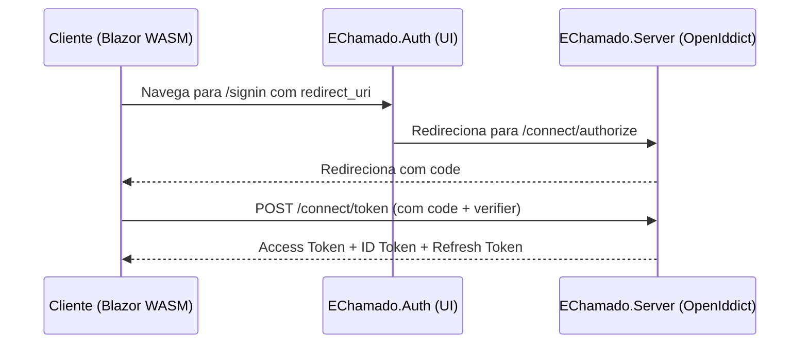

# Gemini Code Assistant

Este arquivo fornece orientações para o assistente de código Gemini garantir que ele siga a arquitetura, convenções e estilo do projeto.

## Visão Geral do Projeto

Este projeto é uma aplicação C# chamada "EChamado", construída em .NET 9. Segue um padrão de Clean Architecture, separando responsabilidades em camadas e projetos distintos. A solução inclui um cliente Blazor WebAssembly, um servidor ASP.NET Core, uma biblioteca compartilhada e um serviço de autenticação.

### Tecnologias Principais

- **Backend:** ASP.NET Core 9.0, Entity Framework Core, PostgreSQL, Redis
- **Frontend:** Blazor WebAssembly, MudBlazor
- **Autenticação:** OpenIddict (OAuth 2.0 + OIDC)
- **Logging:** Serilog
- **Mensageria:** RabbitMQ
- **Padrões de Design:** MediatR (CQRS), FluentValidation
- **Containerização:** Docker, docker-compose
- **Monitoramento:** Elasticsearch, Kibana

## Princípios Arquiteturais

O projeto é estruturado com base nos princípios da Clean Architecture, com uma clara separação de responsabilidades:

### Camadas do Sistema

- **`EChamado.Server.Domain`:** Contém a lógica de domínio central, incluindo entidades, agregados, objetos de valor e eventos de domínio. Esta camada não deve ter dependências de outras camadas.
- **`EChamado.Server.Application`:** Implementa a lógica de aplicação, incluindo casos de uso, comandos, consultas e serviços. Depende da camada `Domain`, mas não das camadas `Infrastructure` ou `Presentation`.
- **`EChamado.Server.Infrastructure`:** Fornece implementações para preocupações externas, como persistência de dados (repositórios), mensageria e serviços de email. Depende das camadas `Application` e `Domain`.
- **`EChamado.Server`:** A camada de apresentação, que expõe os endpoints da API e lida com solicitações do usuário. Também atua como o **Servidor de Autorização OpenIddict**, responsável por emitir e validar tokens. Depende das camadas `Application` e `Infrastructure`.
- **`EChamado.Client`:** Uma aplicação Blazor WebAssembly que consome a API do servidor.
- **`EChamado.Shared`:** Uma biblioteca compartilhada contendo código usado tanto pelo cliente quanto pelo servidor, como DTOs, view models e classes base.
- **`Echamado.Auth`:** Um projeto separado que serve como a **Camada de UI de Autenticação e Orquestração**. Lida com a UI de login/registro/logout do usuário e redireciona fluxos de autenticação para o `EChamado.Server` (o Servidor de Autorização OpenIddict).

### Fluxo de Autenticação

O sistema implementa OAuth 2.0 com Authorization Code + PKCE:

**Responsabilidades de Autenticação:**

- **EChamado.Auth**: UI de autenticação e orquestração (NÃO emite tokens)
- **EChamado.Server**: Servidor OpenIddict real (emite e valida tokens)
- **EChamado.Client**: SPA que consome APIs protegidas

## Estilo de Codificação e Convenções

- **Versão C#:** O projeto usa recursos do C# 12, incluindo usings implícitos e namespaces com escopo de arquivo.
- **Convenções de Nomenclatura:**
  - Use PascalCase para nomes de classes, métodos e propriedades.
  - Use camelCase para nomes de variáveis locais.
  - Prefixe interfaces com `I` (ex: `IUserService`).
- **Organização de Arquivos:**
  - Mantenha arquivos organizados por funcionalidade ou domínio.
  - Use arquivos separados para cada classe.
- **Programação Assíncrona:**
  - Use `async` e `await` para todas as operações vinculadas a I/O.
  - Sufixe métodos assíncronos com `Async` (ex: `GetUserAsync`).
- **Injeção de Dependência:**
  - Use injeção de construtor para fornecer dependências.
  - Registre serviços no arquivo `Program.cs` ou em métodos de extensão.
- **Tratamento de Erros:**
  - Use exceções para casos excepcionais.
  - Use uma abordagem consistente para lidar com e registrar erros.
- **Validação:**
  - Use FluentValidation para validar solicitações e objetos de domínio.

## Workflow de Desenvolvimento

1. **Criar uma nova branch de funcionalidade:** `git checkout -b feature/minha-nova-funcionalidade`
2. **Implementar a funcionalidade:**
   - Adicionar ou modificar entidades de domínio em `EChamado.Server.Domain`.
   - Criar casos de uso (comandos e consultas) em `EChamado.Server.Application`.
   - Implementar serviços de infraestrutura em `EChamado.Server.Infrastructure`.
   - Expor a funcionalidade através de endpoints da API em `EChamado.Server`.
   - Implementar a UI em `EChamado.Client`.
   - Se necessário, atualizar a UI de autenticação em `EChamado.Auth`.
3. **Escrever testes unitários e de integração.**
4. **Fazer commit das suas alterações com uma mensagem descritiva.**
5. **Fazer push das suas alterações para o repositório remoto.**
6. **Criar um pull request para revisão.**

## Documentação de Referência

Para mais informações sobre a arquitetura e implementação, consulte:

- **[Fluxo de Autenticação](docs/auth_flow.md)** - Diagrama detalhado do fluxo OAuth 2.0/OIDC
- **[EChamado.Auth](docs/01-EChamado.Auth.md)** - UI de autenticação e orquestração
- **[EChamado.Server](docs/02-EChamado.Server.md)** - API REST e servidor OpenIddict
- **[EChamado.Client](docs/03-EChamado.Client.md)** - Interface Blazor WebAssembly
- **[Guia do Desenvolvedor](docs/DEVELOPER_GUIDE.md)** - Setup, convenções e workflow

## Padrões de Segurança

- **HTTPS Obrigatório:** Todas as comunicações devem ser criptografadas
- **Authorization Code + PKCE:** Fluxo OAuth seguro para SPAs
- **Tokens JWT:** Validação via OpenIddict.Validation
- **Validação de Entrada:** Sanitização e validação de todos os dados de entrada
- **Princípio do Menor Privilégio:** Usuários devem ter apenas as permissões necessárias

## Como Obter Ajuda

Se você tiver alguma dúvida ou precisar de assistência, consulte a documentação do projeto ou entre em contato com um membro da equipe.
