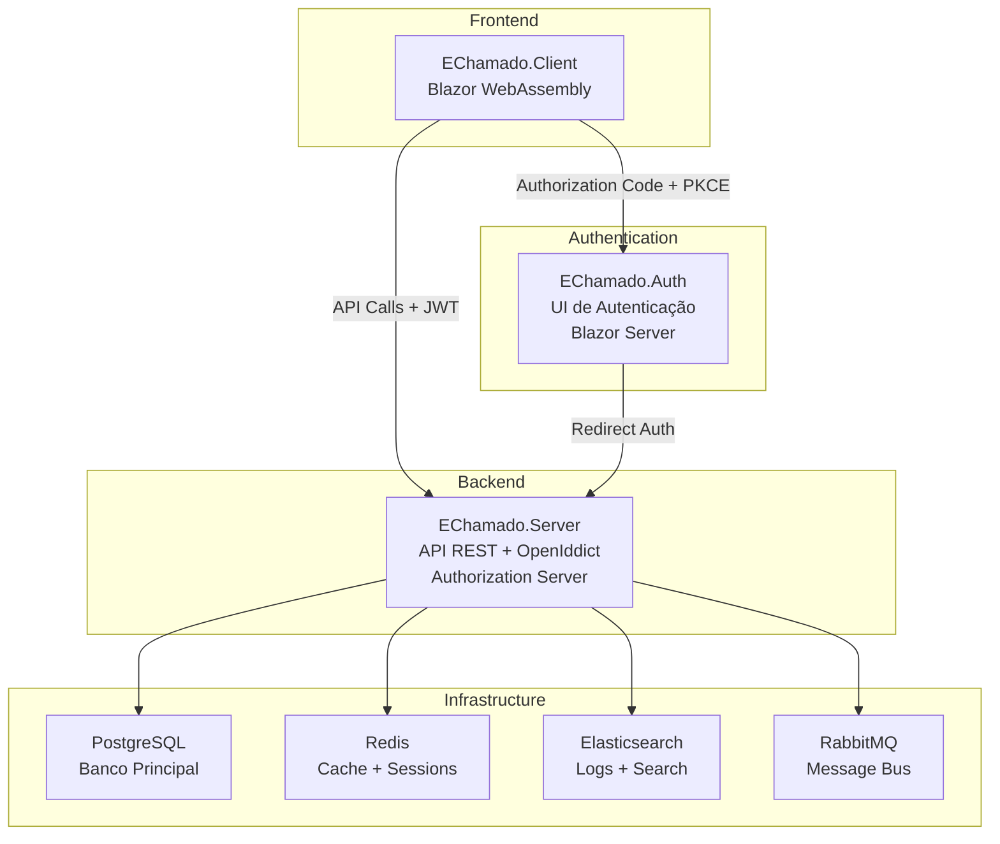

# 🎯 EChamado - Sistema de Gerenciamento de Chamados

[](https://dotnet.microsoft.com/)
[](LICENSE)
[](#)
[](#)

## 🌟 Visão Geral

O **EChamado** é uma solução empresarial moderna para gerenciamento de chamados de TI, desenvolvida com **.NET 9** seguindo as melhores práticas da Microsoft. O sistema implementa **Clean Architecture**, **CQRS**, **OAuth 2.0/OpenID Connect** e **microserviços** para garantir escalabilidade, segurança e manutenibilidade.

### 🏗️ Arquitetura do Sistema



### 🎯 Características Principais

- **🔐 Autenticação Segura**: OAuth 2.0/OpenID Connect com Authorization Code + PKCE
- **🏗️ Clean Architecture**: Separação clara de responsabilidades e dependências
- **📨 Mensageria Assíncrona**: RabbitMQ para processamento em background
- **📊 Observabilidade**: Logging estruturado, métricas e monitoramento
- **🐳 Containerização**: Docker e Kubernetes ready
- **🔒 Segurança**: Implementação OWASP Top 10
- **⚡ Performance**: Cache Redis e otimizações de consulta
- **📱 Responsivo**: Interface moderna com MudBlazor

## 📋 Pré-requisitos

### 🛠️ Ferramentas de Desenvolvimento
- **.NET 9.0 SDK** - [Download](https://dotnet.microsoft.com/download/dotnet/9.0)
- **Docker Desktop** - [Download](https://www.docker.com/products/docker-desktop)
- **Visual Studio 2022** ou **VS Code** com extensões C#
- **Git** - [Download](https://git-scm.com/)

### 🐳 Infraestrutura (via Docker)
- **PostgreSQL 15** - Banco de dados principal
- **Redis 7** - Cache e sessões
- **Elasticsearch 8** - Logs e busca
- **Kibana** - Visualização de logs
- **RabbitMQ** - Message broker
- **PgAdmin** - Administração do PostgreSQL

## 🚀 Início Rápido

### ⚡ Execução Automática (Recomendado)

```powershell
# Windows PowerShell
.\start-all.ps1
```

```bash
# Linux/macOS
./start-all.sh
```

### 🔧 Configuração Manual

#### 1. **Clone do Repositório**

```bash
git clone https://github.com/seu-usuario/e-chamado.git
cd e-chamado/src/EChamado
```

#### 2. **Configuração de Ambiente**

```bash
# Copie o arquivo de exemplo
cp .env.example .env

# Edite as variáveis conforme necessário
# As portas padrão já estão configuradas:
# - EChamado.Server: https://localhost:7296
# - EChamado.Auth: https://localhost:7132  
# - EChamado.Client: https://localhost:7274
```

#### 3. **Infraestrutura Docker**

```bash
# Subir todos os serviços de infraestrutura
docker-compose up -d postgres redis elasticsearch kibana logstash rabbitmq pgadmin

# Verificar status dos containers
docker-compose ps
```

#### 4. **Banco de Dados**

```bash
# Navegar para o projeto Server
cd Server/EChamado.Server

# Aplicar migrações
dotnet ef database update

# Verificar conexão (opcional)
dotnet ef database list
```

#### 5. **Dependências .NET**

```bash
# Restaurar pacotes NuGet para toda a solução
dotnet restore EChamado.sln

# Build da solução
dotnet build EChamado.sln
```

## 🏃‍♂️ Execução dos Serviços

### 📋 Ordem de Inicialização

> **⚠️ Importante**: Siga a ordem exata para garantir que as dependências sejam resolvidas corretamente.

#### 1. **EChamado.Server** (API + Authorization Server)

```bash
cd Server/EChamado.Server
dotnet run --environment Development
```

**Verificação**: Acesse `https://localhost:7296/health-check`

#### 2. **EChamado.Auth** (UI de Autenticação)

```bash
cd Echamado.Auth
dotnet run --environment Development
```

**Verificação**: Acesse `https://localhost:7132`

#### 3. **EChamado.Client** (Frontend Blazor WASM)

```bash
cd Client/EChamado.Client
dotnet run --environment Development
```

**Verificação**: Acesse `https://localhost:7274`

### 🔄 Execução em Modo Watch (Desenvolvimento)

```bash
# Terminal 1 - Server
cd Server/EChamado.Server && dotnet watch run

# Terminal 2 - Auth
cd Echamado.Auth && dotnet watch run

# Terminal 3 - Client
cd Client/EChamado.Client && dotnet watch run
```

## 🔐 Fluxo de Autenticação

1. Usuario acessa `https://localhost:7274` (Client)
2. Client redireciona para `https://localhost:7132` (Auth UI)
3. Auth UI exibe login/registro
4. Após login, redireciona para `https://localhost:7296/connect/authorize` (Server)
5. Server emite código de autorização
6. Client troca código por tokens
7. Client usa tokens para chamar APIs

## 🔧 Configurações Importantes

### EChamado.Server (`appsettings.json`)

- Configuração do OpenIddict como Authorization Server
- Endpoints: `/connect/authorize`, `/connect/token`, `/connect/userinfo`
- Clientes configurados automaticamente via seeder

### EChamado.Auth (`appsettings.json`)

- UI de autenticação (Blazor Server)
- Redireciona para EChamado.Server após login

### EChamado.Client (`wwwroot/appsettings.json`)

- Configuração OIDC para Authorization Code + PKCE
- Authority: `https://localhost:7296`
- Client ID: `bwa-client`

## 📦 Serviços Docker

| Serviço | Porta | Usuário | Senha |
|---------|-------|---------|--------|
| PostgreSQL | 5432 | postgres | dsv@123 |
| PgAdmin | 15432 | <admin@echamado.com> | dsv@123 |
| Redis | 6379 | - | dsv@123 |
| Elasticsearch | 9200 | elastic | dsv@123 |
| Kibana | 5601 | - | - |
| RabbitMQ | 5672/15672 | admin | dsv@123 |

## 🐛 Troubleshooting

### Problema: "Client not found"

- Verifique se o EChamado.Server está rodando
- Confirme que as migrações foram aplicadas
- O seeder deve executar automaticamente

### Problema: "Authority not found"

- Verifique se o EChamado.Server está rodando na porta 7296
- Confirme a configuração no `appsettings.json` do Client

### Problema: "Redirect URI mismatch"

- Verifique se as URLs estão corretas no seeder
- Confirme que o Client está rodando na porta 7274

## 📚 Documentação Técnica

### 📖 Documentação Principal

| Documento | Descrição | Status |
|-----------|-----------|--------|
| [**DOCS/ARCHITECTURE.md**](DOCS/ARCHITECTURE.md) | Arquitetura do sistema e decisões técnicas | ✅ |
| [**DOCS/AUTHENTICATION.md**](DOCS/AUTHENTICATION.md) | Fluxo OAuth2/OpenID Connect detalhado | ✅ |
| [**DOCS/API_REFERENCE.md**](DOCS/API_REFERENCE.md) | Especificações OpenAPI e endpoints | ✅ |
| [**DOCS/DEPLOYMENT.md**](DOCS/DEPLOYMENT.md) | Guia de implantação e escalabilidade | ✅ |
| [**CHECKLIST.md**](CHECKLIST.md) | Checklist de qualidade OWASP Top 10 | ✅ |

### 🔧 Exemplos e Configurações

| Recurso | Localização | Descrição |
|---------|-------------|----------|
| **Configurações OpenIddict** | [EXEMPLOS/](EXEMPLOS/) | Exemplos de configuração OAuth2 |
| **Filas RabbitMQ** | [EXEMPLOS/](EXEMPLOS/) | Definições de mensageria |
| **Docker/Kubernetes** | [EXEMPLOS/](EXEMPLOS/) | Manifests e configurações |
| **Monitoramento** | [EXEMPLOS/](EXEMPLOS/) | Prometheus, Grafana, ELK |

### 📋 Documentação Legacy

- [Fluxo de Autenticação (Legacy)](docs/auth_flow.md)
- [Guia do Desenvolvedor (Legacy)](docs/DEVELOPER_GUIDE.md)

## 🔒 Segurança e Compliance

### 🛡️ Implementações de Segurança

- **✅ OWASP Top 10 2021** - Todas as vulnerabilidades mitigadas
- **✅ OAuth 2.0 + PKCE** - Autenticação segura para SPAs
- **✅ JWT com Refresh Tokens** - Gestão segura de sessões
- **✅ HTTPS Everywhere** - Comunicação criptografada
- **✅ Input Validation** - Validação rigorosa de entrada
- **✅ SQL Injection Protection** - Entity Framework + Parameterized Queries
- **✅ XSS Protection** - Content Security Policy
- **✅ CSRF Protection** - Anti-forgery tokens

### 📊 Monitoramento e Observabilidade

- **Logging Estruturado**: Serilog + Elasticsearch
- **Métricas**: Prometheus + Grafana
- **Tracing**: OpenTelemetry
- **Health Checks**: ASP.NET Core Health Checks
- **Performance**: Application Insights (opcional)

## 🚀 Ambientes e Deploy

### 🏗️ Ambientes Suportados

| Ambiente | URL Base | Descrição |
|----------|----------|----------|
| **Development** | `https://localhost:7xxx` | Desenvolvimento local |
| **Staging** | `https://staging.echamado.com` | Testes de integração |
| **Production** | `https://echamado.com` | Ambiente de produção |

### 🐳 Estratégias de Deploy

- **Docker Compose** - Desenvolvimento e testes
- **Kubernetes** - Produção escalável
- **Azure Container Apps** - Cloud nativo Microsoft
- **GitHub Actions** - CI/CD automatizado
