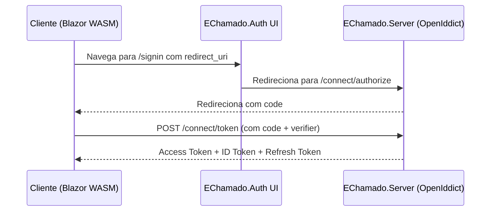

# 🔐 EChamado.Auth - UI de Autenticação

## 🌟 Visão Geral

O `EChamado.Auth` é o componente responsável pela **interface de usuário de autenticação** do sistema EChamado. Ele funciona como uma camada de apresentação que orquestra o fluxo de login, registro e logout, redirecionando para o servidor de autorização real (`EChamado.Server`).

## 🏗️ Arquitetura

### 📋 Responsabilidades

- **UI de Autenticação**: Interface amigável para login e registro
- **Orquestração de Fluxo**: Gerencia redirecionamentos para o servidor OpenIddict
- **Experiência do Usuário**: Feedback visual e validação de formulários
- **Segurança**: Validação client-side e proteção contra ataques

### 🚫 O que NÃO faz

- **Emissão de Tokens**: Tokens são emitidos pelo `EChamado.Server`
- **Validação de Credenciais**: Autenticação real ocorre no `EChamado.Server`
- **Lógica de Negócio**: Não contém regras de negócio do E-Chamado

## 🔧 Tecnologias

- **Framework**: ASP.NET Core 9.0
- **UI**: Blazor Server
- **Componentes**: MudBlazor
- **Banco de Dados**: PostgreSQL (compartilhado com EChamado.Server)
- **Identity**: ASP.NET Core Identity

## 🌐 Endpoints

### Principais Rotas

| Rota | Método | Descrição |
|------|--------|-----------|
| `/signin` | GET | Página de login |
| `/signup` | GET | Página de registro |
| `/signout` | GET | Página de logout |
| `/connect/authorize` | GET/POST | Redirecionamento para EChamado.Server |

### Fluxo de Redirecionamento



## 🔒 Segurança

### Medidas Implementadas

- **HTTPS Obrigatório**: Todas as comunicações são criptografadas
- **Validação Client-Side**: Prevenção de dados inválidos
- **Proteção CSRF**: Tokens anti-falsificação
- **Sanitização de Entrada**: Prevenção de XSS

### Configuração de Segurança

```csharp
// Program.cs
builder.Services.AddAuthentication(options =>
{
    options.DefaultScheme = IdentityConstants.ApplicationScheme;
    options.DefaultSignInScheme = IdentityConstants.ExternalScheme;
});
```

## 📱 Componentes UI

### Principais Componentes

1. **LoginComponent**: Formulário de login
2. **RegisterComponent**: Formulário de registro
3. **LogoutComponent**: Interface de logout
4. **ErrorComponent**: Exibição de erros

### Padrões de UI

- **MudBlazor**: Componentes Material Design
- **Responsividade**: Funciona em desktop e mobile
- **Acessibilidade**: Suporte a leitores de tela
- **Internacionalização**: Suporte a múltiplos idiomas

## 🔄 Integração com EChamado.Server

### Configuração de Redirecionamento

```csharp
// AuthorizationController.cs
[HttpGet("~/connect/authorize")]
[HttpPost("~/connect/authorize")]
public IActionResult Authorize()
{
    var redirectUri = "https://localhost:7296/connect/authorize" + Request.QueryString;
    return Redirect(redirectUri);
}
```

### Parâmetros de Autorização

- **client_id**: Identificador do cliente
- **redirect_uri**: URI de retorno
- **response_type**: Tipo de resposta (code)
- **scope**: Escopos solicitados
- **state**: Estado para prevenção de CSRF
- **code_challenge**: Desafio PKCE
- **code_challenge_method**: Método do desafio

## 🛠️ Desenvolvimento

### Estrutura de Pastas

```
Echamado.Auth/
├── Components/
│   ├── Layout/
│   └── Pages/
├── Controllers/
├── Models/
├── Views/
├── wwwroot/
└── appsettings.json
```

### Configuração de Desenvolvimento

```json
{
  "ConnectionStrings": {
    "DefaultConnection": "Host=localhost;Port=5432;Database=e-chamado;User Id=postgres;Password=dsv@123;"
  },
  "Logging": {
    "LogLevel": {
      "Default": "Information",
      "Microsoft.AspNetCore": "Warning"
    }
  }
}
```

## 🧪 Testes

### Tipos de Testes

1. **Testes Unitários**: Componentes isolados
2. **Testes de Integração**: Fluxo completo
3. **Testes E2E**: Cenários reais de usuário

### Exemplo de Teste

```csharp
[Fact]
public void LoginForm_WithValidCredentials_ShouldRedirectToServer()
{
    // Arrange
    var component = RenderComponent<LoginComponent>();
    
    // Act
    component.Find("#email").Change("user@example.com");
    component.Find("#password").Change("password123");
    component.Find("form").Submit();
    
    // Assert
    Assert.Contains("https://localhost:7296/connect/authorize", 
                   NavigationManager.Uri);
}
```

## 🚀 Deployment

### Configuração de Produção

- **HTTPS**: Certificado SSL válido
- **Secrets**: Configuração via Azure Key Vault
- **Logs**: Integração com Elasticsearch
- **Monitoramento**: Application Insights

### Variáveis de Ambiente

```bash
ASPNETCORE_ENVIRONMENT=Production
ASPNETCORE_URLS=https://+:443;http://+:80
CONNECTION_STRING=Host=prod-postgres;Database=e-chamado;...
```

## 📋 Checklist de Implementação

- [ ] Configurar ASP.NET Core Identity
- [ ] Implementar componentes MudBlazor
- [ ] Configurar redirecionamento para EChamado.Server
- [ ] Implementar validação client-side
- [ ] Adicionar proteção CSRF
- [ ] Configurar HTTPS
- [ ] Implementar testes unitários
- [ ] Configurar logging
- [ ] Documentar endpoints
- [ ] Validar fluxo de autenticação

## 📚 Referências

- [ASP.NET Core Identity](https://docs.microsoft.com/en-us/aspnet/core/security/authentication/identity)
- [MudBlazor Components](https://mudblazor.com/components)
- [OAuth 2.0 Authorization Code Flow](https://oauth.net/2/grant-types/authorization-code/)
- [OpenIddict Documentation](https://documentation.openiddict.com/)

### Testes End-to-End (Playwright com .NET/xUnit)

- **Cenário:** Simular o fluxo completo de um usuário real. Este é o tipo de teste mais importante para este projeto.
- **Template Obrigatório para o Fluxo de Login:**

```csharp
[Fact]
public async Task FullLoginFlow_WithValidCredentials_ShouldRedirectToClientWithSuccess()
{
    // Arrange
    await using var playwright = await Playwright.CreateAsync();
    await using var browser = await playwright.Chromium.LaunchAsync(new() { Headless = false });
    var page = await browser.NewPageAsync();

    // Pré-condição: Garanta que um usuário de teste exista no banco de dados.

    // Act
    // 1. Tenta acessar uma página protegida no cliente para iniciar o redirecionamento.
    await page.GotoAsync("https://localhost:7274/fetchdata");

    // 2. Espera ser redirecionado para a página de login do Auth Server.
    await page.WaitForURLAsync("**/connect/authorize**");

    // 3. Preenche as credenciais e submete o formulário.
    await page.GetByLabel("Email").FillAsync("usuario.teste@email.com");
    await page.GetByLabel("Password").FillAsync("SenhaSuperSegura@123");
    await page.GetByRole(AriaRole.Button, new() { Name = "Log in" }).ClickAsync();

    // 4. Lida com a tela de consentimento, se aplicável.
    await page.GetByRole(AriaRole.Button, new() { Name = "Accept" }).ClickAsync();

    // Assert
    // 5. Valida que o redirecionamento de volta para o cliente foi bem-sucedido.
    await page.WaitForURLAsync("**/fetchdata**");
    await Expect(page.GetByText("Previsão do Tempo")).ToBeVisibleAsync();
}
```
