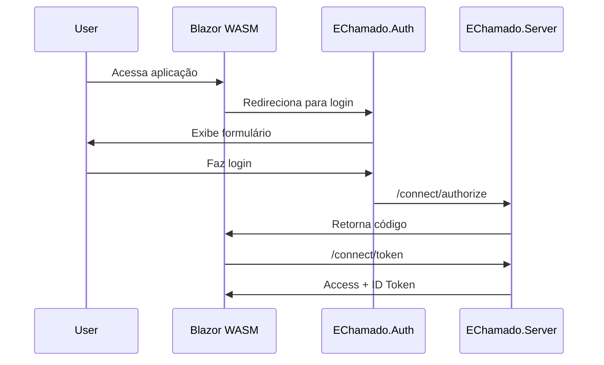

# 🌐 EChamado.Client - Interface Blazor WebAssembly

## 🌟 Visão Geral

O `EChamado.Client` é a interface de usuário do sistema EChamado, desenvolvida em **Blazor WebAssembly**. Oferece uma experiência rica e responsiva para gerenciamento de chamados, com autenticação integrada via OpenIddict e comunicação com APIs protegidas.

## 🏗️ Arquitetura

### 📱 Single Page Application (SPA)

- **Framework**: Blazor WebAssembly (WASM)
- **UI Components**: MudBlazor
- **State Management**: Serviços injetáveis
- **Routing**: Blazor Router
- **Authentication**: OIDC com Authorization Code + PKCE

### 🔄 Padrão Arquitetural

```
EChamado.Client/
├── Components/          # Componentes reutilizáveis
├── Pages/              # Páginas da aplicação
├── Services/           # Serviços de negócio
├── Models/             # ViewModels e DTOs
├── Handlers/           # Message handlers
└── wwwroot/           # Assets estáticos
```

## 🔐 Autenticação OIDC

### Configuração OpenID Connect

```csharp
builder.Services.AddOidcAuthentication(options =>
{
    options.ProviderOptions.Authority = "https://localhost:7296";
    options.ProviderOptions.ClientId = "bwa-client";
    options.ProviderOptions.ResponseType = "code";
    options.ProviderOptions.DefaultScopes.Add("openid");
    options.ProviderOptions.DefaultScopes.Add("profile");
    options.ProviderOptions.DefaultScopes.Add("email");
    options.ProviderOptions.DefaultScopes.Add("api");
    options.ProviderOptions.DefaultScopes.Add("chamados");
});
```

### Fluxo de Autenticação



### Proteção de Rotas

```csharp
// App.razor
<CascadingAuthenticationState>
    <Router AppAssembly="@typeof(App).Assembly">
        <Found Context="routeData">
            <AuthorizeRouteView RouteData="@routeData" DefaultLayout="@typeof(MainLayout)">
                <NotAuthorized>
                    <RedirectToLogin />
                </NotAuthorized>
            </AuthorizeRouteView>
        </Found>
    </Router>
</CascadingAuthenticationState>
```

## 🛠️ Componentes Principais

### 1. Layout Components

**MainLayout.razor**

```razor
@inherits LayoutView
@inject NavigationManager Navigation

<MudThemeProvider />
<MudDialogProvider />
<MudSnackbarProvider />

<MudLayout>
    <MudAppBar>
        <MudIconButton Icon="Icons.Material.Filled.Menu" OnClick="@ToggleDrawer" />
        <MudText Typo="Typo.h6">EChamado</MudText>
        <MudSpacer />
        <LoginDisplay />
    </MudAppBar>
    
    <MudDrawer @bind-Open="@_drawerOpen">
        <NavMenu />
    </MudDrawer>
    
    <MudMainContent>
        @Body
    </MudMainContent>
</MudLayout>
```

**NavMenu.razor**

```razor
<MudNavMenu>
    <MudNavLink Href="/" Match="NavLinkMatch.All" Icon="Icons.Material.Filled.Home">
        Dashboard
    </MudNavLink>
    <MudNavLink Href="/chamados" Icon="Icons.Material.Filled.Support">
        Chamados
    </MudNavLink>
    <MudNavLink Href="/usuarios" Icon="Icons.Material.Filled.People">
        Usuários
    </MudNavLink>
</MudNavMenu>
```

### 2. Feature Components

**ChamadoCard.razor**

```razor
@inject IChamadoService ChamadoService

<MudCard Class="ma-2">
    <MudCardHeader>
        <CardHeaderContent>
            <MudText Typo="Typo.h6">@Chamado.Titulo</MudText>
        </CardHeaderContent>
        <CardHeaderActions>
            <MudChip Color="@GetStatusColor()" Label="true">
                @Chamado.Status
            </MudChip>
        </CardHeaderActions>
    </MudCardHeader>
    
    <MudCardContent>
        <MudText>@Chamado.Descricao</MudText>
        <MudText Typo="Typo.caption" Class="mt-2">
            Criado em: @Chamado.DataCriacao.ToString("dd/MM/yyyy")
        </MudText>
    </MudCardContent>
    
    <MudCardActions>
        <MudButton Variant="Variant.Text" 
                   OnClick="@(() => NavigateToDetails(Chamado.Id))">
            Ver Detalhes
        </MudButton>
    </MudCardActions>
</MudCard>

@code {
    [Parameter] public ChamadoViewModel Chamado { get; set; } = default!;
    
    private Color GetStatusColor() => Chamado.Status switch
    {
        "Aberto" => Color.Warning,
        "Em Andamento" => Color.Info,
        "Fechado" => Color.Success,
        _ => Color.Default
    };
    
    private void NavigateToDetails(Guid id)
    {
        Navigation.NavigateTo($"/chamados/{id}");
    }
}
```

## 🔌 Serviços de Integração

### ChamadoService

```csharp
public interface IChamadoService
{
    Task<PagedResult<ChamadoViewModel>> GetChamadosAsync(int page = 1, int pageSize = 10);
    Task<ChamadoViewModel?> GetChamadoByIdAsync(Guid id);
    Task<ChamadoViewModel> CreateChamadoAsync(CreateChamadoRequest request);
    Task UpdateChamadoAsync(Guid id, UpdateChamadoRequest request);
    Task DeleteChamadoAsync(Guid id);
}

public class ChamadoService : IChamadoService
{
    private readonly HttpClient _httpClient;
    private readonly ILogger<ChamadoService> _logger;

    public ChamadoService(HttpClient httpClient, ILogger<ChamadoService> logger)
    {
        _httpClient = httpClient;
        _logger = logger;
    }

    public async Task<PagedResult<ChamadoViewModel>> GetChamadosAsync(int page = 1, int pageSize = 10)
    {
        try
        {
            var response = await _httpClient.GetAsync($"api/chamados?page={page}&pageSize={pageSize}");
            response.EnsureSuccessStatusCode();
            
            return await response.Content.ReadFromJsonAsync<PagedResult<ChamadoViewModel>>() 
                   ?? new PagedResult<ChamadoViewModel>();
        }
        catch (Exception ex)
        {
            _logger.LogError(ex, "Erro ao buscar chamados");
            throw;
        }
    }

    public async Task<ChamadoViewModel?> GetChamadoByIdAsync(Guid id)
    {
        try
        {
            return await _httpClient.GetFromJsonAsync<ChamadoViewModel>($"api/chamados/{id}");
        }
        catch (HttpRequestException ex) when (ex.Message.Contains("404"))
        {
            return null;
        }
    }

    public async Task<ChamadoViewModel> CreateChamadoAsync(CreateChamadoRequest request)
    {
        var response = await _httpClient.PostAsJsonAsync("api/chamados", request);
        response.EnsureSuccessStatusCode();
        
        return await response.Content.ReadFromJsonAsync<ChamadoViewModel>() 
               ?? throw new InvalidOperationException("Resposta inválida do servidor");
    }
}
```

### AuthenticationService

```csharp
public class AuthenticationService
{
    private readonly IAccessTokenProvider _tokenProvider;
    private readonly NavigationManager _navigation;

    public AuthenticationService(IAccessTokenProvider tokenProvider, NavigationManager navigation)
    {
        _tokenProvider = tokenProvider;
        _navigation = navigation;
    }

    public async Task<string?> GetAccessTokenAsync()
    {
        var tokenResult = await _tokenProvider.RequestAccessToken();
        return tokenResult.TryGetToken(out var token) ? token.Value : null;
    }

    public void NavigateToLogin()
    {
        _navigation.NavigateToLogin("authentication/login");
    }

    public void NavigateToLogout()
    {
        _navigation.NavigateToLogout("authentication/logout");
    }
}
```

## 📱 Páginas Principais

### Dashboard.razor

```razor
@page "/"
@inject IChamadoService ChamadoService
@inject ISnackbar Snackbar
@attribute [Authorize]

<PageTitle>Dashboard - EChamado</PageTitle>

<MudContainer MaxWidth="MaxWidth.Large" Class="mt-4">
    <MudText Typo="Typo.h4" Class="mb-4">Dashboard</MudText>
    
    <MudGrid>
        <MudItem xs="12" md="3">
            <MudPaper Class="pa-4 text-center">
                <MudText Typo="Typo.h6" Color="Color.Primary">
                    Total de Chamados
                </MudText>
                <MudText Typo="Typo.h3">@_totalChamados</MudText>
            </MudPaper>
        </MudItem>
        
        <MudItem xs="12" md="3">
            <MudPaper Class="pa-4 text-center">
                <MudText Typo="Typo.h6" Color="Color.Warning">
                    Em Aberto
                </MudText>
                <MudText Typo="Typo.h3">@_chamadosAbertos</MudText>
            </MudPaper>
        </MudItem>
    </MudGrid>
    
    <MudPaper Class="pa-4 mt-4">
        <MudText Typo="Typo.h6" Class="mb-4">Chamados Recentes</MudText>
        
        @if (_loading)
        {
            <MudProgressLinear Indeterminate="true" />
        }
        else if (_chamados?.Any() == true)
        {
            <MudGrid>
                @foreach (var chamado in _chamados)
                {
                    <MudItem xs="12" md="6" lg="4">
                        <ChamadoCard Chamado="@chamado" />
                    </MudItem>
                }
            </MudGrid>
        }
        else
        {
            <MudAlert Severity="Severity.Info">
                Nenhum chamado encontrado.
            </MudAlert>
        }
    </MudPaper>
</MudContainer>

@code {
    private bool _loading = true;
    private List<ChamadoViewModel>? _chamados;
    private int _totalChamados;
    private int _chamadosAbertos;

    protected override async Task OnInitializedAsync()
    {
        try
        {
            var result = await ChamadoService.GetChamadosAsync(1, 6);
            _chamados = result.Items;
            _totalChamados = result.TotalCount;
            _chamadosAbertos = _chamados?.Count(c => c.Status == "Aberto") ?? 0;
        }
        catch (Exception ex)
        {
            Snackbar.Add($"Erro ao carregar dashboard: {ex.Message}", Severity.Error);
        }
        finally
        {
            _loading = false;
        }
    }
}
```

### ChamadosList.razor

```razor
@page "/chamados"
@inject IChamadoService ChamadoService
@inject IDialogService DialogService
@inject ISnackbar Snackbar
@attribute [Authorize]

<PageTitle>Chamados - EChamado</PageTitle>

<MudContainer MaxWidth="MaxWidth.Large" Class="mt-4">
    <MudText Typo="Typo.h4" Class="mb-4">Gerenciar Chamados</MudText>
    
    <MudPaper Class="pa-4">
        <div class="d-flex justify-space-between align-center mb-4">
            <MudTextField @bind-Value="_searchTerm" 
                         Label="Pesquisar chamados"
                         Immediate="true"
                         OnKeyUp="@SearchChamados"
                         Class="flex-grow-1 mr-4" />
            
            <MudButton Variant="Variant.Filled" 
                      Color="Color.Primary"
                      StartIcon="Icons.Material.Filled.Add"
                      OnClick="@OpenCreateDialog">
                Novo Chamado
            </MudButton>
        </div>
        
        <MudDataGrid @ref="_dataGrid"
                     Items="@_chamados"
                     Loading="@_loading"
                     Pageable="true"
                     PageSize="10">
            <Columns>
                <PropertyColumn Property="x => x.Titulo" Title="Título" />
                <PropertyColumn Property="x => x.Status" Title="Status">
                    <CellTemplate>
                        <MudChip Color="@GetStatusColor(context.Item.Status)" Label="true">
                            @context.Item.Status
                        </MudChip>
                    </CellTemplate>
                </PropertyColumn>
                <PropertyColumn Property="x => x.DataCriacao" Title="Data Criação" />
                <TemplateColumn Title="Ações">
                    <CellTemplate>
                        <MudButtonGroup>
                            <MudIconButton Icon="Icons.Material.Filled.Visibility" 
                                         OnClick="@(() => ViewChamado(context.Item.Id))" />
                            <MudIconButton Icon="Icons.Material.Filled.Edit" 
                                         OnClick="@(() => EditChamado(context.Item.Id))" />
                            <MudIconButton Icon="Icons.Material.Filled.Delete" 
                                         Color="Color.Error"
                                         OnClick="@(() => DeleteChamado(context.Item.Id))" />
                        </MudButtonGroup>
                    </CellTemplate>
                </TemplateColumn>
            </Columns>
        </MudDataGrid>
    </MudPaper>
</MudContainer>

@code {
    private MudDataGrid<ChamadoViewModel>? _dataGrid;
    private List<ChamadoViewModel> _chamados = new();
    private bool _loading = true;
    private string _searchTerm = string.Empty;

    protected override async Task OnInitializedAsync()
    {
        await LoadChamados();
    }

    private async Task LoadChamados()
    {
        try
        {
            _loading = true;
            var result = await ChamadoService.GetChamadosAsync();
            _chamados = result.Items;
        }
        catch (Exception ex)
        {
            Snackbar.Add($"Erro ao carregar chamados: {ex.Message}", Severity.Error);
        }
        finally
        {
            _loading = false;
        }
    }

    private Color GetStatusColor(string status) => status switch
    {
        "Aberto" => Color.Warning,
        "Em Andamento" => Color.Info,
        "Fechado" => Color.Success,
        _ => Color.Default
    };
}
```

## 🔧 Configuração e Setup

### Program.cs

```csharp
var builder = WebAssemblyHostBuilder.CreateDefault(args);
builder.RootComponents.Add<App>("#app");
builder.RootComponents.Add<HeadOutlet>("head::after");

// HttpClient configuração
builder.Services.AddScoped(sp => new HttpClient 
{ 
    BaseAddress = new Uri(builder.HostEnvironment.BaseAddress) 
});

// MudBlazor
builder.Services.AddMudServices();

// Configuração OIDC
builder.Services.AddOidcAuthentication(options =>
{
    builder.Configuration.Bind("oidc", options.ProviderOptions);
});

// HttpClient autenticado para APIs
builder.Services.AddHttpClient<ChamadoService>(client =>
{
    var backendUrl = builder.Configuration["BackendUrl"] ?? "https://localhost:7296";
    client.BaseAddress = new Uri(backendUrl);
})
.AddHttpMessageHandler<BaseAddressAuthorizationMessageHandler>();

// Serviços da aplicação
builder.Services.AddScoped<IChamadoService, ChamadoService>();
builder.Services.AddScoped<AuthenticationService>();

await builder.Build().RunAsync();
```

### appsettings.json

```json
{
  "oidc": {
    "Authority": "https://localhost:7296",
    "ClientId": "bwa-client",
    "DefaultScopes": ["openid", "profile", "email", "api", "chamados"],
    "ResponseType": "code",
    "PostLogoutRedirectUri": "https://localhost:7274/authentication/logout-callback",
    "RedirectUri": "https://localhost:7274/authentication/login-callback"
  },
  "BackendUrl": "https://localhost:7296"
}
```

## 🧪 Testes

### Testes de Componentes (bUnit)

```csharp
[Fact]
public void ChamadoCard_ShouldDisplayCorrectInformation()
{
    // Arrange
    var chamado = new ChamadoViewModel
    {
        Id = Guid.NewGuid(),
        Titulo = "Teste",
        Descricao = "Descrição teste",
        Status = "Aberto",
        DataCriacao = DateTime.Now
    };

    // Act
    var component = RenderComponent<ChamadoCard>(parameters =>
        parameters.Add(p => p.Chamado, chamado));

    // Assert
    component.Find("h6").TextContent.Should().Be("Teste");
    component.Find(".mud-chip").TextContent.Should().Contain("Aberto");
}
```

### Testes de Serviços

```csharp
[Fact]
public async Task GetChamadosAsync_ShouldReturnChamados()
{
    // Arrange
    var httpClient = new HttpClient(new MockHttpMessageHandler());
    var service = new ChamadoService(httpClient, Mock.Of<ILogger<ChamadoService>>());

    // Act
    var result = await service.GetChamadosAsync();

    // Assert
    result.Items.Should().NotBeEmpty();
}
```

## 🚀 Deployment

### Build de Produção

```bash
dotnet publish -c Release -o dist/
```

### Configuração do Servidor Web

```nginx
server {
    listen 80;
    server_name echamado.com;
    root /var/www/echamado/wwwroot;
    index index.html;

    location / {
        try_files $uri $uri/ /index.html;
    }

    location /api/ {
        proxy_pass https://api.echamado.com/;
        proxy_set_header Host $host;
        proxy_set_header X-Real-IP $remote_addr;
    }
}
```

## 📋 Checklist de Implementação

- [ ] Configurar Blazor WebAssembly
- [ ] Implementar autenticação OIDC
- [ ] Configurar MudBlazor
- [ ] Criar serviços de integração
- [ ] Implementar componentes principais
- [ ] Configurar roteamento
- [ ] Implementar tratamento de erros
- [ ] Configurar logging client-side
- [ ] Implementar testes de componentes
- [ ] Otimizar para produção
- [ ] Configurar PWA (opcional)
- [ ] Implementar internacionalização

## 📚 Referências

- [Blazor WebAssembly Documentation](https://docs.microsoft.com/en-us/aspnet/core/blazor/webassembly/)
- [MudBlazor Components](https://mudblazor.com/components)
- [OIDC Authentication in Blazor](https://docs.microsoft.com/en-us/aspnet/core/blazor/security/webassembly/)
- [bUnit Testing Framework](https://bunit.dev/)
