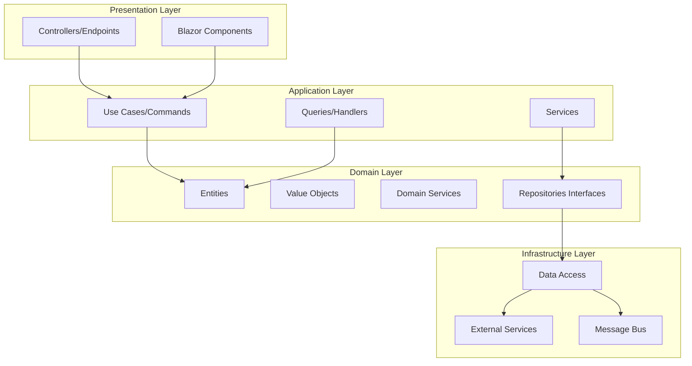
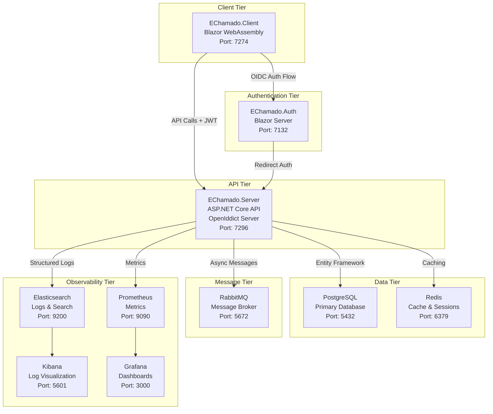
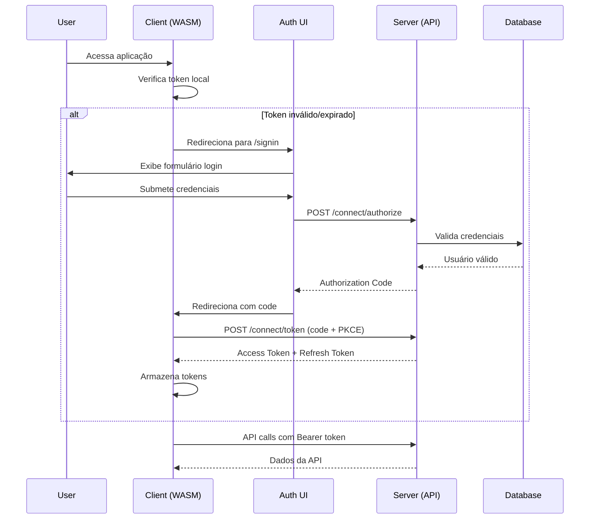
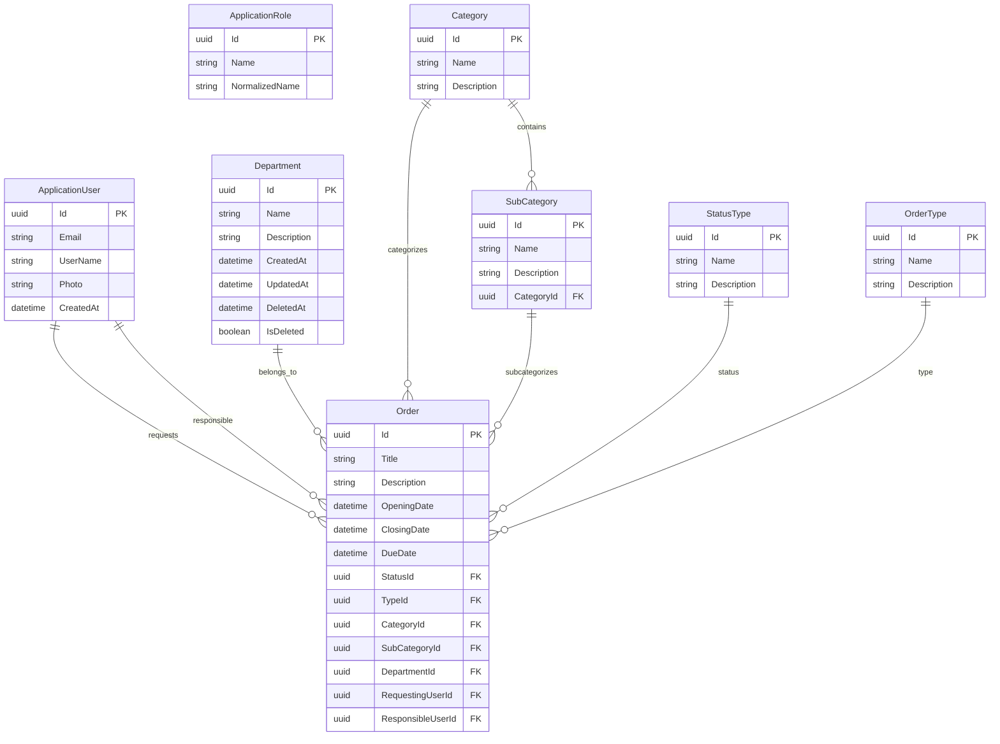
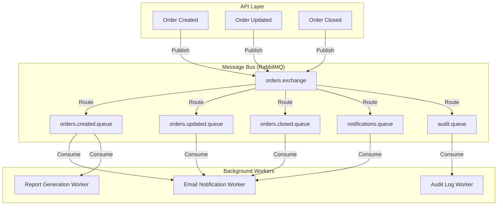
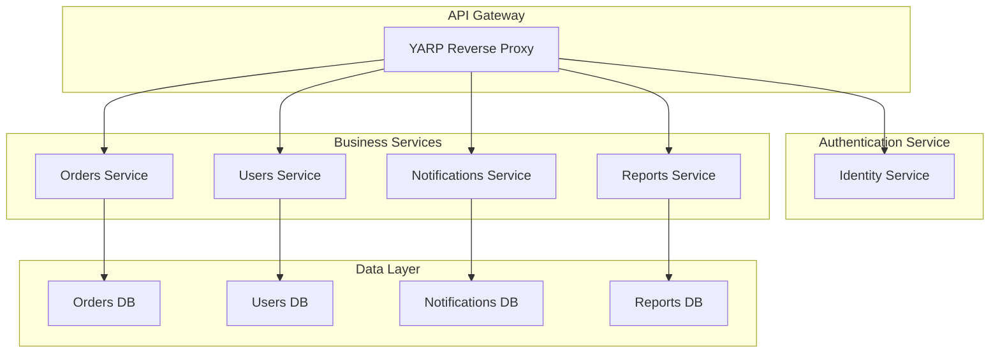

# 🏗️ Arquitetura do Sistema - EChamado

## 📋 Índice

- [Visão Geral](#-visão-geral)
- [Princípios Arquiteturais](#-princípios-arquiteturais)
- [Arquitetura de Alto Nível](#-arquitetura-de-alto-nível)
- [Componentes do Sistema](#-componentes-do-sistema)
- [Padrões Implementados](#-padrões-implementados)
- [Decisões Técnicas](#-decisões-técnicas)
- [Diagramas Detalhados](#-diagramas-detalhados)
- [Estratégias de Escalabilidade](#-estratégias-de-escalabilidade)

## 🌟 Visão Geral

O **EChamado** é uma solução empresarial construída seguindo os princípios da **Clean Architecture** e **Domain-Driven Design (DDD)**, implementando um sistema distribuído com separação clara de responsabilidades e alta coesão.

### 🎯 Objetivos Arquiteturais

- **Escalabilidade**: Suporte a crescimento horizontal e vertical
- **Manutenibilidade**: Código limpo e bem estruturado
- **Testabilidade**: Arquitetura que facilita testes automatizados
- **Segurança**: Implementação robusta de autenticação e autorização
- **Performance**: Otimizações de cache e consultas
- **Observabilidade**: Monitoramento e logging abrangentes

## 🏛️ Princípios Arquiteturais

### 1. **Clean Architecture**



### 2. **CQRS (Command Query Responsibility Segregation)**

- **Commands**: Operações de escrita (Create, Update, Delete)
- **Queries**: Operações de leitura otimizadas
- **Handlers**: Processamento isolado de comandos e consultas
- **MediatR**: Mediação entre controllers e handlers

### 3. **Domain-Driven Design**

- **Bounded Contexts**: Separação por domínios de negócio
- **Aggregates**: Consistência transacional
- **Value Objects**: Objetos imutáveis
- **Domain Events**: Comunicação entre agregados

## 🏗️ Arquitetura de Alto Nível



## 🧩 Componentes do Sistema

### 🖥️ EChamado.Client (Frontend)

**Tecnologia**: Blazor WebAssembly + MudBlazor

**Responsabilidades**:
- Interface de usuário responsiva
- Autenticação OAuth2 + PKCE
- Consumo de APIs REST
- Gerenciamento de estado local

**Estrutura**:
```
EChamado.Client/
├── Pages/           # Páginas Blazor
├── Layout/          # Layouts e componentes de UI
├── Services/        # Serviços HTTP
├── Handlers/        # Handlers de autenticação
└── Security/        # Configurações de segurança
```

### 🔐 EChamado.Auth (Authentication UI)

**Tecnologia**: Blazor Server + ASP.NET Core Identity

**Responsabilidades**:
- Interface de login/registro
- Orquestração do fluxo OAuth2
- Redirecionamento para Authorization Server
- Gestão de sessões de usuário

**Estrutura**:
```
Echamado.Auth/
├── Components/      # Componentes Blazor Server
├── Controllers/     # Controllers de redirecionamento
├── Models/          # ViewModels de autenticação
└── Views/           # Views MVC (se necessário)
```

### 🖥️ EChamado.Server (Backend API)

**Tecnologia**: ASP.NET Core 9 + OpenIddict + Entity Framework

**Responsabilidades**:
- API REST para operações de negócio
- Authorization Server (OpenIddict)
- Validação de tokens JWT
- Lógica de negócio
- Integração com infraestrutura

**Estrutura por Camadas**:

#### 📊 EChamado.Server.Domain
```
Domain/
├── Domains/
│   ├── Identities/     # Entidades de usuário
│   └── Orders/         # Entidades de chamados
├── Repositories/       # Interfaces de repositório
├── Services/          # Serviços de domínio
└── Validations/       # Validações de negócio
```

#### 🔧 EChamado.Server.Application
```
Application/
├── UseCases/
│   ├── Auth/          # Casos de uso de autenticação
│   ├── Departments/   # Casos de uso de departamentos
│   └── Orders/        # Casos de uso de chamados
├── Services/          # Serviços de aplicação
└── Common/            # Behaviors e validações
```

#### 🏗️ EChamado.Server.Infrastructure
```
Infrastructure/
├── Persistence/       # Entity Framework + Mappings
├── OpenIddict/        # Configuração OpenIddict
├── MessageBus/        # RabbitMQ
├── Redis/             # Cache Redis
└── Email/             # Serviços de email
```

#### 🌐 EChamado.Server (Web API)
```
Server/
├── Controllers/       # Controllers OAuth2
├── Endpoints/         # Minimal APIs
├── Configuration/     # Configurações de startup
├── Middlewares/       # Middlewares customizados
└── Extensions/        # Extension methods
```

## 🎨 Padrões Implementados

### 1. **Repository Pattern**

```csharp
public interface IRepository<TEntity> where TEntity : Entity
{
    Task<TEntity?> GetByIdAsync(Guid id);
    Task<PagedResult<TEntity>> GetPagedAsync(BaseSearch search);
    Task<TEntity> AddAsync(TEntity entity);
    Task UpdateAsync(TEntity entity);
    Task DeleteAsync(Guid id);
}
```

### 2. **Unit of Work Pattern**

```csharp
public interface IUnitOfWork
{
    IDepartmentRepository Departments { get; }
    IOrderRepository Orders { get; }
    ICategoryRepository Categories { get; }
    
    Task BeginTransactionAsync();
    Task CommitAsync();
    Task RollbackAsync();
}
```

### 3. **CQRS com MediatR**

```csharp
// Command
public class CreateDepartmentCommand : IRequest<BaseResult>
{
    public string Name { get; set; }
    public string Description { get; set; }
}

// Handler
public class CreateDepartmentCommandHandler : IRequestHandler<CreateDepartmentCommand, BaseResult>
{
    public async Task<BaseResult> Handle(CreateDepartmentCommand request, CancellationToken cancellationToken)
    {
        // Implementação
    }
}
```

### 4. **Domain Events**

```csharp
public class DepartmentCreatedEvent : IDomainEvent
{
    public Guid DepartmentId { get; set; }
    public string Name { get; set; }
    public DateTime OccurredOn { get; set; }
}
```

## 🤔 Decisões Técnicas

### 1. **Por que Blazor WebAssembly?**

**Decisão**: Blazor WASM para o frontend

**Justificativa**:
- ✅ Desenvolvimento full-stack em C#
- ✅ Reutilização de código entre client/server
- ✅ Performance próxima ao nativo
- ✅ Integração natural com .NET ecosystem
- ✅ Suporte oficial Microsoft

**Alternativas Consideradas**:
- React/Angular: Complexidade adicional de tecnologias
- Blazor Server: Dependência de conexão constante

### 2. **Por que OpenIddict?**

**Decisão**: OpenIddict como Authorization Server

**Justificativa**:
- ✅ Implementação completa OAuth2/OIDC
- ✅ Integração nativa com ASP.NET Core
- ✅ Suporte a múltiplos fluxos de autenticação
- ✅ Flexibilidade de configuração
- ✅ Performance superior

**Alternativas Consideradas**:
- IdentityServer: Licenciamento comercial
- Azure AD B2C: Dependência de cloud
- Auth0: Custo e dependência externa

### 3. **Por que PostgreSQL?**

**Decisão**: PostgreSQL como banco principal

**Justificativa**:
- ✅ Performance superior para consultas complexas
- ✅ Suporte avançado a JSON
- ✅ Extensibilidade e recursos avançados
- ✅ Open source e gratuito
- ✅ Excelente suporte no Entity Framework

**Alternativas Consideradas**:
- SQL Server: Custo de licenciamento
- MySQL: Recursos limitados
- MongoDB: Complexidade de relacionamentos

### 4. **Por que RabbitMQ?**

**Decisão**: RabbitMQ para mensageria

**Justificativa**:
- ✅ Confiabilidade e durabilidade de mensagens
- ✅ Padrões de roteamento flexíveis
- ✅ Interface de administração robusta
- ✅ Suporte a clustering
- ✅ Integração .NET madura

**Alternativas Consideradas**:
- Azure Service Bus: Dependência de cloud
- Apache Kafka: Complexidade desnecessária
- Redis Pub/Sub: Falta de persistência

## 📊 Diagramas Detalhados

### 1. **Fluxo de Autenticação Completo**



### 2. **Arquitetura de Dados**



### 3. **Fluxo de Mensageria**



## 🚀 Estratégias de Escalabilidade

### 1. **Escalabilidade Horizontal**

#### **Load Balancing**
```yaml
# nginx.conf
upstream echamado_api {
    server api1:7296;
    server api2:7296;
    server api3:7296;
}

server {
    listen 443 ssl;
    server_name api.echamado.com;
    
    location / {
        proxy_pass http://echamado_api;
        proxy_set_header Host $host;
        proxy_set_header X-Real-IP $remote_addr;
    }
}
```

#### **Database Scaling**
- **Read Replicas**: PostgreSQL com réplicas de leitura
- **Connection Pooling**: PgBouncer para otimização de conexões
- **Partitioning**: Particionamento de tabelas por data

#### **Cache Distribuído**
- **Redis Cluster**: Cache distribuído para múltiplas instâncias
- **CDN**: CloudFlare para assets estáticos
- **Application Cache**: Cache em memória com invalidação

### 2. **Escalabilidade Vertical**

#### **Performance Tuning**
- **Database Indexing**: Índices otimizados para consultas frequentes
- **Query Optimization**: Análise e otimização de consultas EF Core
- **Memory Management**: Configuração de pools de objetos

#### **Resource Optimization**
```yaml
# docker-compose.production.yml
services:
  api:
    deploy:
      resources:
        limits:
          cpus: '2.0'
          memory: 4G
        reservations:
          cpus: '1.0'
          memory: 2G
```

### 3. **Microserviços (Futuro)**



## 📈 Métricas e Monitoramento

### 1. **Métricas de Performance**

- **Response Time**: < 200ms para 95% das requisições
- **Throughput**: > 1000 req/s por instância
- **Error Rate**: < 0.1% de erros 5xx
- **Availability**: 99.9% uptime

### 2. **Métricas de Negócio**

- **Orders Created**: Chamados criados por período
- **Resolution Time**: Tempo médio de resolução
- **User Activity**: Usuários ativos por período
- **System Usage**: Funcionalidades mais utilizadas

### 3. **Alertas Configurados**

- **High Error Rate**: > 1% de erros em 5 minutos
- **High Response Time**: > 500ms médio em 5 minutos
- **Database Connection**: Falha de conexão com BD
- **Memory Usage**: > 80% de uso de memória
- **Disk Space**: < 10% de espaço livre

---

## 📚 Referências

- [Clean Architecture - Robert C. Martin](https://blog.cleancoder.com/uncle-bob/2012/08/13/the-clean-architecture.html)
- [Domain-Driven Design - Eric Evans](https://domainlanguage.com/ddd/)
- [Microsoft .NET Application Architecture Guides](https://docs.microsoft.com/en-us/dotnet/architecture/)
- [OpenIddict Documentation](https://documentation.openiddict.com/)
- [ASP.NET Core Performance Best Practices](https://docs.microsoft.com/en-us/aspnet/core/performance/performance-best-practices)

---

**Última Atualização**: Janeiro 2025  
**Versão**: 1.0  
**Autor**: Equipe de Arquitetura EChamado