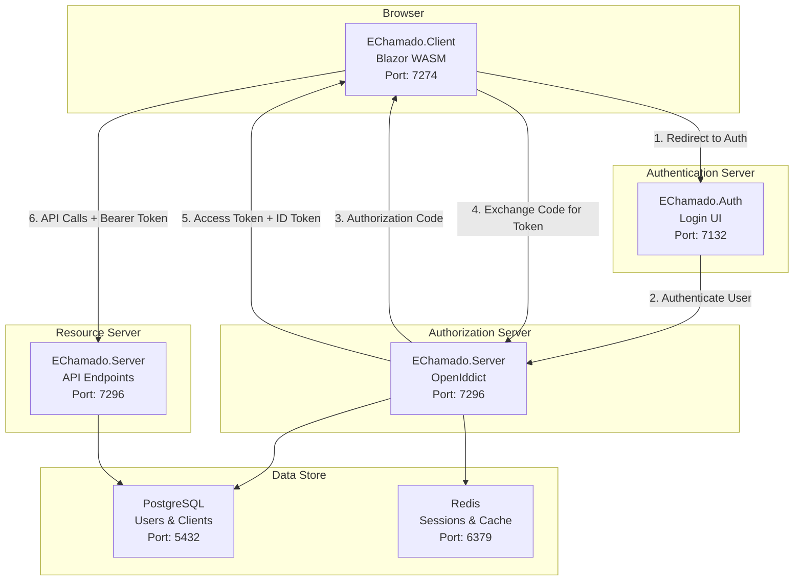
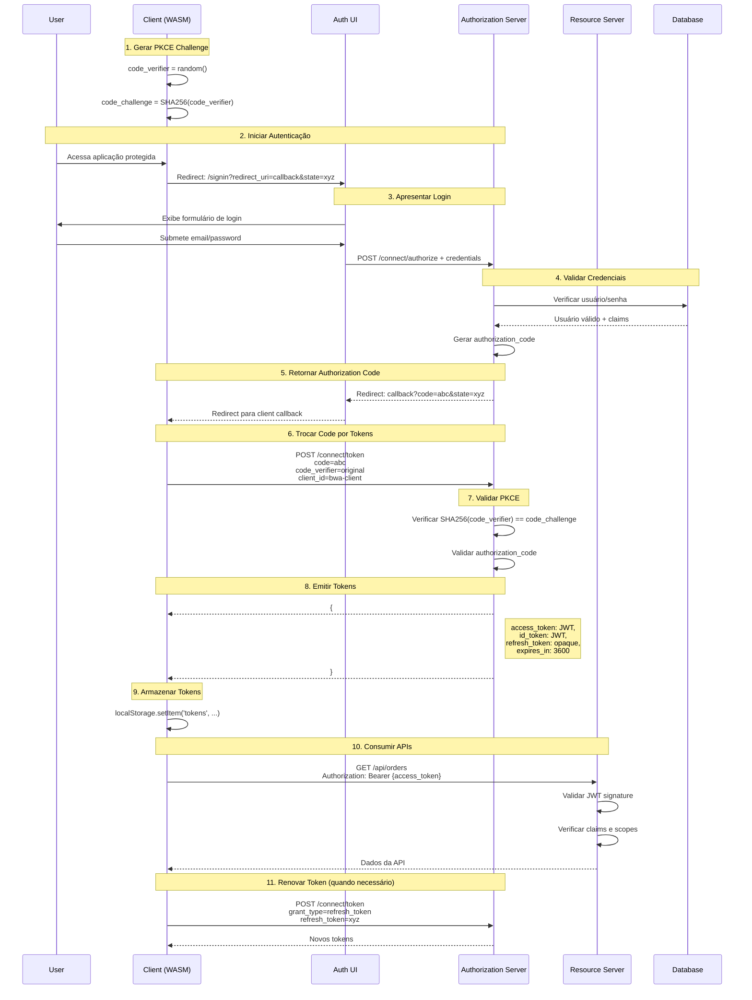

# 🔐 Autenticação e Autorização - EChamado

## 📋 Índice

- [Visão Geral](#-visão-geral)
- [Arquitetura de Autenticação](#-arquitetura-de-autenticação)
- [Fluxo OAuth2/OpenID Connect](#-fluxo-oauth2openid-connect)
- [Configuração OpenIddict](#-configuração-openiddict)
- [Implementação no Cliente](#-implementação-no-cliente)
- [Validação de Tokens](#-validação-de-tokens)
- [Segurança e Boas Práticas](#-segurança-e-boas-práticas)
- [Troubleshooting](#-troubleshooting)

## 🌟 Visão Geral

O sistema EChamado implementa um fluxo de autenticação moderno e seguro baseado em **OAuth 2.0** e **OpenID Connect**, utilizando o padrão **Authorization Code Flow com PKCE** (Proof Key for Code Exchange) para garantir máxima segurança em aplicações Single Page Applications (SPA).

### 🎯 Objetivos de Segurança

- **🔒 Zero Trust**: Nenhuma confiança implícita em componentes
- **🛡️ Defense in Depth**: Múltiplas camadas de segurança
- **🔑 Least Privilege**: Acesso mínimo necessário
- **📊 Auditability**: Rastreabilidade completa de acessos
- **⚡ Performance**: Validação eficiente de tokens

### 🏗️ Componentes de Autenticação

| Componente | Responsabilidade | Tecnologia |
|------------|------------------|------------|
| **EChamado.Auth** | UI de Autenticação | Blazor Server + Identity |
| **EChamado.Server** | Authorization Server | OpenIddict + ASP.NET Core |
| **EChamado.Client** | Resource Client | Blazor WASM + OIDC |

## 🏛️ Arquitetura de Autenticação

### 📊 Diagrama de Componentes



### 🔄 Fluxo de Responsabilidades

1. **EChamado.Client**: Inicia fluxo de autenticação e consome APIs
2. **EChamado.Auth**: Apresenta interface de login e coleta credenciais
3. **EChamado.Server**: Valida credenciais e emite tokens seguros
4. **PostgreSQL**: Armazena usuários, roles e configurações de clientes
5. **Redis**: Cache de sessões e tokens para performance

## 🔐 Fluxo OAuth2/OpenID Connect

### 📋 Authorization Code Flow com PKCE



### 🔑 Detalhes dos Tokens

#### **Access Token (JWT)**
```json
{
  "header": {
    "alg": "RS256",
    "typ": "JWT",
    "kid": "key-id"
  },
  "payload": {
    "iss": "https://localhost:7296",
    "aud": "EChamado.Server",
    "sub": "user-guid",
    "email": "user@example.com",
    "role": ["User", "Admin"],
    "scope": "openid profile email api chamados",
    "iat": 1640995200,
    "exp": 1640998800,
    "nbf": 1640995200
  }
}
```

#### **ID Token (JWT)**
```json
{
  "header": {
    "alg": "RS256",
    "typ": "JWT"
  },
  "payload": {
    "iss": "https://localhost:7296",
    "aud": "bwa-client",
    "sub": "user-guid",
    "email": "user@example.com",
    "name": "João Silva",
    "email_verified": true,
    "iat": 1640995200,
    "exp": 1640998800
  }
}
```

#### **Refresh Token (Opaque)**
```
Cryptographically secure random string
Usado apenas para renovar access tokens
Armazenado de forma segura no servidor
```

## ⚙️ Configuração OpenIddict

### 🔧 Configuração do Servidor (EChamado.Server)

#### **Program.cs**
```csharp
// Configuração OpenIddict
builder.Services.AddOpenIddict()
    .AddCore(options =>
    {
        options.UseEntityFrameworkCore()
               .UseDbContext<ApplicationDbContext>();
    })
    .AddServer(options =>
    {
        // Endpoints
        options.SetAuthorizationEndpointUris("/connect/authorize")
               .SetTokenEndpointUris("/connect/token")
               .SetUserinfoEndpointUris("/connect/userinfo")
               .SetLogoutEndpointUris("/connect/logout");

        // Fluxos permitidos
        options.AllowAuthorizationCodeFlow()
               .RequireProofKeyForCodeExchange()
               .AllowRefreshTokenFlow();

        // Certificados (Development)
        options.AddDevelopmentEncryptionCertificate()
               .AddDevelopmentSigningCertificate();

        // Integração ASP.NET Core
        options.UseAspNetCore()
               .EnableAuthorizationEndpointPassthrough()
               .EnableTokenEndpointPassthrough();
    });
```

#### **OpenIddictWorker.cs - Configuração de Clientes**
```csharp
public class OpenIddictWorker : IHostedService
{
    public async Task StartAsync(CancellationToken cancellationToken)
    {
        using var scope = _serviceProvider.CreateScope();
        var manager = scope.ServiceProvider.GetRequiredService<IOpenIddictApplicationManager>();

        // Cliente Blazor WebAssembly
        if (await manager.FindByClientIdAsync("bwa-client") is null)
        {
            await manager.CreateAsync(new OpenIddictApplicationDescriptor
            {
                ClientId = "bwa-client",
                DisplayName = "EChamado Blazor WebAssembly Client",
                ClientType = ClientTypes.Public, // SPA não pode manter segredos
                ConsentType = ConsentTypes.Explicit,
                
                // URLs de redirecionamento
                RedirectUris =
                {
                    new Uri("https://localhost:7274/authentication/login-callback")
                },
                PostLogoutRedirectUris =
                {
                    new Uri("https://localhost:7274/authentication/logout-callback")
                },
                
                // Permissões
                Permissions =
                {
                    // Endpoints
                    Permissions.Endpoints.Authorization,
                    Permissions.Endpoints.Token,
                    Permissions.Endpoints.Logout,
                    
                    // Grant types
                    Permissions.GrantTypes.AuthorizationCode,
                    Permissions.GrantTypes.RefreshToken,
                    
                    // Response types
                    Permissions.ResponseTypes.Code,
                    
                    // Scopes
                    Permissions.Scopes.Email,
                    Permissions.Scopes.Profile,
                    Permissions.Scopes.Roles,
                    Permissions.Prefixes.Scope + "api",
                    Permissions.Prefixes.Scope + "chamados"
                },
                
                // Requisitos de segurança
                Requirements =
                {
                    Requirements.Features.ProofKeyForCodeExchange
                }
            });
        }
    }
}
```

#### **AuthorizationController.cs**
```csharp
[ApiController]
public class AuthorizationController : Controller
{
    [HttpGet("~/connect/authorize")]
    [HttpPost("~/connect/authorize")]
    public async Task<IActionResult> Authorize()
    {
        var request = HttpContext.GetOpenIddictServerRequest();
        
        // Verificar se usuário está autenticado
        var result = await HttpContext.AuthenticateAsync();
        if (!result.Succeeded)
        {
            // Redirecionar para UI de autenticação
            var authUrl = "https://localhost:7132/signin";
            var returnUrl = Request.PathBase + Request.Path + Request.QueryString;
            return Redirect($"{authUrl}?returnUrl={Uri.EscapeDataString(returnUrl)}");
        }

        // Criar claims principal
        var identity = new ClaimsIdentity(TokenValidationParameters.DefaultAuthenticationType);
        identity.AddClaim(new Claim(Claims.Subject, result.Principal.Identity.Name));
        identity.AddClaim(new Claim(Claims.Email, result.Principal.FindFirst(Claims.Email)?.Value));
        
        // Definir scopes e destinos
        var principal = new ClaimsPrincipal(identity);
        principal.SetScopes(request.GetScopes());
        principal.SetDestinations(GetDestinations);

        return SignIn(principal, OpenIddictServerAspNetCoreDefaults.AuthenticationScheme);
    }

    [HttpPost("~/connect/token")]
    public async Task<IActionResult> Exchange()
    {
        var request = HttpContext.GetOpenIddictServerRequest();

        if (request.IsAuthorizationCodeGrantType())
        {
            // Validar authorization code e PKCE
            var principal = (await HttpContext.AuthenticateAsync(
                OpenIddictServerAspNetCoreDefaults.AuthenticationScheme)).Principal;
                
            return SignIn(principal, OpenIddictServerAspNetCoreDefaults.AuthenticationScheme);
        }
        
        if (request.IsRefreshTokenGrantType())
        {
            // Validar refresh token
            var principal = (await HttpContext.AuthenticateAsync(
                OpenIddictServerAspNetCoreDefaults.AuthenticationScheme)).Principal;
                
            return SignIn(principal, OpenIddictServerAspNetCoreDefaults.AuthenticationScheme);
        }

        throw new NotImplementedException("Grant type não suportado.");
    }
}
```

### 🖥️ Configuração do Cliente (EChamado.Client)

#### **Program.cs**
```csharp
// Configuração OIDC Authentication
builder.Services.AddOidcAuthentication(options =>
{
    // Configurações do provider
    options.ProviderOptions.Authority = "https://localhost:7296";
    options.ProviderOptions.ClientId = "bwa-client";
    options.ProviderOptions.ResponseType = "code";
    
    // URLs de callback
    options.ProviderOptions.RedirectUri = "https://localhost:7274/authentication/login-callback";
    options.ProviderOptions.PostLogoutRedirectUri = "https://localhost:7274/authentication/logout-callback";
    
    // Scopes solicitados
    options.ProviderOptions.DefaultScopes.Clear();
    options.ProviderOptions.DefaultScopes.Add("openid");
    options.ProviderOptions.DefaultScopes.Add("profile");
    options.ProviderOptions.DefaultScopes.Add("email");
    options.ProviderOptions.DefaultScopes.Add("roles");
    options.ProviderOptions.DefaultScopes.Add("api");
    options.ProviderOptions.DefaultScopes.Add("chamados");
    
    // Configurações de segurança
    options.ProviderOptions.AdditionalProviderParameters.Add("code_challenge_method", "S256");
});

// HttpClient autenticado
builder.Services.AddHttpClient("EChamado.ServerAPI", client =>
    client.BaseAddress = new Uri("https://localhost:7296"))
    .AddHttpMessageHandler<BaseAddressAuthorizationMessageHandler>();
```

#### **appsettings.json**
```json
{
  "oidc": {
    "Authority": "https://localhost:7296",
    "ClientId": "bwa-client",
    "ResponseType": "code",
    "DefaultScopes": [
      "openid",
      "profile",
      "email",
      "roles",
      "api",
      "chamados"
    ]
  }
}
```

## 🛡️ Implementação no Cliente

### 🔐 Componente de Login

```razor
@page "/login"
@using Microsoft.AspNetCore.Components.WebAssembly.Authentication
@inject NavigationManager Navigation

<MudContainer MaxWidth="MaxWidth.Small" Class="mt-16">
    <MudPaper Class="pa-8" Elevation="4">
        <div class="d-flex flex-column align-center mb-6">
            <MudIcon Icon="@Icons.Material.Filled.Lock" Size="Size.Large" Class="mb-4" />
            <MudText Typo="Typo.h4" Align="Align.Center">Entrar no EChamado</MudText>
        </div>

        <MudButton 
            Variant="Variant.Filled" 
            Color="Color.Primary" 
            Size="Size.Large" 
            FullWidth="true"
            OnClick="RedirectToLogin">
            Fazer Login
        </MudButton>
    </MudPaper>
</MudContainer>

@code {
    private void RedirectToLogin()
    {
        Navigation.NavigateToLogin("authentication/login");
    }
}
```

### 🔄 Callback de Autenticação

```razor
@page "/authentication/login-callback"
@using Microsoft.AspNetCore.Components.WebAssembly.Authentication
@inject NavigationManager Navigation

<RemoteAuthenticatorView Action="@RemoteAuthenticationActions.LogInCallback">
    <LoggingIn>
        <MudContainer MaxWidth="MaxWidth.Small" Class="mt-16 text-center">
            <MudProgressCircular Indeterminate="true" Size="Size.Large" />
            <MudText Typo="Typo.h6" Class="mt-4">Processando login...</MudText>
        </MudContainer>
    </LoggingIn>
    
    <CompletingLoggingIn>
        <MudContainer MaxWidth="MaxWidth.Small" Class="mt-16 text-center">
            <MudProgressCircular Indeterminate="true" Size="Size.Large" />
            <MudText Typo="Typo.h6" Class="mt-4">Finalizando autenticação...</MudText>
        </MudContainer>
    </CompletingLoggingIn>
    
    <LogInFailed>
        <MudContainer MaxWidth="MaxWidth.Small" Class="mt-16 text-center">
            <MudAlert Severity="Severity.Error">
                Falha no login. Tente novamente.
            </MudAlert>
            <MudButton Href="/login" Color="Color.Primary" Class="mt-4">
                Tentar Novamente
            </MudButton>
        </MudContainer>
    </LogInFailed>
</RemoteAuthenticatorView>
```

### 🔒 Proteção de Rotas

```razor
@page "/dashboard"
@attribute [Authorize]
@using Microsoft.AspNetCore.Authorization

<AuthorizeView>
    <Authorized>
        <MudText Typo="Typo.h3">Dashboard</MudText>
        <MudText>Bem-vindo, @context.User.Identity?.Name!</MudText>
        
        <!-- Conteúdo protegido -->
        
    </Authorized>
    <NotAuthorized>
        <MudAlert Severity="Severity.Warning">
            Você precisa estar logado para acessar esta página.
        </MudAlert>
    </NotAuthorized>
</AuthorizeView>
```

### 📞 Chamadas de API Autenticadas

```csharp
public class ChamadoService
{
    private readonly HttpClient _httpClient;
    
    public ChamadoService(HttpClient httpClient)
    {
        _httpClient = httpClient;
    }
    
    public async Task<List<Order>> GetOrdersAsync()
    {
        // O token é automaticamente incluído pelo BaseAddressAuthorizationMessageHandler
        var response = await _httpClient.GetAsync("/api/orders");
        response.EnsureSuccessStatusCode();
        
        return await response.Content.ReadFromJsonAsync<List<Order>>();
    }
    
    public async Task<Order> CreateOrderAsync(CreateOrderRequest request)
    {
        var response = await _httpClient.PostAsJsonAsync("/api/orders", request);
        response.EnsureSuccessStatusCode();
        
        return await response.Content.ReadFromJsonAsync<Order>();
    }
}
```

## ✅ Validação de Tokens

### 🔍 Middleware de Validação

```csharp
public class JwtValidationMiddleware
{
    private readonly RequestDelegate _next;
    private readonly ILogger<JwtValidationMiddleware> _logger;
    
    public JwtValidationMiddleware(RequestDelegate next, ILogger<JwtValidationMiddleware> logger)
    {
        _next = next;
        _logger = logger;
    }
    
    public async Task InvokeAsync(HttpContext context)
    {
        var token = ExtractTokenFromHeader(context.Request);
        
        if (!string.IsNullOrEmpty(token))
        {
            try
            {
                var principal = await ValidateTokenAsync(token);
                context.User = principal;
                
                _logger.LogInformation("Token validado com sucesso para usuário {UserId}", 
                    principal.FindFirst("sub")?.Value);
            }
            catch (SecurityTokenException ex)
            {
                _logger.LogWarning("Token inválido: {Error}", ex.Message);
                context.Response.StatusCode = 401;
                return;
            }
        }
        
        await _next(context);
    }
    
    private string ExtractTokenFromHeader(HttpRequest request)
    {
        var authHeader = request.Headers["Authorization"].FirstOrDefault();
        if (authHeader?.StartsWith("Bearer ") == true)
        {
            return authHeader.Substring("Bearer ".Length).Trim();
        }
        return null;
    }
    
    private async Task<ClaimsPrincipal> ValidateTokenAsync(string token)
    {
        var tokenHandler = new JwtSecurityTokenHandler();
        
        var validationParameters = new TokenValidationParameters
        {
            ValidateIssuer = true,
            ValidIssuer = "https://localhost:7296",
            
            ValidateAudience = true,
            ValidAudience = "EChamado.Server",
            
            ValidateLifetime = true,
            ClockSkew = TimeSpan.FromMinutes(5),
            
            ValidateIssuerSigningKey = true,
            IssuerSigningKey = await GetSigningKeyAsync()
        };
        
        var principal = tokenHandler.ValidateToken(token, validationParameters, out _);
        return principal;
    }
}
```

### 🔑 Configuração de Validação

```csharp
// Startup.cs ou Program.cs
services.AddAuthentication(OpenIddictValidationAspNetCoreDefaults.AuthenticationScheme)
    .AddOpenIddictValidation(options =>
    {
        options.SetIssuer("https://localhost:7296");
        options.AddAudiences("EChamado.Server");
        
        // Configuração para desenvolvimento
        options.UseIntrospection()
               .SetClientId("resource-server")
               .SetClientSecret("resource-server-secret");
               
        // Configuração para produção (validação local)
        options.UseLocalValidation();
        
        options.UseAspNetCore();
    });

services.AddAuthorization(options =>
{
    options.AddPolicy("ApiScope", policy =>
    {
        policy.RequireAuthenticatedUser();
        policy.RequireClaim("scope", "api");
    });
    
    options.AddPolicy("AdminOnly", policy =>
    {
        policy.RequireAuthenticatedUser();
        policy.RequireClaim("role", "Admin");
    });
});
```

## 🛡️ Segurança e Boas Práticas

### 🔒 Implementações de Segurança

#### **1. PKCE (Proof Key for Code Exchange)**
```csharp
// Geração automática pelo cliente Blazor
var codeVerifier = GenerateCodeVerifier(); // 128 chars aleatórios
var codeChallenge = GenerateCodeChallenge(codeVerifier); // SHA256(codeVerifier)

// Enviado na requisição de autorização
var authUrl = $"{authority}/connect/authorize?" +
    $"client_id={clientId}&" +
    $"response_type=code&" +
    $"scope={scopes}&" +
    $"redirect_uri={redirectUri}&" +
    $"code_challenge={codeChallenge}&" +
    $"code_challenge_method=S256&" +
    $"state={state}";
```

#### **2. State Parameter**
```csharp
// Prevenção contra CSRF
var state = GenerateRandomString(32);
sessionStorage.setItem('oauth_state', state);

// Validação no callback
var returnedState = GetQueryParameter('state');
var storedState = sessionStorage.getItem('oauth_state');
if (returnedState !== storedState) {
    throw new SecurityException("State parameter mismatch");
}
```

#### **3. Token Rotation**
```csharp
public async Task<TokenResponse> RefreshTokenAsync(string refreshToken)
{
    var response = await _httpClient.PostAsync("/connect/token", new FormUrlEncodedContent(new[]
    {
        new KeyValuePair<string, string>("grant_type", "refresh_token"),
        new KeyValuePair<string, string>("refresh_token", refreshToken),
        new KeyValuePair<string, string>("client_id", "bwa-client")
    }));
    
    if (response.IsSuccessStatusCode)
    {
        var tokenResponse = await response.Content.ReadFromJsonAsync<TokenResponse>();
        
        // Invalidar refresh token anterior
        await InvalidateRefreshTokenAsync(refreshToken);
        
        return tokenResponse;
    }
    
    throw new SecurityTokenException("Falha ao renovar token");
}
```

#### **4. Secure Storage**
```javascript
// Armazenamento seguro no cliente
class SecureTokenStorage {
    static setTokens(tokens) {
        // Usar sessionStorage para maior segurança
        sessionStorage.setItem('access_token', tokens.access_token);
        sessionStorage.setItem('refresh_token', tokens.refresh_token);
        sessionStorage.setItem('expires_at', tokens.expires_at);
    }
    
    static getAccessToken() {
        const token = sessionStorage.getItem('access_token');
        const expiresAt = sessionStorage.getItem('expires_at');
        
        if (Date.now() > expiresAt) {
            this.clearTokens();
            return null;
        }
        
        return token;
    }
    
    static clearTokens() {
        sessionStorage.removeItem('access_token');
        sessionStorage.removeItem('refresh_token');
        sessionStorage.removeItem('expires_at');
    }
}
```

### 🔐 Configurações de Segurança

#### **Content Security Policy**
```csharp
app.Use(async (context, next) =>
{
    context.Response.Headers.Add("Content-Security-Policy", 
        "default-src 'self'; " +
        "script-src 'self' 'unsafe-eval'; " +
        "style-src 'self' 'unsafe-inline'; " +
        "connect-src 'self' https://localhost:7296; " +
        "img-src 'self' data:;");
        
    await next();
});
```

#### **CORS Configuration**
```csharp
services.AddCors(options =>
{
    options.AddPolicy("EChamadoPolicy", builder =>
    {
        builder.WithOrigins(
                "https://localhost:7274", // Client
                "https://localhost:7132"  // Auth UI
            )
            .AllowAnyHeader()
            .AllowAnyMethod()
            .AllowCredentials();
    });
});
```

#### **Rate Limiting**
```csharp
services.AddRateLimiter(options =>
{
    options.AddFixedWindowLimiter("AuthPolicy", limiterOptions =>
    {
        limiterOptions.PermitLimit = 10;
        limiterOptions.Window = TimeSpan.FromMinutes(1);
        limiterOptions.QueueProcessingOrder = QueueProcessingOrder.OldestFirst;
        limiterOptions.QueueLimit = 5;
    });
});

// Aplicar nos endpoints de autenticação
app.MapPost("/connect/token", HandleTokenRequest)
   .RequireRateLimiting("AuthPolicy");
```

## 🔧 Troubleshooting

### ❌ Problemas Comuns

#### **1. "Client not found"**

**Sintomas**:
```
OpenIddict.Abstractions.OpenIddictExceptions.OpenIddictException: 
The client application cannot be found in the database.
```

**Soluções**:
```bash
# Verificar se o seeder executou
dotnet ef database update

# Verificar logs do OpenIddictWorker
docker logs echamado-server

# Verificar configuração do cliente
SELECT * FROM "OpenIddictApplications" WHERE "ClientId" = 'bwa-client';
```

#### **2. "Invalid redirect URI"**

**Sintomas**:
```
The specified 'redirect_uri' is not valid for this client application.
```

**Soluções**:
```csharp
// Verificar configuração no OpenIddictWorker
RedirectUris =
{
    new Uri("https://localhost:7274/authentication/login-callback")
},

// Verificar configuração no cliente
options.ProviderOptions.RedirectUri = "https://localhost:7274/authentication/login-callback";
```

#### **3. "PKCE validation failed"**

**Sintomas**:
```
The 'code_verifier' parameter is missing or invalid.
```

**Soluções**:
```csharp
// Verificar se PKCE está habilitado no cliente
Requirements =
{
    Requirements.Features.ProofKeyForCodeExchange
}

// Verificar configuração no cliente
options.ProviderOptions.AdditionalProviderParameters.Add("code_challenge_method", "S256");
```

#### **4. "Token signature validation failed"**

**Sintomas**:
```
IDX10503: Signature validation failed. Token does not have a kid.
```

**Soluções**:
```csharp
// Verificar configuração de certificados
options.AddDevelopmentEncryptionCertificate()
       .AddDevelopmentSigningCertificate();

// Para produção, usar certificados reais
options.AddEncryptionCertificate(certificate)
       .AddSigningCertificate(certificate);
```

### 📊 Logs e Monitoramento

#### **Configuração de Logs**
```json
{
  "Logging": {
    "LogLevel": {
      "Default": "Information",
      "OpenIddict": "Debug",
      "Microsoft.AspNetCore.Authentication": "Debug",
      "EChamado.Server.Controllers.AuthorizationController": "Debug"
    }
  }
}
```

#### **Métricas de Autenticação**
```csharp
public class AuthenticationMetrics
{
    private readonly IMetrics _metrics;
    
    public void RecordSuccessfulLogin(string userId)
    {
        _metrics.CreateCounter("auth_login_success_total")
               .Add(1, new KeyValuePair<string, object>("user_id", userId));
    }
    
    public void RecordFailedLogin(string reason)
    {
        _metrics.CreateCounter("auth_login_failed_total")
               .Add(1, new KeyValuePair<string, object>("reason", reason));
    }
    
    public void RecordTokenRefresh()
    {
        _metrics.CreateCounter("auth_token_refresh_total").Add(1);
    }
}
```

### 🔍 Ferramentas de Debug

#### **JWT Decoder**
```csharp
public static class JwtDebugger
{
    public static void DecodeToken(string token)
    {
        var handler = new JwtSecurityTokenHandler();
        var jsonToken = handler.ReadJwtToken(token);
        
        Console.WriteLine("Header:");
        Console.WriteLine(JsonSerializer.Serialize(jsonToken.Header, new JsonSerializerOptions { WriteIndented = true }));
        
        Console.WriteLine("\nPayload:");
        Console.WriteLine(JsonSerializer.Serialize(jsonToken.Payload, new JsonSerializerOptions { WriteIndented = true }));
        
        Console.WriteLine("\nExpiration:");
        Console.WriteLine($"Expires: {jsonToken.ValidTo}");
        Console.WriteLine($"Is Expired: {jsonToken.ValidTo < DateTime.UtcNow}");
    }
}
```

#### **Network Debugging**
```javascript
// Browser DevTools - Network tab
// Filtrar por:
// - /connect/authorize
// - /connect/token
// - /authentication/login-callback

// Verificar headers:
// - Authorization: Bearer <token>
// - Content-Type: application/x-www-form-urlencoded
// - PKCE parameters
```

---

## 📚 Referências

- [OAuth 2.0 RFC 6749](https://tools.ietf.org/html/rfc6749)
- [OpenID Connect Core 1.0](https://openid.net/specs/openid-connect-core-1_0.html)
- [PKCE RFC 7636](https://tools.ietf.org/html/rfc7636)
- [OpenIddict Documentation](https://documentation.openiddict.com/)
- [ASP.NET Core Authentication](https://docs.microsoft.com/en-us/aspnet/core/security/authentication/)
- [Blazor WebAssembly Authentication](https://docs.microsoft.com/en-us/aspnet/core/blazor/security/webassembly/)

---

**Última Atualização**: Janeiro 2025  
**Versão**: 1.0  
**Autor**: Equipe de Segurança EChamado