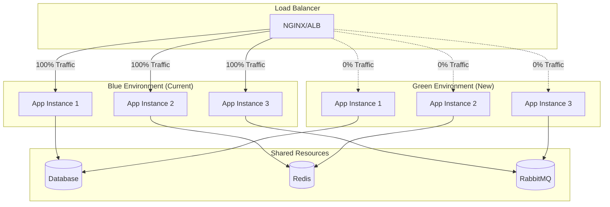

# 🚀 Guia de Implantação e Escalabilidade - EChamado

## 📋 Índice

- [Visão Geral](#-visão-geral)
- [Pré-requisitos](#-pré-requisitos)
- [Ambientes de Deploy](#-ambientes-de-deploy)
- [Estratégias de Implantação](#-estratégias-de-implantação)
- [Docker e Containerização](#-docker-e-containerização)
- [Kubernetes](#-kubernetes)
- [CI/CD Pipeline](#-cicd-pipeline)
- [Monitoramento e Observabilidade](#-monitoramento-e-observabilidade)
- [Backup e Disaster Recovery](#-backup-e-disaster-recovery)
- [Escalabilidade](#-escalabilidade)
- [Segurança em Produção](#-segurança-em-produção)
- [Troubleshooting](#-troubleshooting)

## 🌟 Visão Geral

Este guia fornece instruções completas para implantação do sistema EChamado em diferentes ambientes, desde desenvolvimento local até produção em larga escala. O sistema foi projetado para ser cloud-native e suportar múltiplas estratégias de deployment.

### 🎯 Objetivos de Deployment

- **Zero Downtime**: Deployments sem interrupção de serviço
- **Rollback Rápido**: Capacidade de reverter mudanças rapidamente
- **Escalabilidade**: Suporte a crescimento horizontal e vertical
- **Observabilidade**: Monitoramento completo de saúde e performance
- **Segurança**: Implementação de melhores práticas de segurança
- **Automação**: Processos automatizados de CI/CD

## 📋 Pré-requisitos

### 🛠️ Ferramentas Necessárias

| Ferramenta | Versão Mínima | Propósito |
|------------|---------------|----------|
| **Docker** | 24.0+ | Containerização |
| **Docker Compose** | 2.20+ | Orquestração local |
| **Kubernetes** | 1.28+ | Orquestração produção |
| **Helm** | 3.12+ | Gerenciamento Kubernetes |
| **kubectl** | 1.28+ | CLI Kubernetes |
| **Azure CLI** | 2.50+ | Gerenciamento Azure |
| **Terraform** | 1.5+ | Infrastructure as Code |
| **Git** | 2.40+ | Controle de versão |

### 🔧 Infraestrutura Mínima

#### **Desenvolvimento**
- **CPU**: 4 cores
- **RAM**: 16 GB
- **Storage**: 100 GB SSD
- **Network**: 100 Mbps

#### **Staging**
- **CPU**: 8 cores
- **RAM**: 32 GB
- **Storage**: 500 GB SSD
- **Network**: 1 Gbps
- **Load Balancer**: 1 instância

#### **Produção**
- **CPU**: 16+ cores (distribuídos)
- **RAM**: 64+ GB (distribuídos)
- **Storage**: 2+ TB SSD (com backup)
- **Network**: 10+ Gbps
- **Load Balancer**: 2+ instâncias (HA)
- **CDN**: CloudFlare ou similar

## 🏗️ Ambientes de Deploy

### 📊 Matriz de Ambientes

| Ambiente | Propósito | URL Base | Dados | Monitoramento |
|----------|-----------|----------|-------|---------------|
| **Development** | Desenvolvimento local | `localhost:7xxx` | Dados de teste | Logs locais |
| **Testing** | Testes automatizados | `test.internal` | Dados sintéticos | Métricas básicas |
| **Staging** | Homologação | `staging.echamado.com` | Dados anonimizados | Monitoramento completo |
| **Production** | Produção | `echamado.com` | Dados reais | Monitoramento 24/7 |

### 🔧 Configurações por Ambiente

#### **Development**
```yaml
# docker-compose.dev.yml
version: '3.8'
services:
  echamado-server:
    build: .
    environment:
      - ASPNETCORE_ENVIRONMENT=Development
      - ASPNETCORE_URLS=https://+:7296;http://+:5000
      - ConnectionStrings__DefaultConnection=Host=localhost;Database=echamado_dev;Username=dev_user;Password=dev_pass
    ports:
      - "7296:7296"
      - "5000:5000"
    volumes:
      - ./src:/app/src
      - ./logs:/app/logs
```

#### **Staging**
```yaml
# docker-compose.staging.yml
version: '3.8'
services:
  echamado-server:
    image: echamado/server:${VERSION}
    environment:
      - ASPNETCORE_ENVIRONMENT=Staging
      - ConnectionStrings__DefaultConnection=${DATABASE_CONNECTION_STRING}
      - Redis__ConnectionString=${REDIS_CONNECTION_STRING}
      - OpenIddict__Issuer=https://staging-api.echamado.com
    deploy:
      replicas: 2
      resources:
        limits:
          cpus: '1.0'
          memory: 2G
```

#### **Production**
```yaml
# docker-compose.production.yml
version: '3.8'
services:
  echamado-server:
    image: echamado/server:${VERSION}
    environment:
      - ASPNETCORE_ENVIRONMENT=Production
      - ConnectionStrings__DefaultConnection=${DATABASE_CONNECTION_STRING}
      - Redis__ConnectionString=${REDIS_CONNECTION_STRING}
      - OpenIddict__Issuer=https://api.echamado.com
    deploy:
      replicas: 3
      resources:
        limits:
          cpus: '2.0'
          memory: 4G
      update_config:
        parallelism: 1
        delay: 30s
        failure_action: rollback
```

## 🚀 Estratégias de Implantação

### 1. **Blue-Green Deployment**



**Vantagens:**
- Zero downtime
- Rollback instantâneo
- Testes completos antes do switch

**Script de Deploy:**
```bash
#!/bin/bash
# blue-green-deploy.sh

CURRENT_ENV=$(kubectl get service echamado-service -o jsonpath='{.spec.selector.version}')
NEW_ENV=$([ "$CURRENT_ENV" = "blue" ] && echo "green" || echo "blue")

echo "🚀 Iniciando deploy Blue-Green"
echo "📊 Ambiente atual: $CURRENT_ENV"
echo "🎯 Novo ambiente: $NEW_ENV"

# 1. Deploy da nova versão
echo "📦 Fazendo deploy da versão $NEW_VERSION no ambiente $NEW_ENV"
helm upgrade echamado-$NEW_ENV ./helm/echamado \
  --set image.tag=$NEW_VERSION \
  --set environment=$NEW_ENV \
  --wait --timeout=10m

# 2. Health check
echo "🏥 Verificando saúde da aplicação"
for i in {1..30}; do
  if curl -f http://echamado-$NEW_ENV-service/health; then
    echo "✅ Health check passou"
    break
  fi
  echo "⏳ Aguardando health check... ($i/30)"
  sleep 10
done

# 3. Smoke tests
echo "🧪 Executando smoke tests"
./scripts/smoke-tests.sh $NEW_ENV

if [ $? -eq 0 ]; then
  # 4. Switch do tráfego
  echo "🔄 Redirecionando tráfego para $NEW_ENV"
  kubectl patch service echamado-service -p '{"spec":{"selector":{"version":"'$NEW_ENV'"}}}'
  
  echo "✅ Deploy concluído com sucesso!"
  echo "🗑️ Ambiente $CURRENT_ENV disponível para rollback"
else
  echo "❌ Smoke tests falharam. Deploy cancelado."
  exit 1
fi
```

### 2. **Rolling Deployment**

```yaml
# kubernetes/deployment.yaml
apiVersion: apps/v1
kind: Deployment
metadata:
  name: echamado-server
spec:
  replicas: 6
  strategy:
    type: RollingUpdate
    rollingUpdate:
      maxUnavailable: 1
      maxSurge: 2
  template:
    spec:
      containers:
      - name: echamado-server
        image: echamado/server:${VERSION}
        readinessProbe:
          httpGet:
            path: /health/ready
            port: 80
          initialDelaySeconds: 30
          periodSeconds: 10
        livenessProbe:
          httpGet:
            path: /health/live
            port: 80
          initialDelaySeconds: 60
          periodSeconds: 30
```

### 3. **Canary Deployment**

```yaml
# Istio VirtualService para Canary
apiVersion: networking.istio.io/v1beta1
kind: VirtualService
metadata:
  name: echamado-canary
spec:
  hosts:
  - echamado-service
  http:
  - match:
    - headers:
        canary:
          exact: "true"
    route:
    - destination:
        host: echamado-service
        subset: canary
      weight: 100
  - route:
    - destination:
        host: echamado-service
        subset: stable
      weight: 95
    - destination:
        host: echamado-service
        subset: canary
      weight: 5
```

## 🐳 Docker e Containerização

### 📦 Multi-stage Dockerfile

```dockerfile
# Dockerfile.production
FROM mcr.microsoft.com/dotnet/sdk:9.0 AS build
WORKDIR /src

# Copy solution and project files
COPY EChamado.sln ./
COPY Server/EChamado.Server/*.csproj ./Server/EChamado.Server/
COPY Server/EChamado.Server.Application/*.csproj ./Server/EChamado.Server.Application/
COPY Server/EChamado.Server.Domain/*.csproj ./Server/EChamado.Server.Domain/
COPY Server/EChamado.Server.Infrastructure/*.csproj ./Server/EChamado.Server.Infrastructure/
COPY EChamado.Shared/*.csproj ./EChamado.Shared/

# Restore dependencies
RUN dotnet restore

# Copy source code
COPY . .

# Build application
WORKDIR /src/Server/EChamado.Server
RUN dotnet build -c Release -o /app/build

# Publish application
FROM build AS publish
RUN dotnet publish -c Release -o /app/publish --no-restore

# Runtime image
FROM mcr.microsoft.com/dotnet/aspnet:9.0 AS runtime
WORKDIR /app

# Create non-root user
RUN groupadd -r echamado && useradd -r -g echamado echamado

# Install security updates
RUN apt-get update && apt-get upgrade -y && \
    apt-get install -y --no-install-recommends curl && \
    rm -rf /var/lib/apt/lists/*

# Copy published application
COPY --from=publish /app/publish .

# Set ownership
RUN chown -R echamado:echamado /app
USER echamado

# Health check
HEALTHCHECK --interval=30s --timeout=10s --start-period=60s --retries=3 \
  CMD curl -f http://localhost/health || exit 1

# Expose port
EXPOSE 80

# Entry point
ENTRYPOINT ["dotnet", "EChamado.Server.dll"]
```

### 🔧 Docker Compose para Produção

```yaml
# docker-compose.production.yml
version: '3.8'

services:
  # Load Balancer
  nginx:
    image: nginx:1.25-alpine
    ports:
      - "80:80"
      - "443:443"
    volumes:
      - ./nginx/nginx.conf:/etc/nginx/nginx.conf:ro
      - ./nginx/ssl:/etc/nginx/ssl:ro
    depends_on:
      - echamado-server
    networks:
      - echamado-network
    deploy:
      replicas: 2
      placement:
        constraints:
          - node.role == manager

  # Application Server
  echamado-server:
    image: echamado/server:${VERSION}
    environment:
      - ASPNETCORE_ENVIRONMENT=Production
      - ASPNETCORE_URLS=http://+:80
      - ConnectionStrings__DefaultConnection=${DATABASE_CONNECTION}
      - ConnectionStrings__Redis=${REDIS_CONNECTION}
      - ConnectionStrings__RabbitMQ=${RABBITMQ_CONNECTION}
      - OpenIddict__Issuer=${OPENIDDICT_ISSUER}
    secrets:
      - db_password
      - jwt_signing_key
    networks:
      - echamado-network
    deploy:
      replicas: 3
      resources:
        limits:
          cpus: '2.0'
          memory: 4G
        reservations:
          cpus: '1.0'
          memory: 2G
      restart_policy:
        condition: on-failure
        delay: 5s
        max_attempts: 3
      update_config:
        parallelism: 1
        delay: 30s
        failure_action: rollback
        monitor: 60s

  # Database
  postgres:
    image: postgres:15-alpine
    environment:
      - POSTGRES_DB=${POSTGRES_DB}
      - POSTGRES_USER=${POSTGRES_USER}
      - POSTGRES_PASSWORD_FILE=/run/secrets/db_password
    volumes:
      - postgres_data:/var/lib/postgresql/data
      - ./postgres/init:/docker-entrypoint-initdb.d:ro
    secrets:
      - db_password
    networks:
      - echamado-network
    deploy:
      placement:
        constraints:
          - node.labels.postgres == true
      resources:
        limits:
          cpus: '2.0'
          memory: 4G

secrets:
  db_password:
    external: true
  jwt_signing_key:
    external: true

volumes:
  postgres_data:
    driver: local
    driver_opts:
      type: none
      o: bind
      device: /data/postgres

networks:
  echamado-network:
    driver: overlay
    attachable: true
```

## ☸️ Kubernetes

### 🎯 Namespace e Resources

```yaml
# kubernetes/namespace.yaml
apiVersion: v1
kind: Namespace
metadata:
  name: echamado
  labels:
    name: echamado
    environment: production
---
apiVersion: v1
kind: ResourceQuota
metadata:
  name: echamado-quota
  namespace: echamado
spec:
  hard:
    requests.cpu: "10"
    requests.memory: 20Gi
    limits.cpu: "20"
    limits.memory: 40Gi
    persistentvolumeclaims: "10"
    services: "10"
    secrets: "20"
    configmaps: "20"
```

### 🔧 ConfigMap e Secrets

```yaml
# kubernetes/configmap.yaml
apiVersion: v1
kind: ConfigMap
metadata:
  name: echamado-config
  namespace: echamado
data:
  ASPNETCORE_ENVIRONMENT: "Production"
  ASPNETCORE_URLS: "http://+:80"
  OpenIddict__Issuer: "https://api.echamado.com"
  Serilog__MinimumLevel: "Information"
  Redis__Database: "0"
  RabbitMQ__VirtualHost: "echamado"
---
apiVersion: v1
kind: Secret
metadata:
  name: echamado-secrets
  namespace: echamado
type: Opaque
data:
  DATABASE_CONNECTION: <base64-encoded>
  REDIS_CONNECTION: <base64-encoded>
  RABBITMQ_CONNECTION: <base64-encoded>
  JWT_SIGNING_KEY: <base64-encoded>
```

### 🚀 Deployment

```yaml
# kubernetes/deployment.yaml
apiVersion: apps/v1
kind: Deployment
metadata:
  name: echamado-server
  namespace: echamado
  labels:
    app: echamado-server
    version: v1
spec:
  replicas: 3
  selector:
    matchLabels:
      app: echamado-server
  template:
    metadata:
      labels:
        app: echamado-server
        version: v1
      annotations:
        prometheus.io/scrape: "true"
        prometheus.io/port: "80"
        prometheus.io/path: "/metrics"
    spec:
      serviceAccountName: echamado-service-account
      securityContext:
        runAsNonRoot: true
        runAsUser: 1000
        fsGroup: 1000
      containers:
      - name: echamado-server
        image: echamado/server:1.0.0
        imagePullPolicy: Always
        ports:
        - containerPort: 80
          name: http
        envFrom:
        - configMapRef:
            name: echamado-config
        - secretRef:
            name: echamado-secrets
        resources:
          requests:
            cpu: 500m
            memory: 1Gi
          limits:
            cpu: 2000m
            memory: 4Gi
        readinessProbe:
          httpGet:
            path: /health/ready
            port: 80
          initialDelaySeconds: 30
          periodSeconds: 10
          timeoutSeconds: 5
          failureThreshold: 3
        livenessProbe:
          httpGet:
            path: /health/live
            port: 80
          initialDelaySeconds: 60
          periodSeconds: 30
          timeoutSeconds: 10
          failureThreshold: 3
        securityContext:
          allowPrivilegeEscalation: false
          readOnlyRootFilesystem: true
          capabilities:
            drop:
            - ALL
        volumeMounts:
        - name: tmp
          mountPath: /tmp
        - name: logs
          mountPath: /app/logs
      volumes:
      - name: tmp
        emptyDir: {}
      - name: logs
        emptyDir: {}
      nodeSelector:
        kubernetes.io/os: linux
      tolerations:
      - key: "app"
        operator: "Equal"
        value: "echamado"
        effect: "NoSchedule"
```

### 🌐 Service e Ingress

```yaml
# kubernetes/service.yaml
apiVersion: v1
kind: Service
metadata:
  name: echamado-service
  namespace: echamado
  labels:
    app: echamado-server
spec:
  selector:
    app: echamado-server
  ports:
  - port: 80
    targetPort: 80
    name: http
  type: ClusterIP
---
apiVersion: networking.k8s.io/v1
kind: Ingress
metadata:
  name: echamado-ingress
  namespace: echamado
  annotations:
    kubernetes.io/ingress.class: "nginx"
    cert-manager.io/cluster-issuer: "letsencrypt-prod"
    nginx.ingress.kubernetes.io/rate-limit: "100"
    nginx.ingress.kubernetes.io/rate-limit-window: "1m"
    nginx.ingress.kubernetes.io/ssl-redirect: "true"
    nginx.ingress.kubernetes.io/force-ssl-redirect: "true"
spec:
  tls:
  - hosts:
    - api.echamado.com
    secretName: echamado-tls
  rules:
  - host: api.echamado.com
    http:
      paths:
      - path: /
        pathType: Prefix
        backend:
          service:
            name: echamado-service
            port:
              number: 80
```

### 📊 HorizontalPodAutoscaler

```yaml
# kubernetes/hpa.yaml
apiVersion: autoscaling/v2
kind: HorizontalPodAutoscaler
metadata:
  name: echamado-hpa
  namespace: echamado
spec:
  scaleTargetRef:
    apiVersion: apps/v1
    kind: Deployment
    name: echamado-server
  minReplicas: 3
  maxReplicas: 20
  metrics:
  - type: Resource
    resource:
      name: cpu
      target:
        type: Utilization
        averageUtilization: 70
  - type: Resource
    resource:
      name: memory
      target:
        type: Utilization
        averageUtilization: 80
  behavior:
    scaleDown:
      stabilizationWindowSeconds: 300
      policies:
      - type: Percent
        value: 10
        periodSeconds: 60
    scaleUp:
      stabilizationWindowSeconds: 60
      policies:
      - type: Percent
        value: 50
        periodSeconds: 60
      - type: Pods
        value: 2
        periodSeconds: 60
      selectPolicy: Max
```

## 🔄 CI/CD Pipeline

### 🏗️ GitHub Actions Workflow

```yaml
# .github/workflows/deploy.yml
name: Deploy EChamado

on:
  push:
    branches: [main, develop]
  pull_request:
    branches: [main]

env:
  REGISTRY: ghcr.io
  IMAGE_NAME: echamado/server

jobs:
  test:
    runs-on: ubuntu-latest
    steps:
    - uses: actions/checkout@v4
    
    - name: Setup .NET
      uses: actions/setup-dotnet@v3
      with:
        dotnet-version: '9.0.x'
    
    - name: Restore dependencies
      run: dotnet restore
    
    - name: Build
      run: dotnet build --no-restore
    
    - name: Test
      run: dotnet test --no-build --verbosity normal --collect:"XPlat Code Coverage"
    
    - name: Upload coverage reports
      uses: codecov/codecov-action@v3

  security-scan:
    runs-on: ubuntu-latest
    steps:
    - uses: actions/checkout@v4
    
    - name: Run Trivy vulnerability scanner
      uses: aquasecurity/trivy-action@master
      with:
        scan-type: 'fs'
        scan-ref: '.'
        format: 'sarif'
        output: 'trivy-results.sarif'
    
    - name: Upload Trivy scan results
      uses: github/codeql-action/upload-sarif@v2
      with:
        sarif_file: 'trivy-results.sarif'

  build-and-push:
    needs: [test, security-scan]
    runs-on: ubuntu-latest
    if: github.ref == 'refs/heads/main'
    steps:
    - uses: actions/checkout@v4
    
    - name: Log in to Container Registry
      uses: docker/login-action@v2
      with:
        registry: ${{ env.REGISTRY }}
        username: ${{ github.actor }}
        password: ${{ secrets.GITHUB_TOKEN }}
    
    - name: Extract metadata
      id: meta
      uses: docker/metadata-action@v4
      with:
        images: ${{ env.REGISTRY }}/${{ env.IMAGE_NAME }}
        tags: |
          type=ref,event=branch
          type=ref,event=pr
          type=sha,prefix={{branch}}-
          type=raw,value=latest,enable={{is_default_branch}}
    
    - name: Build and push Docker image
      uses: docker/build-push-action@v4
      with:
        context: .
        file: ./Dockerfile.production
        push: true
        tags: ${{ steps.meta.outputs.tags }}
        labels: ${{ steps.meta.outputs.labels }}
        cache-from: type=gha
        cache-to: type=gha,mode=max

  deploy-staging:
    needs: build-and-push
    runs-on: ubuntu-latest
    if: github.ref == 'refs/heads/main'
    environment: staging
    steps:
    - uses: actions/checkout@v4
    
    - name: Setup kubectl
      uses: azure/setup-kubectl@v3
      with:
        version: 'v1.28.0'
    
    - name: Set up Helm
      uses: azure/setup-helm@v3
      with:
        version: '3.12.0'
    
    - name: Configure kubectl
      run: |
        echo "${{ secrets.KUBE_CONFIG }}" | base64 -d > kubeconfig
        export KUBECONFIG=kubeconfig
    
    - name: Deploy to Staging
      run: |
        helm upgrade --install echamado-staging ./helm/echamado \
          --namespace echamado-staging \
          --create-namespace \
          --set image.tag=${{ github.sha }} \
          --set environment=staging \
          --set ingress.host=staging.echamado.com \
          --wait --timeout=10m
    
    - name: Run smoke tests
      run: |
        ./scripts/smoke-tests.sh staging.echamado.com

  deploy-production:
    needs: deploy-staging
    runs-on: ubuntu-latest
    if: github.ref == 'refs/heads/main'
    environment: production
    steps:
    - uses: actions/checkout@v4
    
    - name: Deploy to Production
      run: |
        # Blue-Green deployment
        ./scripts/blue-green-deploy.sh ${{ github.sha }}
```

### 🔧 Helm Chart

```yaml
# helm/echamado/Chart.yaml
apiVersion: v2
name: echamado
description: EChamado Helm Chart
type: application
version: 1.0.0
appVersion: "1.0.0"

dependencies:
- name: postgresql
  version: 12.x.x
  repository: https://charts.bitnami.com/bitnami
  condition: postgresql.enabled
- name: redis
  version: 17.x.x
  repository: https://charts.bitnami.com/bitnami
  condition: redis.enabled
```

```yaml
# helm/echamado/values.yaml
replicaCount: 3

image:
  repository: echamado/server
  tag: "latest"
  pullPolicy: IfNotPresent

service:
  type: ClusterIP
  port: 80

ingress:
  enabled: true
  className: "nginx"
  annotations:
    cert-manager.io/cluster-issuer: "letsencrypt-prod"
    nginx.ingress.kubernetes.io/rate-limit: "100"
  hosts:
    - host: api.echamado.com
      paths:
        - path: /
          pathType: Prefix
  tls:
    - secretName: echamado-tls
      hosts:
        - api.echamado.com

resources:
  limits:
    cpu: 2000m
    memory: 4Gi
  requests:
    cpu: 500m
    memory: 1Gi

autoscaling:
  enabled: true
  minReplicas: 3
  maxReplicas: 20
  targetCPUUtilizationPercentage: 70
  targetMemoryUtilizationPercentage: 80

postgresql:
  enabled: true
  auth:
    postgresPassword: "secure-password"
    database: "echamado"
  primary:
    persistence:
      enabled: true
      size: 100Gi

redis:
  enabled: true
  auth:
    enabled: true
    password: "redis-password"
  master:
    persistence:
      enabled: true
      size: 20Gi
```

## 📊 Monitoramento e Observabilidade

### 🔍 Prometheus Configuration

```yaml
# monitoring/prometheus-config.yaml
apiVersion: v1
kind: ConfigMap
metadata:
  name: prometheus-config
  namespace: monitoring
data:
  prometheus.yml: |
    global:
      scrape_interval: 15s
      evaluation_interval: 15s
    
    rule_files:
      - "/etc/prometheus/rules/*.yml"
    
    alerting:
      alertmanagers:
        - static_configs:
            - targets:
              - alertmanager:9093
    
    scrape_configs:
      - job_name: 'echamado-server'
        kubernetes_sd_configs:
          - role: pod
            namespaces:
              names:
                - echamado
        relabel_configs:
          - source_labels: [__meta_kubernetes_pod_annotation_prometheus_io_scrape]
            action: keep
            regex: true
          - source_labels: [__meta_kubernetes_pod_annotation_prometheus_io_path]
            action: replace
            target_label: __metrics_path__
            regex: (.+)
```

### 📈 Grafana Dashboards

```json
{
  "dashboard": {
    "title": "EChamado - Application Metrics",
    "panels": [
      {
        "title": "Request Rate",
        "type": "graph",
        "targets": [
          {
            "expr": "rate(http_requests_total{job=\"echamado-server\"}[5m])",
            "legendFormat": "{{method}} {{status}}"
          }
        ]
      },
      {
        "title": "Response Time",
        "type": "graph",
        "targets": [
          {
            "expr": "histogram_quantile(0.95, rate(http_request_duration_seconds_bucket{job=\"echamado-server\"}[5m]))",
            "legendFormat": "95th percentile"
          },
          {
            "expr": "histogram_quantile(0.50, rate(http_request_duration_seconds_bucket{job=\"echamado-server\"}[5m]))",
            "legendFormat": "50th percentile"
          }
        ]
      },
      {
        "title": "Error Rate",
        "type": "singlestat",
        "targets": [
          {
            "expr": "rate(http_requests_total{job=\"echamado-server\",status=~\"5..\"}[5m]) / rate(http_requests_total{job=\"echamado-server\"}[5m]) * 100"
          }
        ]
      }
    ]
  }
}
```

### 🚨 Alerting Rules

```yaml
# monitoring/alert-rules.yaml
apiVersion: monitoring.coreos.com/v1
kind: PrometheusRule
metadata:
  name: echamado-alerts
  namespace: monitoring
spec:
  groups:
  - name: echamado.rules
    rules:
    - alert: EChamadoHighErrorRate
      expr: |
        (
          rate(http_requests_total{job="echamado-server",status=~"5.."}[5m])
          /
          rate(http_requests_total{job="echamado-server"}[5m])
        ) * 100 > 5
      for: 5m
      labels:
        severity: critical
      annotations:
        summary: "EChamado high error rate"
        description: "Error rate is {{ $value }}% for the last 5 minutes"
    
    - alert: EChamadoHighResponseTime
      expr: |
        histogram_quantile(0.95,
          rate(http_request_duration_seconds_bucket{job="echamado-server"}[5m])
        ) > 0.5
      for: 5m
      labels:
        severity: warning
      annotations:
        summary: "EChamado high response time"
        description: "95th percentile response time is {{ $value }}s"
    
    - alert: EChamadoPodCrashLooping
      expr: |
        rate(kube_pod_container_status_restarts_total{namespace="echamado"}[15m]) > 0
      for: 5m
      labels:
        severity: critical
      annotations:
        summary: "EChamado pod crash looping"
        description: "Pod {{ $labels.pod }} is crash looping"
```

## 💾 Backup e Disaster Recovery

### 🔄 Estratégia de Backup

```yaml
# backup/postgres-backup-cronjob.yaml
apiVersion: batch/v1
kind: CronJob
metadata:
  name: postgres-backup
  namespace: echamado
spec:
  schedule: "0 2 * * *"  # Daily at 2 AM
  jobTemplate:
    spec:
      template:
        spec:
          containers:
          - name: postgres-backup
            image: postgres:15-alpine
            env:
            - name: PGPASSWORD
              valueFrom:
                secretKeyRef:
                  name: postgres-secret
                  key: password
            command:
            - /bin/bash
            - -c
            - |
              BACKUP_FILE="/backup/echamado-$(date +%Y%m%d-%H%M%S).sql"
              pg_dump -h postgres-service -U postgres -d echamado > $BACKUP_FILE
              
              # Upload to cloud storage
              aws s3 cp $BACKUP_FILE s3://echamado-backups/database/
              
              # Keep only last 30 days locally
              find /backup -name "*.sql" -mtime +30 -delete
            volumeMounts:
            - name: backup-storage
              mountPath: /backup
          volumes:
          - name: backup-storage
            persistentVolumeClaim:
              claimName: backup-pvc
          restartPolicy: OnFailure
```

### 🚨 Disaster Recovery Plan

```bash
#!/bin/bash
# disaster-recovery.sh

echo "🚨 Iniciando procedimento de Disaster Recovery"

# 1. Verificar status dos serviços
echo "📊 Verificando status dos serviços..."
kubectl get pods -n echamado
kubectl get services -n echamado

# 2. Restaurar banco de dados
echo "💾 Restaurando banco de dados..."
LATEST_BACKUP=$(aws s3 ls s3://echamado-backups/database/ | sort | tail -n 1 | awk '{print $4}')
aws s3 cp s3://echamado-backups/database/$LATEST_BACKUP /tmp/restore.sql

# Criar novo pod temporário para restore
kubectl run postgres-restore --rm -i --tty \
  --image=postgres:15-alpine \
  --env="PGPASSWORD=$POSTGRES_PASSWORD" \
  -- psql -h postgres-service -U postgres -d echamado -f /tmp/restore.sql

# 3. Verificar integridade dos dados
echo "🔍 Verificando integridade dos dados..."
kubectl exec -it deployment/echamado-server -- \
  dotnet EChamado.Server.dll --verify-data

# 4. Executar smoke tests
echo "🧪 Executando smoke tests..."
./scripts/smoke-tests.sh

if [ $? -eq 0 ]; then
  echo "✅ Disaster Recovery concluído com sucesso!"
  # Notificar equipe
  curl -X POST $SLACK_WEBHOOK \
    -H 'Content-type: application/json' \
    --data '{"text":"✅ EChamado: Disaster Recovery concluído com sucesso!"}'
else
  echo "❌ Disaster Recovery falhou!"
  # Escalar para equipe de emergência
  curl -X POST $PAGERDUTY_WEBHOOK \
    -H 'Content-type: application/json' \
    --data '{"incident_key":"echamado-dr-failed","event_type":"trigger"}'
fi
```

## 📈 Escalabilidade

### 🔄 Auto Scaling

#### **Horizontal Pod Autoscaler (HPA)**
```yaml
apiVersion: autoscaling/v2
kind: HorizontalPodAutoscaler
metadata:
  name: echamado-hpa
spec:
  scaleTargetRef:
    apiVersion: apps/v1
    kind: Deployment
    name: echamado-server
  minReplicas: 3
  maxReplicas: 50
  metrics:
  - type: Resource
    resource:
      name: cpu
      target:
        type: Utilization
        averageUtilization: 70
  - type: Resource
    resource:
      name: memory
      target:
        type: Utilization
        averageUtilization: 80
  - type: Pods
    pods:
      metric:
        name: http_requests_per_second
      target:
        type: AverageValue
        averageValue: "100"
```

#### **Vertical Pod Autoscaler (VPA)**
```yaml
apiVersion: autoscaling.k8s.io/v1
kind: VerticalPodAutoscaler
metadata:
  name: echamado-vpa
spec:
  targetRef:
    apiVersion: apps/v1
    kind: Deployment
    name: echamado-server
  updatePolicy:
    updateMode: "Auto"
  resourcePolicy:
    containerPolicies:
    - containerName: echamado-server
      maxAllowed:
        cpu: 4
        memory: 8Gi
      minAllowed:
        cpu: 100m
        memory: 256Mi
```

#### **Cluster Autoscaler**
```yaml
apiVersion: apps/v1
kind: Deployment
metadata:
  name: cluster-autoscaler
  namespace: kube-system
spec:
  template:
    spec:
      containers:
      - image: k8s.gcr.io/autoscaling/cluster-autoscaler:v1.28.0
        name: cluster-autoscaler
        command:
        - ./cluster-autoscaler
        - --v=4
        - --stderrthreshold=info
        - --cloud-provider=azure
        - --skip-nodes-with-local-storage=false
        - --expander=random
        - --node-group-auto-discovery=asg:tag=k8s.io/cluster-autoscaler/enabled,k8s.io/cluster-autoscaler/echamado-cluster
        - --balance-similar-node-groups
        - --skip-nodes-with-system-pods=false
        - --scale-down-delay-after-add=10m
        - --scale-down-unneeded-time=10m
```

### 🌐 Load Balancing

#### **NGINX Configuration**
```nginx
# nginx/nginx.conf
upstream echamado_backend {
    least_conn;
    server echamado-server-1:80 max_fails=3 fail_timeout=30s;
    server echamado-server-2:80 max_fails=3 fail_timeout=30s;
    server echamado-server-3:80 max_fails=3 fail_timeout=30s;
    
    # Health check
    keepalive 32;
}

server {
    listen 80;
    listen 443 ssl http2;
    server_name api.echamado.com;
    
    # SSL Configuration
    ssl_certificate /etc/nginx/ssl/echamado.crt;
    ssl_certificate_key /etc/nginx/ssl/echamado.key;
    ssl_protocols TLSv1.2 TLSv1.3;
    ssl_ciphers ECDHE-RSA-AES256-GCM-SHA512:DHE-RSA-AES256-GCM-SHA512;
    
    # Security Headers
    add_header X-Frame-Options "SAMEORIGIN" always;
    add_header X-Content-Type-Options "nosniff" always;
    add_header X-XSS-Protection "1; mode=block" always;
    add_header Strict-Transport-Security "max-age=31536000; includeSubDomains" always;
    
    # Rate Limiting
    limit_req_zone $binary_remote_addr zone=api:10m rate=10r/s;
    limit_req zone=api burst=20 nodelay;
    
    # Compression
    gzip on;
    gzip_vary on;
    gzip_min_length 1024;
    gzip_types text/plain text/css application/json application/javascript;
    
    location / {
        proxy_pass http://echamado_backend;
        proxy_set_header Host $host;
        proxy_set_header X-Real-IP $remote_addr;
        proxy_set_header X-Forwarded-For $proxy_add_x_forwarded_for;
        proxy_set_header X-Forwarded-Proto $scheme;
        
        # Timeouts
        proxy_connect_timeout 30s;
        proxy_send_timeout 30s;
        proxy_read_timeout 30s;
        
        # Health check
        proxy_next_upstream error timeout invalid_header http_500 http_502 http_503;
    }
    
    location /health {
        access_log off;
        proxy_pass http://echamado_backend/health;
    }
}
```

### 📊 Performance Tuning

#### **Database Optimization**
```sql
-- PostgreSQL performance tuning
-- postgresql.conf optimizations

-- Memory settings
shared_buffers = '4GB'                    -- 25% of RAM
effective_cache_size = '12GB'             -- 75% of RAM
work_mem = '256MB'                        -- Per connection
maintenance_work_mem = '1GB'              -- Maintenance operations

-- Checkpoint settings
checkpoint_completion_target = 0.9
wal_buffers = '64MB'
max_wal_size = '4GB'
min_wal_size = '1GB'

-- Connection settings
max_connections = 200
shared_preload_libraries = 'pg_stat_statements'

-- Logging
log_statement = 'all'
log_min_duration_statement = 1000         -- Log slow queries
log_checkpoints = on
log_connections = on
log_disconnections = on
```

#### **Redis Configuration**
```conf
# redis.conf optimizations

# Memory management
maxmemory 2gb
maxmemory-policy allkeys-lru

# Persistence
save 900 1
save 300 10
save 60 10000

# Network
tcp-keepalive 300
timeout 0

# Performance
tcp-backlog 511
databases 16

# Security
requirepass your-secure-password
rename-command FLUSHDB ""
rename-command FLUSHALL ""
rename-command DEBUG ""
```

## 🔒 Segurança em Produção

### 🛡️ Network Policies

```yaml
# security/network-policy.yaml
apiVersion: networking.k8s.io/v1
kind: NetworkPolicy
metadata:
  name: echamado-network-policy
  namespace: echamado
spec:
  podSelector:
    matchLabels:
      app: echamado-server
  policyTypes:
  - Ingress
  - Egress
  ingress:
  - from:
    - namespaceSelector:
        matchLabels:
          name: ingress-nginx
    - podSelector:
        matchLabels:
          app: echamado-server
    ports:
    - protocol: TCP
      port: 80
  egress:
  - to:
    - podSelector:
        matchLabels:
          app: postgres
    ports:
    - protocol: TCP
      port: 5432
  - to:
    - podSelector:
        matchLabels:
          app: redis
    ports:
    - protocol: TCP
      port: 6379
  - to: []
    ports:
    - protocol: TCP
      port: 443  # HTTPS outbound
    - protocol: TCP
      port: 53   # DNS
    - protocol: UDP
      port: 53   # DNS
```

### 🔐 Pod Security Standards

```yaml
# security/pod-security-policy.yaml
apiVersion: policy/v1beta1
kind: PodSecurityPolicy
metadata:
  name: echamado-psp
spec:
  privileged: false
  allowPrivilegeEscalation: false
  requiredDropCapabilities:
    - ALL
  volumes:
    - 'configMap'
    - 'emptyDir'
    - 'projected'
    - 'secret'
    - 'downwardAPI'
    - 'persistentVolumeClaim'
  runAsUser:
    rule: 'MustRunAsNonRoot'
  seLinux:
    rule: 'RunAsAny'
  fsGroup:
    rule: 'RunAsAny'
  readOnlyRootFilesystem: true
```

### 🔍 Security Scanning

```yaml
# security/trivy-scan.yaml
apiVersion: batch/v1
kind: CronJob
metadata:
  name: trivy-scan
  namespace: security
spec:
  schedule: "0 6 * * *"  # Daily at 6 AM
  jobTemplate:
    spec:
      template:
        spec:
          containers:
          - name: trivy
            image: aquasec/trivy:latest
            command:
            - /bin/sh
            - -c
            - |
              trivy image --format json --output /tmp/scan-results.json echamado/server:latest
              
              # Send results to security team
              curl -X POST $SECURITY_WEBHOOK \
                -H 'Content-Type: application/json' \
                -d @/tmp/scan-results.json
            env:
            - name: SECURITY_WEBHOOK
              valueFrom:
                secretKeyRef:
                  name: security-secrets
                  key: webhook-url
          restartPolicy: OnFailure
```

## 🔧 Troubleshooting

### 🚨 Problemas Comuns

#### **1. Pod não inicia**

```bash
# Verificar status do pod
kubectl get pods -n echamado
kubectl describe pod <pod-name> -n echamado

# Verificar logs
kubectl logs <pod-name> -n echamado --previous

# Verificar eventos
kubectl get events -n echamado --sort-by='.lastTimestamp'

# Verificar recursos
kubectl top pods -n echamado
kubectl describe node <node-name>
```

#### **2. Problemas de conectividade**

```bash
# Testar conectividade entre pods
kubectl exec -it <pod-name> -n echamado -- nslookup postgres-service
kubectl exec -it <pod-name> -n echamado -- telnet postgres-service 5432

# Verificar network policies
kubectl get networkpolicies -n echamado
kubectl describe networkpolicy <policy-name> -n echamado

# Verificar DNS
kubectl exec -it <pod-name> -n echamado -- nslookup kubernetes.default
```

#### **3. Performance issues**

```bash
# Verificar métricas de recursos
kubectl top pods -n echamado
kubectl top nodes

# Verificar HPA
kubectl get hpa -n echamado
kubectl describe hpa echamado-hpa -n echamado

# Verificar logs de performance
kubectl logs -f deployment/echamado-server -n echamado | grep "slow"
```

### 📊 Scripts de Diagnóstico

```bash
#!/bin/bash
# diagnostic.sh

echo "🔍 EChamado - Diagnóstico do Sistema"
echo "======================================"

# 1. Status geral
echo "📊 Status dos Pods:"
kubectl get pods -n echamado -o wide

echo "\n🌐 Status dos Services:"
kubectl get services -n echamado

echo "\n📈 Status do HPA:"
kubectl get hpa -n echamado

# 2. Health checks
echo "\n❤️ Health Checks:"
for pod in $(kubectl get pods -n echamado -o jsonpath='{.items[*].metadata.name}'); do
  echo "Checking $pod..."
  kubectl exec $pod -n echamado -- curl -f http://localhost/health || echo "❌ Health check failed for $pod"
done

# 3. Recursos
echo "\n💾 Uso de Recursos:"
kubectl top pods -n echamado

# 4. Logs recentes
echo "\n📝 Logs Recentes (últimos 10 minutos):"
kubectl logs --since=10m -l app=echamado-server -n echamado --tail=50

# 5. Eventos
echo "\n📅 Eventos Recentes:"
kubectl get events -n echamado --sort-by='.lastTimestamp' | tail -20

echo "\n✅ Diagnóstico concluído!"
```

### 🔄 Rollback Procedures

```bash
#!/bin/bash
# rollback.sh

echo "🔄 Iniciando procedimento de rollback"

# 1. Verificar histórico de deployments
echo "📋 Histórico de deployments:"
kubectl rollout history deployment/echamado-server -n echamado

# 2. Fazer rollback para versão anterior
echo "⏪ Fazendo rollback..."
kubectl rollout undo deployment/echamado-server -n echamado

# 3. Aguardar conclusão
echo "⏳ Aguardando conclusão do rollback..."
kubectl rollout status deployment/echamado-server -n echamado --timeout=300s

# 4. Verificar saúde
echo "🏥 Verificando saúde da aplicação..."
sleep 30
for i in {1..10}; do
  if curl -f https://api.echamado.com/health; then
    echo "✅ Rollback concluído com sucesso!"
    
    # Notificar equipe
    curl -X POST $SLACK_WEBHOOK \
      -H 'Content-type: application/json' \
      --data '{"text":"✅ EChamado: Rollback concluído com sucesso!"}'
    
    exit 0
  fi
  echo "⏳ Aguardando aplicação ficar saudável... ($i/10)"
  sleep 30
done

echo "❌ Rollback falhou!"
exit 1
```

---

## 📞 Suporte e Contatos

### 🚨 Escalação de Incidentes

| Severidade | Tempo de Resposta | Contato |
|------------|-------------------|----------|
| **P1 - Crítico** | 15 minutos | PagerDuty + Telefone |
| **P2 - Alto** | 1 hora | Slack + Email |
| **P3 - Médio** | 4 horas | Email |
| **P4 - Baixo** | 24 horas | Ticket |

### 📧 Contatos da Equipe

- **DevOps Lead**: devops-lead@echamado.com
- **SRE Team**: sre@echamado.com
- **Security Team**: security@echamado.com
- **On-Call**: +55 11 99999-9999

### 🔗 Links Úteis

- **Status Page**: https://status.echamado.com
- **Grafana**: https://grafana.echamado.com
- **Kibana**: https://kibana.echamado.com
- **Runbooks**: https://runbooks.echamado.com
- **Documentation**: https://docs.echamado.com

---

**Última Atualização**: Janeiro 2025  
**Versão**: 1.0  
**Próxima Revisão**: Abril 2025