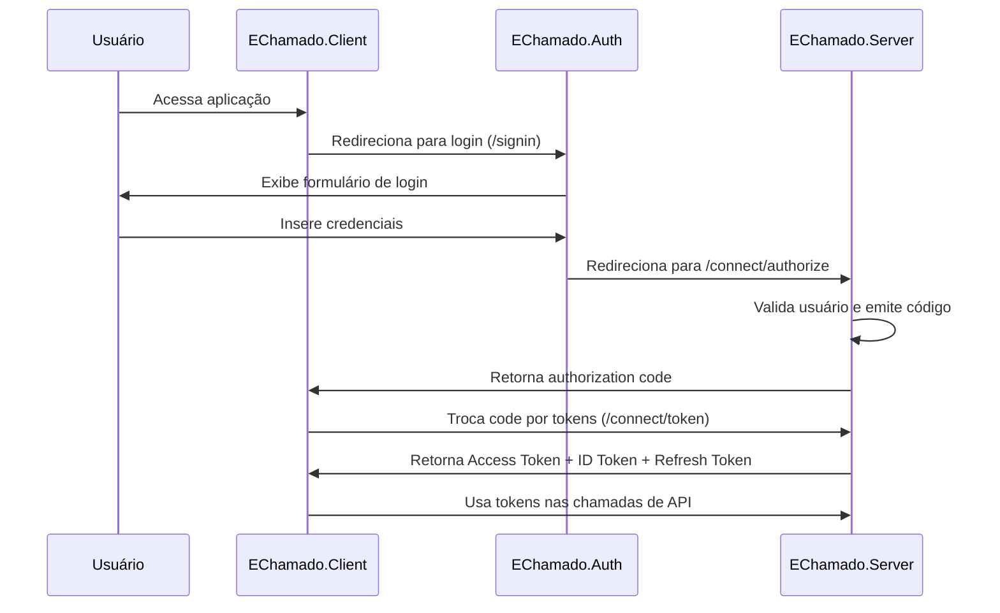

# 👨‍💻 Guia do Desenvolvedor - EChamado

## 🌟 Visão Geral

Este guia fornece instruções completas para configurar o ambiente de desenvolvimento, entender a arquitetura e seguir as convenções de codificação do sistema EChamado.

## 🏗️ Arquitetura do Sistema

### 📐 Visão Geral da Arquitetura

O EChamado é um sistema distribuído composto por três aplicações principais:

```
┌─────────────────┐    ┌─────────────────┐    ┌─────────────────┐
│  EChamado.Auth  │    │ EChamado.Server │    │ EChamado.Client │
│   (Auth UI)     │◄───┤ (API + OpenId)  │───►│  (Blazor WASM)  │
└─────────────────┘    └─────────────────┘    └─────────────────┘
         │                       │                       │
         └───────────────────────┼───────────────────────┘
                                 │
                    ┌─────────────────┐
                    │   Infrastructure │
                    │ PostgreSQL/Redis │
                    │ Elastic/RabbitMQ │
                    └─────────────────┘
```

### 🔐 EChamado.Auth - UI de Autenticação

**Responsabilidades:**

- Interface de usuário para login/registro
- Orquestração do fluxo de autenticação
- Redirecionamento para o servidor OpenIddict

**Tecnologias:**

- ASP.NET Core 9.0
- Blazor Server
- MudBlazor (UI Components)
- ASP.NET Core Identity

### 🖥️ EChamado.Server - API e Servidor OpenIddict

**Responsabilidades:**

- API REST para operações de negócio
- Servidor de autorização OpenIddict
- Gerenciamento de usuários e permissões
- Lógica de negócio dos chamados

**Tecnologias:**

- ASP.NET Core 9.0 Web API
- Entity Framework Core
- PostgreSQL
- OpenIddict (OAuth 2.0/OIDC)
- MediatR (CQRS)
- Serilog (Logging)

### 🌐 EChamado.Client - Interface Web

**Responsabilidades:**

- Interface de usuário principal
- Gestão de chamados
- Dashboards e relatórios
- Comunicação com APIs

**Tecnologias:**

- Blazor WebAssembly
- MudBlazor (UI Framework)
- OIDC Authentication
- HttpClient (API Integration)

## ⚙️ Configuração do Ambiente

### 📋 Pré-requisitos

```bash
# Verificar versões instaladas
dotnet --version    # Mínimo: 9.0
docker --version    # Para infraestrutura
git --version       # Para controle de versão
```

**Requisitos:**

- [.NET 9.0 SDK](https://dotnet.microsoft.com/download/dotnet/9.0)
- [Docker Desktop](https://www.docker.com/products/docker-desktop)
- [Git](https://git-scm.com/)
- [Visual Studio 2022](https://visualstudio.microsoft.com/) ou [VS Code](https://code.visualstudio.com/)

### 🚀 Setup Inicial

#### 1. Clonar o Repositório

```bash
git clone https://github.com/seu-usuario/e-chamado.git
cd e-chamado/src/EChamado
```

#### 2. Configurar Variáveis de Ambiente

O arquivo `.env` já está configurado com valores de desenvolvimento:

```env
# Banco de dados PostgreSQL
POSTGRES_USER=postgres
POSTGRES_PASSWORD=dsv@123
POSTGRES_DB=e-chamado

# Redis
REDIS_PASSWORD=dsv@123

# RabbitMQ
RABBITMQ_USER=admin
RABBITMQ_PASS=dsv@123

# Elasticsearch
ELASTIC_PASSWORD=dsv@123
KIBANA_PASSWORD=dsv@123
```

#### 3. Iniciar Infraestrutura

```bash
# Subir todos os serviços de infraestrutura
docker-compose up -d

# Verificar status dos serviços
docker-compose ps
```

**Serviços disponíveis:**

- PostgreSQL: `localhost:5432`
- PgAdmin: `http://localhost:15432`
- Redis: `localhost:6379`
- Elasticsearch: `http://localhost:9200`
- Kibana: `http://localhost:5601`
- RabbitMQ: `http://localhost:15672`

#### 4. Configurar Banco de Dados

```bash
# Aplicar migrações do Entity Framework
cd Server/EChamado.Server
dotnet ef database update
```

### 🏃‍♂️ Executando a Aplicação

#### Opção 1: Scripts Automatizados (Recomendado)

**Windows:**

```powershell
# Executar todos os projetos
.\start-all.ps1

# Parar todos os serviços
.\stop-all.ps1
```

**Linux/macOS:**

```bash
# Executar todos os projetos
./start-all.sh

# Parar todos os serviços
./stop-all.sh
```

#### Opção 2: Execução Manual

```bash
# Terminal 1 - EChamado.Server (API + OpenIddict)
cd Server/EChamado.Server
dotnet run

# Terminal 2 - EChamado.Auth (UI de Login)
cd Echamado.Auth
dotnet run

# Terminal 3 - EChamado.Client (Interface Principal)
cd Client/EChamado.Client
dotnet run
```

### 🌐 URLs da Aplicação

| Serviço | URL | Descrição |
|---------|-----|-----------|
| **Client** | <https://localhost:7274> | Interface principal |
| **Auth** | <https://localhost:7132> | UI de autenticação |
| **Server** | <https://localhost:7296> | API e OpenIddict |
| **Swagger** | <https://localhost:7296/swagger> | Documentação da API |

## 🔄 Fluxo de Autenticação

### Sequência de Autenticação



### Configuração OIDC

**EChamado.Client (appsettings.json):**

```json
{
  "oidc": {
    "Authority": "https://localhost:7296",
    "ClientId": "bwa-client",
    "DefaultScopes": ["openid", "profile", "email", "api", "chamados"],
    "ResponseType": "code"
  }
}
```

## 🏛️ Arquitetura Clean Architecture

### Estrutura de Camadas

```
EChamado.Server/
├── Domain/              # Entidades e regras de negócio
│   ├── Entities/
│   ├── Aggregates/
│   ├── ValueObjects/
│   └── Interfaces/
├── Application/         # Casos de uso (CQRS)
│   ├── Commands/
│   ├── Queries/
│   ├── Handlers/
│   └── Validators/
├── Infrastructure/      # Implementações externas
│   ├── Persistence/
│   ├── Services/
│   └── Configuration/
└── API/                # Controllers e endpoints
    ├── Controllers/
    ├── Endpoints/
    └── Configuration/
```

### Princípios de Dependência

1. **Domain** não depende de ninguém
2. **Application** depende apenas do **Domain**
3. **Infrastructure** e **API** dependem de **Application** e **Domain**

### Exemplo de Feature (CQRS)

```csharp
// 1. Domain - Entidade
public class Chamado : AggregateRoot
{
    public string Titulo { get; private set; }
    public string Descricao { get; private set; }
    public StatusChamado Status { get; private set; }
    
    public void AtualizarStatus(StatusChamado novoStatus)
    {
        Status = novoStatus;
        AddDomainEvent(new ChamadoStatusAtualizadoEvent(Id, novoStatus));
    }
}

// 2. Application - Command
public record UpdateChamadoStatusCommand(Guid ChamadoId, StatusChamado NovoStatus) 
    : IRequest<Result>;

// 3. Application - Handler
public class UpdateChamadoStatusHandler : IRequestHandler<UpdateChamadoStatusCommand, Result>
{
    private readonly IChamadoRepository _repository;
    
    public async Task<Result> Handle(UpdateChamadoStatusCommand request, CancellationToken cancellationToken)
    {
        var chamado = await _repository.GetByIdAsync(request.ChamadoId);
        if (chamado == null) return Result.NotFound();
        
        chamado.AtualizarStatus(request.NovoStatus);
        await _repository.UpdateAsync(chamado);
        
        return Result.Success();
    }
}

// 4. API - Endpoint
app.MapPut("/api/chamados/{id}/status", async (Guid id, UpdateStatusRequest request, IMediator mediator) =>
{
    var command = new UpdateChamadoStatusCommand(id, request.Status);
    var result = await mediator.Send(command);
    
    return result.IsSuccess ? Results.Ok() : Results.BadRequest(result.Error);
}).RequireAuthorization();
```

## 🧪 Estratégia de Testes

### Tipos de Testes

1. **Unit Tests**: Lógica de domínio e handlers
2. **Integration Tests**: Repositórios e banco de dados
3. **E2E Tests**: Fluxos completos da aplicação

### Estrutura de Testes

```
tests/
├── EChamado.Domain.Tests/       # Testes de domínio
├── EChamado.Application.Tests/  # Testes de casos de uso
├── EChamado.Infrastructure.Tests/ # Testes de repositório
├── EChamado.API.Tests/         # Testes de integração
└── EChamado.E2E.Tests/         # Testes end-to-end
```

### Exemplo de Teste

```csharp
[Fact]
public async Task CreateChamado_WithValidData_ShouldReturnSuccess()
{
    // Arrange
    var command = new CreateChamadoCommand("Título", "Descrição", "user123");
    var repository = new Mock<IChamadoRepository>();
    var handler = new CreateChamadoHandler(repository.Object);
    
    // Act
    var result = await handler.Handle(command, CancellationToken.None);
    
    // Assert
    result.IsSuccess.Should().BeTrue();
    repository.Verify(r => r.AddAsync(It.IsAny<Chamado>()), Times.Once);
}
```

## 📝 Convenções de Código

### Naming Conventions

```csharp
// Classes - PascalCase
public class ChamadoService { }

// Métodos - PascalCase
public async Task<Result> CreateChamadoAsync() { }

// Propriedades - PascalCase
public string Titulo { get; set; }

// Campos privados - _camelCase
private readonly IChamadoRepository _repository;

// Parâmetros - camelCase
public void DoSomething(string titulo, int id) { }

// Constantes - SCREAMING_SNAKE_CASE
public const string DEFAULT_STATUS = "OPEN";
```

### Estrutura de Arquivos

```
Feature/
├── Commands/
│   ├── CreateChamado/
│   │   ├── CreateChamadoCommand.cs
│   │   ├── CreateChamadoHandler.cs
│   │   └── CreateChamadoValidator.cs
│   └── UpdateChamado/
└── Queries/
    └── GetChamados/
        ├── GetChamadosQuery.cs
        ├── GetChamadosHandler.cs
        └── ChamadoViewModel.cs
```

### Patterns de Commit

```bash
# Formato
type(scope): description

# Tipos
feat: nova funcionalidade
fix: correção de bug
docs: documentação
style: formatação
refactor: refatoração
test: testes
chore: tarefas gerais

# Exemplos
feat(auth): implementar login com OpenIddict
fix(api): corrigir validação de chamados
docs(readme): atualizar instruções de setup
```

## 🔧 Ferramentas de Desenvolvimento

### Visual Studio Extensions

- **C# Dev Kit**: Suporte avançado para C#
- **REST Client**: Testes de API
- **GitLens**: Informações avançadas do Git
- **SonarLint**: Análise de código

### Comandos Úteis

```bash
# Build
dotnet build
dotnet build --configuration Release

# Testes
dotnet test
dotnet test --collect:"XPlat Code Coverage"

# Migrations
dotnet ef migrations add NomeDaMigration
dotnet ef database update

# Packages
dotnet add package PackageName
dotnet remove package PackageName

# Linting
dotnet format
dotnet format --verify-no-changes
```

## 🐛 Debugging e Troubleshooting

### Logs Importantes

```bash
# Verificar logs do container
docker-compose logs -f postgres
docker-compose logs -f elasticsearch

# Logs da aplicação (via Serilog)
# Disponíveis em Kibana: http://localhost:5601
```

### Problemas Comuns

**1. Erro de Conexão com Banco:**

```bash
# Verificar se PostgreSQL está rodando
docker-compose ps postgres

# Verificar logs
docker-compose logs postgres
```

**2. Erro de Autenticação OIDC:**

```bash
# Verificar se EChamado.Server está rodando
curl https://localhost:7296/.well-known/openid_configuration
```

**3. Erro de CORS:**

```csharp
// Verificar configuração no Program.cs
app.UseCors(builder => builder
    .WithOrigins("https://localhost:7274", "https://localhost:7132")
    .AllowAnyHeader()
    .AllowAnyMethod()
    .AllowCredentials());
```

## 📚 Recursos Adicionais

### Documentação

- [Clean Architecture](https://blog.cleancoder.com/uncle-bob/2012/08/13/the-clean-architecture.html)
- [CQRS Pattern](https://docs.microsoft.com/en-us/azure/architecture/patterns/cqrs)
- [OpenIddict Documentation](https://documentation.openiddict.com/)
- [Blazor WebAssembly](https://docs.microsoft.com/en-us/aspnet/core/blazor/webassembly/)

### Projetos de Referência

- [eShop on Containers](https://github.com/dotnet-architecture/eShopOnContainers)
- [Clean Architecture Template](https://github.com/jasontaylordev/CleanArchitecture)
- [ABP Framework](https://github.com/abpframework/abp)

## 🔄 Workflow de Desenvolvimento

### 1. Nova Feature

```bash
# 1. Criar branch
git checkout -b feature/nome-da-feature

# 2. Implementar seguindo Clean Architecture
# - Domain: Entidades e interfaces
# - Application: Commands/Queries e Handlers
# - Infrastructure: Implementações
# - API: Endpoints

# 3. Testes
dotnet test

# 4. Commit e Push
git add .
git commit -m "feat: implementar nova funcionalidade"
git push origin feature/nome-da-feature

# 5. Pull Request
```

### 2. Bug Fix

```bash
# 1. Reproduzir o bug
# 2. Criar teste que falha
# 3. Implementar correção
# 4. Verificar que teste passa
# 5. Commit com fix:
```

### 3. Deploy

```bash
# 1. Build de produção
dotnet publish -c Release

# 2. Testes de integração
dotnet test --configuration Release

# 3. Deploy (CI/CD pipeline)
```

## ✅ Checklist do Desenvolvedor

### Antes de Submeter PR

- [ ] Código segue convenções de naming
- [ ] Testes unitários implementados
- [ ] Testes passando
- [ ] Documentação atualizada
- [ ] Logs apropriados adicionados
- [ ] Tratamento de erros implementado
- [ ] Validações de entrada
- [ ] Autorização verificada
- [ ] Performance analisada

### Revisão de Código

- [ ] Código limpo e legível
- [ ] Separação de responsabilidades
- [ ] Princípios SOLID seguidos
- [ ] Sem code smells
- [ ] Testes adequados
- [ ] Documentação suficiente

     ```
   - **EChamado.Server:**
     ```bash
     cd ../Server/EChamado.Server
     dotnet run
     ```

  - **EChamado.Client:**

     ```bash
     cd ../Client/EChamado.Client
     dotnet run
     ```

## Convenções de Codificação

- **Nomenclatura:** Siga as convenções de nomenclatura do C# da Microsoft.
- **Estilo de Código:** Use o estilo de código padrão do .NET.
- **Commits:** Escreva mensagens de commit claras e concisas.

## Fluxo de Trabalho

1. Crie uma nova branch para cada nova funcionalidade ou correção de bug.
2. Implemente as alterações, seguindo as convenções de codificação.
3. Escreva testes de unidade para as novas funcionalidades.
4. Envie um pull request para a branch `main`.
