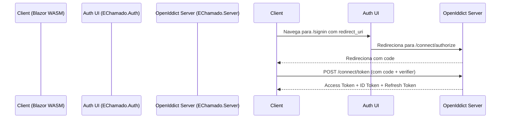

# 📁 Fluxo de Autenticação – EChamado

## 🌟 Objetivo

Descrever o fluxo de autenticação implementado no sistema **EChamado**, com foco na separação entre os papéis do `EChamado.Auth` (UI de autenticação) e do `EChamado.Server` (servidor OpenIddict real).

---

## 🏧 Arquitetura Geral

---

## 🔱 Componentes

### 🔐 `EChamado.Auth` (UI de Autenticação)

- Front-end do login, registro e logout.
- Renderizado em Blazor Server.
- Interações:
  - `/signin?redirect_uri=...`
  - `/signup?redirect_uri=...`
  - `/signout?redirect_uri=...`
- **Redireciona** para o servidor de autorização real (`EChamado.Server`) via endpoint `/connect/authorize`.
- **NÃO** emite tokens por conta própria. Sua função é apenas apresentar a UI e intermediar o redirecionamento.

### 🧠 `EChamado.Server` (Servidor OpenIddict)

- Implementa o **servidor de identidade real**.
- Usa OpenIddict com fluxo **Authorization Code + PKCE**.
- Endpoints:
  - `GET /connect/authorize`
  - `POST /connect/token`
  - `GET /connect/userinfo`
  - `GET /connect/logout`

---

## 🔄 Fluxo Completo

1. O **cliente SPA (Blazor WebAssembly)** acessa `EChamado.Auth` passando `?redirect_uri=https://cliente.com/callback`.
2. `EChamado.Auth` exibe a tela de login/registro.
3. Após login bem-sucedido, o `Auth` redireciona o usuário para o `EChamado.Server` (o servidor OpenIddict):
   - Via `/connect/authorize` com `client_id`, `code_challenge`, `redirect_uri`, `scope`, etc.
4. O `EChamado.Server` (OpenIddict):
   - Autentica o usuário.
   - Emite um `code`.
   - Redireciona de volta ao `redirect_uri` do `Client`.
5. O `Client` faz `POST /connect/token` com o `code` + `code_verifier`.
6. O `EChamado.Server` emite:
   - `Access Token`
   - `ID Token`
   - `Refresh Token`
7. O `Client` armazena e utiliza o token para chamar APIs protegidas.

---

## 🔒 Segurança

- Fluxo Authorization Code com PKCE (seguro para SPA).
- Tokens validados via `OpenIddict.Validation` no `EChamado.Server`.
- HTTPS obrigatório entre todos os componentes.

---

## 🔄 Endpoints Relevantes

### EChamado.Auth (UI de Autenticação)

| Método | Endpoint   | Descrição                 |
| ------ | ---------- | ------------------------- |
| GET    | `/signin`  | Inicia login com redirect |
| GET    | `/signup`  | Inicia cadastro           |
| GET    | `/signout` | Realiza logout            |

### EChamado.Server (OpenIddict)

| Método | Endpoint             | Descrição                 |
| ------ | -------------------- | ------------------------- |
| GET    | `/connect/authorize` | Fluxo de autorização      |
| POST   | `/connect/token`     | Troca de código por token |
| GET    | `/connect/userinfo`  | Informações do usuário    |
| GET    | `/connect/logout`    | Logout seguro             |

---

## ✅ Observações

- `EChamado.Auth` é uma **camada de UI e orquestração** para o fluxo de autenticação.
- Toda emissão de tokens, verificação de código e refresh de token ocorre no `EChamado.Server`, que centraliza a lógica do OpenIddict.
- A responsabilidade do `Auth` é **apenas apresentar a UI amigável e intermediar o redirecionamento de login** para o `EChamado.Server`.