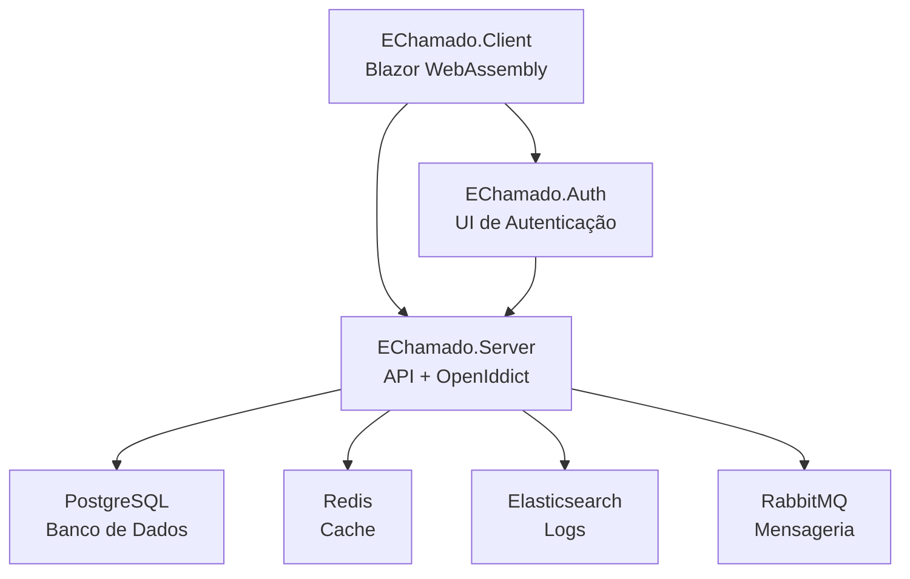
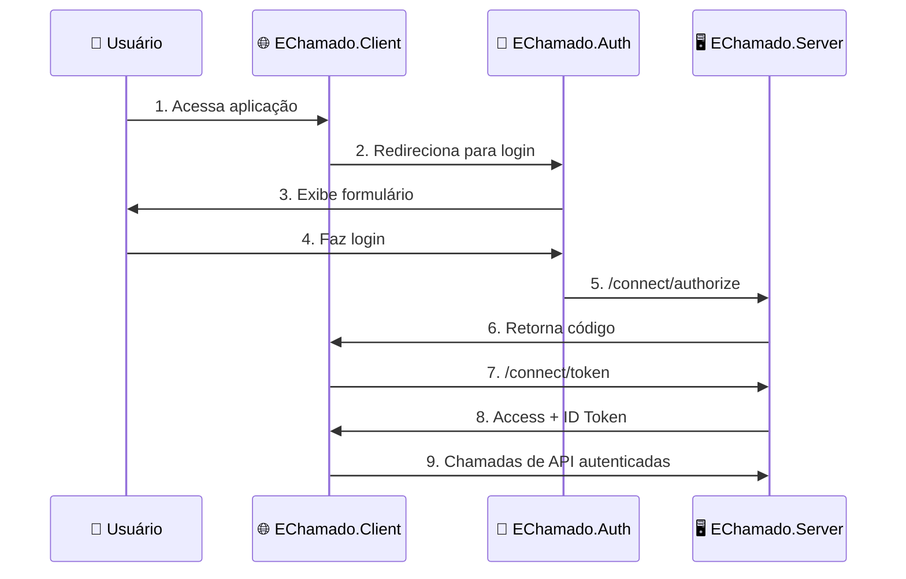

# 📚 Documentação EChamado

## 🌟 Visão Geral

O **EChamado** é um sistema moderno de gerenciamento de chamados desenvolvido com .NET 9, seguindo princípios de Clean Architecture, CQRS e autenticação segura via OpenIddict.

## 🏗️ Arquitetura do Sistema

O sistema é composto por três aplicações principais que trabalham em conjunto:



## 📖 Documentação por Componente

### 🔐 Autenticação

- **[Fluxo de Autenticação](auth_flow.md)** - Diagrama completo do fluxo OAuth 2.0/OIDC
- **[EChamado.Auth](01-EChamado.Auth.md)** - UI de autenticação e orquestração

### 🖥️ Backend

- **[EChamado.Server](02-EChamado.Server.md)** - API REST e servidor OpenIddict

### 🌐 Frontend

- **[EChamado.Client](03-EChamado.Client.md)** - Interface Blazor WebAssembly

### 👨‍💻 Desenvolvimento

- **[Guia do Desenvolvedor](DEVELOPER_GUIDE.md)** - Setup, convenções e workflow

## 🚀 Início Rápido

### ⚡ Execução Automática

```bash
# Windows
.\start-all.ps1

# Linux/macOS
./start-all.sh
```

### 🔧 Execução Manual

```bash
# 1. Infraestrutura
docker-compose up -d

# 2. API + OpenIddict
cd Server/EChamado.Server && dotnet run

# 3. UI de Autenticação  
cd Echamado.Auth && dotnet run

# 4. Interface Principal
cd Client/EChamado.Client && dotnet run
```

## 🌐 URLs da Aplicação

| Serviço | URL | Descrição |
|---------|-----|-----------|
| **Interface Principal** | <https://localhost:7274> | Blazor WebAssembly Client |
| **UI de Login** | <https://localhost:7132> | Interface de autenticação |
| **API** | <https://localhost:7296> | REST API + OpenIddict |
| **Swagger** | <https://localhost:7296/swagger> | Documentação da API |

## 🔄 Fluxo de Autenticação



## 🛠️ Tecnologias Utilizadas

### Backend

- **.NET 9.0** - Framework principal
- **ASP.NET Core** - Web API
- **Entity Framework Core** - ORM
- **PostgreSQL** - Banco de dados
- **OpenIddict** - Servidor OAuth 2.0/OIDC
- **MediatR** - CQRS Pattern
- **Serilog** - Logging estruturado

### Frontend  

- **Blazor WebAssembly** - SPA Framework
- **MudBlazor** - UI Components
- **OIDC Authentication** - Autenticação

### Infraestrutura

- **Docker Compose** - Containerização
- **Redis** - Cache distribuído
- **Elasticsearch** - Busca e logs
- **Kibana** - Visualização de logs
- **RabbitMQ** - Message broker

## 📋 Recursos Adicionais

### 📖 Guias de Referência

- **[QUICKSTART.md](../QUICKSTART.md)** - Guia de início rápido
- **[README.md](../README.md)** - Documentação completa do projeto

### 🔗 Links Úteis

- [Clean Architecture](https://blog.cleancoder.com/uncle-bob/2012/08/13/the-clean-architecture.html)
- [CQRS Pattern](https://docs.microsoft.com/en-us/azure/architecture/patterns/cqrs)
- [OpenIddict Documentation](https://documentation.openiddict.com/)
- [Blazor WebAssembly](https://docs.microsoft.com/en-us/aspnet/core/blazor/webassembly/)
- [MudBlazor Components](https://mudblazor.com/components)

## 🏷️ Princípios Arquiteturais

### 1. Separação de Responsabilidades

- **EChamado.Auth**: UI de autenticação e orquestração
- **EChamado.Server**: API REST e servidor de autorização
- **EChamado.Client**: Interface de usuário (SPA)

### 2. Segurança First

- Autenticação via OAuth 2.0/OIDC
- Authorization Code + PKCE
- HTTPS obrigatório
- Tokens JWT seguros

### 3. Clean Architecture

- Domain-driven design
- Inversão de dependências
- Testabilidade
- Separação de camadas

### 4. Padrões Modernos

- CQRS com MediatR
- Repository Pattern
- Dependency Injection
- Event-driven architecture

## 📞 Suporte

Para dúvidas sobre o desenvolvimento:

1. Consulte a **[documentação específica](DEVELOPER_GUIDE.md)** do componente
2. Verifique o **[fluxo de autenticação](auth_flow.md)** para questões de segurança
3. Consulte os **[guias de referência](../README.md)** para configurações

---

> **Nota**: Esta documentação é mantida atualizada com a evolução do projeto. Sempre consulte a versão mais recente antes de iniciar o desenvolvimento.
